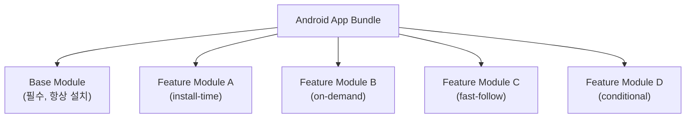
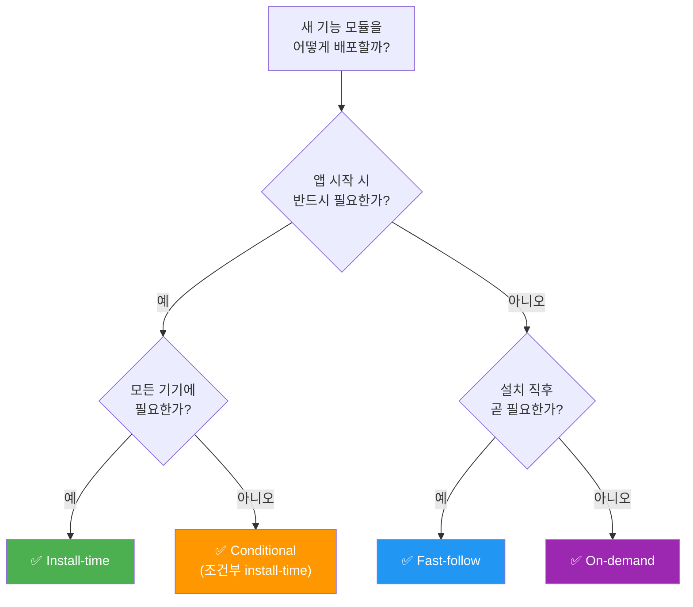

# Play Feature Delivery 완전 가이드

> 📖 원본
> 문서: [Overview of Play Feature Delivery](https://developer.android.com/guide/playcore/feature-delivery)

---

## 1. Play Feature Delivery란?

Play Feature Delivery는 **Android App Bundle**을 기반으로, 앱의 특정 기능을 **사용자 기기에 언제, 어떻게 다운로드할지** 세밀하게 제어할 수
있는 Google Play의 기능입니다.

### 핵심 개념

기존 APK 방식에서는 모든 기능이 하나의 파일에 포함되어 설치되었습니다. 하지만 App Bundle + Feature Delivery를 사용하면:

- 앱을 여러 개의 **Feature Module(동적 기능 모듈)** 로 분리
- 각 모듈의 **배포 시점과 방식**을 개별 제어
- 결과적으로 **초기 다운로드 크기를 대폭 감소**



---

## 2. 배포 모드 (Delivery Options) 상세

### 2.1 Install-time Delivery (설치 시 배포)

| 항목           | 설명                         |
|--------------|----------------------------|
| **동작**       | 앱 설치 시 자동으로 함께 다운로드        |
| **사용 가능 시점** | 앱을 처음 열 때 즉시 사용 가능         |
| **제거 가능 여부** | `removable` 옵션으로 나중에 제거 가능 |

```groovy
// build.gradle (feature module)
android {
    dynamicFeatures = [':feature_camera']
}

// feature module의 build.gradle
plugins {
    id 'com.android.dynamic-feature'
}

android {
    // install-time이 기본값
}
```

**AndroidManifest.xml 설정:**

```xml

<manifest xmlns:dist="http://schemas.android.com/apk/distribution"
    package="com.example.feature.camera">
    <dist:module dist:instant="false" dist:title="@string/title_camera">
        <dist:delivery>
            <dist:install-time />
        </dist:delivery>
    </dist:module>
</manifest>
```

> [!TIP]
> `removable="true"` 를 설정하면 나중에 기기 용량이 부족할 때 Play Store가 자동으로 해당 모듈을 제거할 수 있습니다. 사용 빈도가 낮은 기능에
> 유용합니다.

**적합한 상황:**

- 앱 실행 시 반드시 필요한 핵심 기능
- 단, 일부 기기에서만 필요하거나, 나중에 제거해도 되는 기능 → `removable` 옵션 활용

---

### 2.2 Fast-follow Delivery (빠른 후속 배포)

| 항목           | 설명                      |
|--------------|-------------------------|
| **동작**       | 앱 설치 직후 백그라운드에서 자동 다운로드 |
| **사용 가능 시점** | 다운로드 완료 후 (앱은 바로 사용 가능) |
| **사용자 조작**   | 불필요 (자동)                |

```xml

<dist:delivery>
    <dist:fast-follow />
</dist:delivery>
```

**적합한 상황:**

- 앱 첫 실행에는 필수가 아니지만, **곧 필요해질 기능**
- 예: 게임의 추가 레벨 데이터, 튜토리얼 영상, 오프라인 데이터
- 사용자가 앱을 둘러보는 동안 백그라운드로 준비

> [!IMPORTANT]
> Fast-follow 모듈은 다운로드 완료 전에 사용자가 해당 기능에 접근할 수 있으므로, **다운로드 상태를 확인하고 적절한 로딩 UI를 제공**해야 합니다.

---

### 2.3 On-demand Delivery (주문형 배포)

| 항목           | 설명                                            |
|--------------|-----------------------------------------------|
| **동작**       | 앱이 런타임에 명시적으로 요청할 때만 다운로드                     |
| **사용 가능 시점** | 다운로드 + 설치 완료 후                                |
| **필요 라이브러리** | Play Core SDK / Play Feature Delivery Library |

```xml

<dist:delivery>
    <dist:on-demand />
</dist:delivery>
```

**런타임 요청 및 상태 모니터링 코드 (Kotlin):**

On-demand 다운로드는 백그라운드에서 오랜 시간 소요되거나 여러 변수가 발생할 수 있으므로, `SplitInstallStateUpdatedListener`를 등록하여 상태
변화를 리스닝하고 사용자에게 시각적인 피드백을 전달해야 합니다.

```kotlin
val splitInstallManager = SplitInstallManagerFactory.create(context)
var mySessionId = 0

// 상태 업데이트 리스너 설정
val listener = SplitInstallStateUpdatedListener { state ->
    if (state.sessionId() == mySessionId) {
        when (state.status()) {
            SplitInstallSessionStatus.DOWNLOADING -> {
                val totalBytes = state.totalBytesToDownload()
                val progress = state.bytesDownloaded()
                // TODO: UI에 다운로드 진행 상태 업데이트 (progress / totalBytes)
            }
            SplitInstallSessionStatus.INSTALLING -> {
                // UI에 설치 중 메시지 표시
            }
            SplitInstallSessionStatus.INSTALLED -> {
                // 다운로드 및 설치 성공 -> 해당 기능 화면 진입 허용
            }
            SplitInstallSessionStatus.FAILED -> {
                val errorCode = state.errorCode()
                // 사용자에게 에러 상황을 명확히 알리고 필요시 재시도 버튼 노출
            }
            SplitInstallSessionStatus.REQUIRES_USER_CONFIRMATION -> {
                // 10MB가 넘는 모듈 등 사용 승인이 필요할 때 Play Store의 확인 대화상자 노출
                splitInstallManager.startConfirmationDialogForResult(state, activity, REQUEST_CODE)
            }
        }
    }
}

// 리스너 등록 (일반적으로 Activity의 onResume 등에서)
splitInstallManager.registerListener(listener)

val request = SplitInstallRequest.newBuilder()
    .addModule("feature_ar")
    .build()

splitInstallManager.startInstall(request)
    .addOnSuccessListener { sessionId ->
        mySessionId = sessionId
    }
    .addOnFailureListener { exception ->
        // 요청 자체 실패 시 처리
    }

// 메모리 누수 방지를 위해 사용 종료 시 해제 (일반적으로 Activity의 onPause 등에서)
// splitInstallManager.unregisterListener(listener)
```

**적합한 상황:**

- **일부 사용자만 사용하는 기능** (예: AR 기능, 고급 편집 도구)
- 용량이 큰 부가 기능 (예: 특수 필터, 이미지 인식 모델)
- 유료/프리미엄 전용 기능
- 특정 이벤트나 시즌에만 필요한 기능

> [!WARNING]
> On-demand 모듈을 요청할 때는 **반드시 다운로드 진행률 UI를 제공**하세요. 특히 10MB를 초과하는 모듈은 사용자 확인 대화상자가 표시됩니다.

---

### 2.4 Conditional Delivery (조건부 배포)

| 항목           | 설명                            |
|--------------|-------------------------------|
| **동작**       | 설치 시 특정 조건을 만족하는 기기에만 자동 다운로드 |
| **조건 불만족 시** | 해당 모듈이 아예 설치되지 않음             |

```xml

<dist:delivery>
    <dist:install-time>
        <dist:conditions>
            <!-- API 레벨 조건 -->
            <dist:min-sdk dist:value="21" />

            <!-- 기기 기능 조건 -->
            <dist:device-feature dist:name="android.hardware.camera.ar" />

            <!-- 사용자 국가 조건 -->
            <dist:user-countries dist:exclude="false">
                <dist:country dist:code="KR" />
                <dist:country dist:code="US" />
            </dist:user-countries>
        </dist:conditions>
    </dist:install-time>
</dist:delivery>
```

**지원 조건 목록:**

| 조건               | 설명                  | 예시            |
|------------------|---------------------|---------------|
| `min-sdk`        | 최소 API 레벨           | API 21 이상만    |
| `device-feature` | 하드웨어/소프트웨어 기능       | AR 지원, NFC 탑재 |
| `user-countries` | 사용자 국가              | 한국, 미국만       |
| `device-model`   | 특정 기기 모델 (API 31+)  | 특정 제조사 기기     |
| `device-ram`     | 기기 RAM 용량 (API 31+) | 4GB 이상        |
| `system-feature` | 시스템 기능 (API 31+)    | 특정 SoC        |

**적합한 상황:**

- **AR 기능**: AR Core를 지원하는 기기에만 배포
- **국가별 기능**: 특정 국가의 규제나 서비스에 맞는 모듈
- **고사양 기능**: 충분한 RAM이 있는 기기에만 고해상도 리소스 배포
- **특정 하드웨어**: NFC, 지문인식 등 특정 센서가 있는 기기

---

### 2.5 Google Play Instant (인스턴트 앱)

* **정의:** 사용자가 앱 전체를 설치하지 않고도 웹 링크나 Google Play 스토어의 "지금 해보기" 버튼으로 앱의 일부 기능을 즉시 사용할 수 있도록 제공하는
  모드입니다. (`dist:instant="true"`)
* **핵심 설계 규칙:**
    * **Base Module 연계:** 인스턴트 모듈을 제공하려면 Base Module 역시 인스턴트 모듈로 설정되어 있어야 합니다.
    * **상호 배타적 설정:** 인스턴트 모드(`dist:instant="true"`)로 구성된 기능 모듈은 manifest 상에서 `dist:on-demand` 설정을
      동시에 가질 수 없습니다. (단, 런타임 상에서 추가 인스턴트 모듈을 필요 시점에 가져오도록 요청하는 API 호출은 가능)
    * **용량 제한:** 인스턴트 경험을 원활하게 제공하기 위해 Base Module과 연동되는 인스턴트 기능 모듈의 총용량 합은 일반적으로 **10MB** 이하여야 합니다.
*   > [!CAUTION]
    > **중요 업데이트 (서비스 종료):** Google Play Instant 서비스는 **2025년 12월**을 기점으로 전체 지원이 종료되었습니다. 따라서, 새로운
    아키텍처나 기능 설계 시 인스턴트 앱 활성화 방식은 권장되지 않으며, 대신 사용자 유입 목적을 달성하기 위해 **딥링크(Deep Link)**를 활성화하여 기본 앱 설치 및
    화면 전환을 유도하는 구조로 가이드를 따르길 적극 권장합니다.

---

## 3. 배포 모드 비교 요약

| 특성               | Install-time | Fast-follow | On-demand | Conditional |
|------------------|:------------:|:-----------:|:---------:|:-----------:|
| 설치 시 포함          |      ✅       |      ❌      |     ❌     |    조건부 ✅    |
| 자동 다운로드          |      ✅       |      ✅      |     ❌     |  조건 충족 시 ✅  |
| 사용자 요청 필요        |      ❌       |      ❌      |     ✅     |      ❌      |
| Play Core SDK 필요 |      ❌       |      ✅      |     ✅     |      ❌      |
| 앱 크기 절감 효과       |      낮음      |     중간      |    높음     |    중간~높음    |
| 즉시 사용 가능         |      ✅       |      ❌      |     ❌     |      ✅      |

---

## 4. 실전 활용 시나리오

### 시나리오 1: 이커머스 앱

```
Base Module     → 상품 검색, 장바구니 (필수)
Install-time    → 결제 모듈 (항상 필요)
Fast-follow     → 상품 리뷰 이미지 캐시 데이터
On-demand       → AR 상품 미리보기 기능
Conditional     → 특정 국가 전용 결제 수단 (예: 한국 전용 카카오페이)
```

### 시나리오 2: 게임 앱

```
Base Module     → 메인 메뉴, 기본 게임 로직
Install-time    → 첫 번째 챕터 데이터
Fast-follow     → 2~3번째 챕터 데이터 (설치 후 자동 다운로드)
On-demand       → 추가 캐릭터 스킨, 보너스 레벨
Conditional     → 고해상도 텍스처 (RAM 4GB 이상 기기만)
```

### 시나리오 3: 카메라/사진 편집 앱

```
Base Module     → 기본 촬영, 간단한 필터
Install-time    → 갤러리 기능
On-demand       → AI 기반 고급 편집 도구 (ML 모델 포함)
On-demand       → 동영상 편집 기능
Conditional     → AR 스티커 (AR Core 지원 기기만)
```

---

## 5. 구현 시 주의사항 및 UX 가이드라인

### 💡 UX 디자인 핵심 가이드 (UX Guidelines)

사용자가 런타임 중에 기능을 추가로 내려받아야 하므로, 부드러운 사용성을 해치지 않기 위해 다음 권장사항을 충족해야 합니다.

1. **다운로드 상태 알림:** 10MB 미만의 가벼운 파일이라도 사용자가 인지하지 못하는 깜빡임이 생길 수 있으므로, 다운로드 중에는 진행 상태(Spinner 등)를 명확하게
   UI에 보여주어야 합니다.
2. **명확한 진입점 제공:** 다운로드가 진행되는 버튼/영역은 다운로드 진행률을 함께 표기하거나, 다른 액션을 방해하지 않도록 적절히 비활성화 처리하십시오.
3. **취소 권한 제공:** 용량이 큰 파일의 경우, 사용자가 다운로드를 도중에 취소할 수 있는 수단(예: 취소 버튼)을 보장해야 합니다.
4. **에러 핸들링:** 네트워크 실패, 기기 여유 공간 부족 등으로 다운로드 실패 시 그냥 앱이 멈추는 것이 아니라 "일시적인 오류로 콘텐츠를 가져오지 못했습니다. 다시
   시도하시겠습니까?" 와 같이 복구가 가능한 재시도(Retry) 흐름을 필수로 구성하십시오.

### ✅ 개발 모범 사례

1. **공통 코드는 Base Module에**: 여러 Feature Module이 공유하는 코드/리소스는 반드시 Base Module에 포함
2. **다운로드 상태 확인**: Fast-follow, On-demand 모듈은 사용 전 반드시 설치 상태 확인
3. **에러 처리**: 네트워크 불안정, 저장 공간 부족 등의 에러 핸들링 필수
4. **사용자 안내**: On-demand 모듈 다운로드 시 진행률 표시 UI 제공
5. **테스트**: `bundletool`을 사용하여 로컬에서 Feature Module 테스트

### ❌ 주의할 점

1. **모듈 간 의존성**: Feature Module은 Base Module에만 의존 가능 (다른 Feature Module에 의존 불가)
2. **모듈 크기 제한**: On-demand 모듈이 **150MB를 초과하면 Wi-Fi가 필요**할 수 있음
3. **10MB 초과 시**: 사용자에게 다운로드 확인 대화상자가 표시됨
4. **Instant App 비호환**: 일부 배포 옵션은 Instant App과 호환되지 않음

---

## 6. 필요한 의존성

```groovy
// app/build.gradle
dependencies {
    // Play Feature Delivery Library (Kotlin)
    implementation 'com.google.android.play:feature-delivery-ktx:2.1.0'

    // 또는 Java용
    implementation 'com.google.android.play:feature-delivery:2.1.0'
}
```

---

## 7. 한 눈에 보는 의사결정 플로우차트



