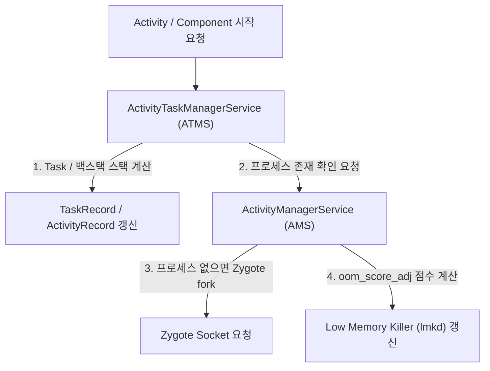

## ActivityManagerService (AMS) & ActivityTaskManagerService (ATMS)

### 1. 개요 (Overview)

**ActivityManagerService (AMS)** 와 **ActivityTaskManagerService (ATMS)** 는 `system_server` 내부에서 상주하며 **안드로이드 앱 컴포넌트(Activity, Service, BroadcastReceiver, ContentProvider)의 생명주기(Lifecycle), 프로세스 생성/수거, Task 백스택(Backstack) 및 윈도우 계층 구조를 관제하는 중심 프레임워크 시스템 서비스**이다.

Android 10(Q) 이전에는 AMS 가 모든 책임을 몰아서 담당했으나, Android 10 이상부터 화면 분할, 창 전환, 태블릿/폴더블 UI 처리를 정밀화하기 위해 **Activity 생명주기 및 Task 관리는 ATMS (ActivityTaskManagerService)** 로 분리되었고, **프로세스 OOM 점수([LMK](../01_system_internals/lmk-low-memory-killer.md)) 및 백그라운드 서비스 관리는 AMS** 가 전담한다.

---

#### 초보자를 위한 쉽게 이해하는 비유

- **AMS & ATMS (시청 종합 주민등록국과 무대 연출 감독)**:
  - **AMS (주민등록 주민과장)**: 앱 시민(프로세스)이 태어나고(Zygote fork), 생존 점수([oom_score_adj](../01_system_internals/lmk-low-memory-killer.md))를 매기며, 죽을 때 정리하는 종합 인적 관리자.
  - **ATMS (연극 무대 연출 감독)**: 현재 주연 배우(Activity)가 무대 전면에 나올지, 뒤로 들어갈지(Backstack), 연극 창(Task/Window)을 나누어 띄울지를 전문 지휘하는 무대 총감독.



---

### 2. AMS 대 ATMS 역할 분담 비교

| 구분 | ActivityManagerService (AMS) | ActivityTaskManagerService (ATMS) |
| :--- | :--- | :--- |
| **주요 책임** | **프로세스 생명주기, OOM 점수([LMK](../01_system_internals/lmk-low-memory-killer.md)), Memory Trim** | **Activity 생명주기, Task, Recents, Multi-Window** |
| **관련 컴포넌트**| Service, BroadcastReceiver, ContentProvider | Activity 메인 컴포넌트 |
| **생성 시점** | Android OS 극초기부터 하부 관제 | Android 10(Q) 이상에서 AMS 로부터 아키텍처 분리 |
| **핵심 클래스** | `ProcessRecord`, `OomAdjuster` | `ActivityRecord`, `Task`, `ActivityTaskSupervisor` |

---

### 3. 관측 가능 증거 및 CLI 명령어

`adb shell` 로 현재 AMS 와 ATMS 가 관리 중인 Task 백스택 및 프로세스 상태를 관측할 수 있다:

```bash
# 1. ATMS 가 관리 중인 현재 활성 Activity 백스택 및 Task 덤프
adb shell dumpsys activity activities

# 2. AMS 가 관리 중인 프로세스 LRU 리스트 및 oom_score_adj 덤프
adb shell dumpsys activity processes
```

---

### 4. 연결 문서 (Related Links)

- [system_server 표준 레퍼런스](system-server.md) - AMS & ATMS 를 호스팅하는 프레임워크 프로세스
- [ServiceManager](service-manager.md) - AMS & ATMS 바인더 핸들 조회
- [Context.getSystemService()](get-system-service.md) - 앱에서 ActivityManager 프록시 습득
- [Low Memory Killer (LMK)](../01_system_internals/lmk-low-memory-killer.md) - AMS 가 oom_score_adj 주입하는 메모리 회수기
- [Binder IPC](../01_system_internals/binder-ipc.md) - 앱과 AMS/ATMS 간 IPC 디스패치
