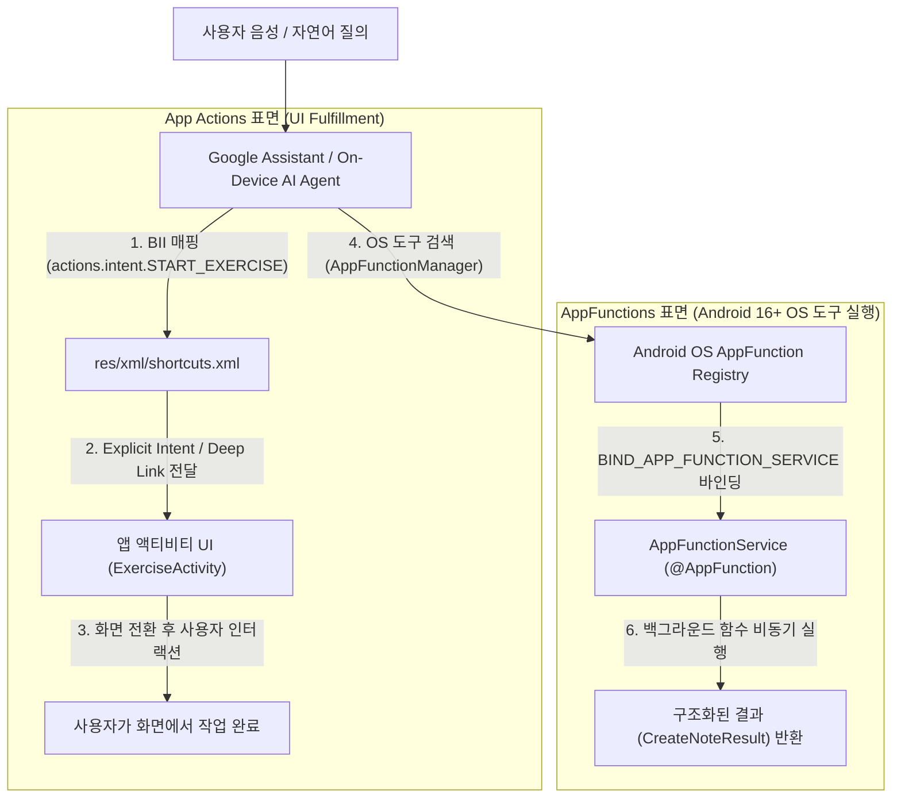

## Assistant 와 에이전트 통합 계약

이 지도는 Google Assistant 와 차세대 On-Device AI 에이전트가 앱의 기능과 데이터를 호출하는 방식을 단일한 AI 연동으로 뭉뚱그리지 않고, **UI 화면으로 이동시키는 App Actions (BII/Custom Intent)** 와 **OS 레지스트리에 도구를 등록하여 백그라운드 함수로 실행하는 AppFunctions (Android 16+)** 의 2대 외부 실행 표면별 계약으로 분리하여 다룬다.



### 주요 메커니즘 및 코드 예시 (Mechanisms & Code Examples)

1. **`App Actions` (UI 진입점)**: `shortcuts.xml` 에 `capability` 및 Built-in Intent(BII)를 선언하여 사용자 질의를 특정 화면이나 위젯 Deep Link 로 매핑.
2. **`AppFunctions` (Android 16+ 에이전트 도구)**: `@AppFunction` 및 `AppFunctionService` 를 통해 앱의 핵심 함수를 시스템 레지스트리에 노출하고 에이전트가 백그라운드에서 직접 실행.
3. **보안 및 신뢰 경계**: 외부 호출은 모두 신뢰할 수 없는 입력으로 취급하며, `EXECUTE_APP_FUNCTIONS` (privileged/signature) 권한 검증 및 앱 내부 도메인 인가(로그인 상태, 소유권)를 별도로 강제.

```xml
<!-- 1. App Actions: shortcuts.xml 의 capability 선언 -->
<shortcuts xmlns:android="http://schemas.android.com/apk/res/android">
    <capability android:name="actions.intent.START_EXERCISE">
        <intent
            android:action="android.intent.action.VIEW"
            android:targetPackage="com.example.app"
            android:targetClass="com.example.app.ExerciseActivity">
            <parameter android:name="exercise.name" android:key="exerciseType" />
        </intent>
    </capability>
</shortcuts>
```

```kotlin
// 2. AppFunctions: Android 16+ 함수 등록 예시
@AppFunctionServiceEntryPoint(
    serviceName = "MyAppFunctionService",
    appFunctionXmlFileName = "my_app_functions"
)
abstract class BaseMyAppFunctionService : AppFunctionService() {
    @AppFunction
    suspend fun createNote(title: String, content: String): CreateNoteResult {
        // 도메인 인가 및 입력 검증 후 로직 수행
        return noteRepository.createNote(title, content)
    }
}
```

### 관찰 신호 및 CLI 검증 (Observation Signals)

```bash
# 1. 앱의 shortcuts.xml 등록 상태 및 capability 메타데이터 확인
adb shell dumpsys package <package_name> | grep -A 10 "android.app.shortcuts"

# 2. AppFunctions 서비스 바인딩 권한 및 exported 상태 덤프
adb shell dumpsys package <package_name> | grep -E "AppFunctionService|BIND_APP_FUNCTION_SERVICE"

# 3. Intent 실행 시뮬레이션
adb shell am start -a android.intent.action.VIEW -d "myapp://exercise?type=running"
```

### 읽는 순서 (Recommended Reading Order)

1. [Android 외부 실행 표면은 App Actions와 AppFunctions로 나뉜다](app-actions-vs-appfunctions.md): UI fulfillment 와 함수 도구 등록의 근본적 차이 확인.
2. [App Actions는 Assistant 질의를 앱 fulfillment로 연결한다](app-actions-fulfillment.md): `shortcuts.xml`, BII 매핑, 파라미터 전달 및 모호성(Disambiguation) 해소.
3. [AppFunctions는 에이전트용 앱 기능 계약이다](appfunctions-capabilities.md): Android 16+, `@AppFunction`, KSP 컴파일러, 시스템 서비스 계약 확인.
4. [외부 의도 실행은 의미 해석, 전달, 검증, 실행을 분리한다](external-intent-execution.md): 외부 입력 정규화, 멱등성(Idempotency), 실패 복구 흐름 확인.
5. [Assistant와 에이전트 호출은 앱 내부 권한 검사를 대체하지 않는다](agent-authorization-boundaries.md): `EXECUTE_APP_FUNCTIONS`, `BIND_APP_FUNCTION_SERVICE`, 도메인 보안.
6. [App Actions와 AppFunctions 도입은 preview와 호출 표면을 검증해야 한다](surface-preview-validation.md): 출시 전 체크리스트 및 검증 파이프라인.

### 문제 분류 (Troubleshooting Matrix)

| 증상 | 먼저 확인할 경계 | 점검 CLI / 진단 신호 |
| :--- | :--- | :--- |
| Assistant 음성 질의 시 앱이 열리지 않음 | `shortcuts.xml` 내 BII 이름, locale 지원, metadata 선언 | App Actions Test Tool 로그 |
| 앱 화면은 열리지만 엉뚱한 항목이 표시됨 | BII parameter 매핑 오류 또는 딥링크 파싱 실패 | Logcat Intent extras 출력 |
| AppFunction 이 에이전트에 의해 검색되지 않음 | Android 16 미만 기기 또는 KSP XML 스키마 생성 누락 | `dumpsys package` 서비스 등록 상태 |
| AppFunction 호출 시 `SecurityException` 발생 | 호출자의 `EXECUTE_APP_FUNCTIONS` 권한 부재 | Logcat 보안 예외 스택 확인 |
| 동일한 결제/메모 생성이 반복해서 일어남 | 호출 재시도 시 서버 멱등성 키(Idempotency Key) 누락 | 서버 트랜잭션 로그 대조 |

### 책임 경계 (Architectural Boundaries)

- **App Actions**는 Google Assistant 가 BII 를 해석하여 적절한 Android Intent 로 화면을 열어주는 제품 표면이다.
- **AppFunctions**는 Android OS 레지스트리에 함수 메타데이터를 노출하여 권한을 가진 시스템 에이전트가 백그라운드에서 직접 실행하는 플랫폼 API 다.
- 두 표면 모두 **외부 입력의 의미 정확성, 로그인 여부, 리소스 소유권, 민감 작업(결제, 삭제) 승인을 보장하지 않으므로** 앱 내부에서 반드시 2차 검증을 수행해야 한다.

### 노트 목록 (Topic Notes)

- [Android 외부 실행 표면은 App Actions와 AppFunctions로 나뉜다](app-actions-vs-appfunctions.md)
- [App Actions는 Assistant 질의를 앱 fulfillment로 연결한다](app-actions-fulfillment.md)
- [AppFunctions는 에이전트용 앱 기능 계약이다](appfunctions-capabilities.md)
- [외부 의도 실행은 의미 해석, 전달, 검증, 실행을 분리한다](external-intent-execution.md)
- [Assistant와 에이전트 호출은 앱 내부 권한 검사를 대체하지 않는다](agent-authorization-boundaries.md)
- [App Actions와 AppFunctions 도입은 preview와 호출 표면을 검증해야 한다](surface-preview-validation.md)

검증일: 2026-08-24. [App Actions 공식 가이드](https://developer.android.com/develop/devices/assistant/get-started) 및 [Android 16 AppFunctions Jetpack 문서](https://developer.android.com/ai/appfunctions)를 기준으로 최신 AI 에이전트 통합 아키텍처 검증 완료.

