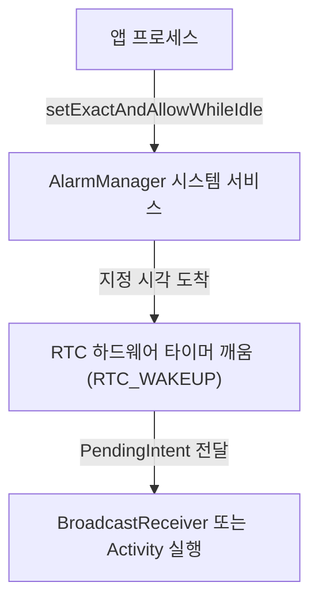

# Alarm Manager Contract

## 1. 개요 (Overview)

### 초보자를 위한 쉽게 이해하는 비유
* **AlarmManager (정확한 시각에 울리는 정밀 자상 모닝콜)**:
  - 배터리 상태와 관계없이 정확히 지정된 시각(RTC_WAKEUP)에 CPU 를 깨워 알람이나 정시 사용자 이벤트를 처리하는 시스템 모닝콜 서비스.



---

---

## AlarmManager 는 시간 자체가 기능인 이벤트에 쓴다

상위 문서: [Android 시스템 서비스와 기기 기능 지도](../../android-system-services-and-device-capabilities.md)

관련 지도: [백그라운드 작업 계약](./background-work-contracts.md)

### 핵심 주장

- AlarmManager 는 특정 시각 또는 시간 간격에 시스템이 앱을 깨워야 하는 기능에 적합하다.
- 알람 시계, 약 복용 알림, 캘린더 리마인더처럼 시간 자체가 기능의 핵심인 경우를 우선 검토한다.
- 일반적인 서버 동기화는 시간이 조금 밀려도 되므로 WorkManager 가 보통 더 적합하다.
- 정확한 알람은 배터리 비용이 있으므로 꼭 필요한 경우에만 사용한다.
- setExactAndAllowWhileIdle 은 유휴 상태에서도 정확성을 높이는 대신 남용해서는 안 된다.
- 알람은 실행을 시작하는 신호이지 장시간 작업을 수행할 공간 자체가 아니다.

### exact alarm 권한의 경계

exact alarm 의 권한 조건은 기기 OS, `targetSdkVersion`, 전달 방식에 따라 달라진다.

| 조건 | 요구사항 |
| --- | --- |
| target 30 이하 | Android 12 의 exact alarm 특별 접근 제한 대상이 아니다. 새 설계의 기준으로 삼지 않는다. |
| Android 12~13 에서 target 31+ | `PendingIntent` 기반 exact alarm 뿐 아니라 `OnAlarmListener` 기반 `setExact()` 도 exact alarm capability 또는 배터리 제한 예외가 필요하다. Android 12 에서는 `SCHEDULE_EXACT_ALARM` 을, Android 13 의 target 33+ 핵심 용도에서는 `USE_EXACT_ALARM` 을 선택할 수 있다. |
| Android 12+ 에서 `PendingIntent` 기반 exact alarm | `setExact*()` 또는 `setAlarmClock()` 호출 전에 exact alarm 사용 가능 상태여야 한다. `SCHEDULE_EXACT_ALARM` 을 쓰는 앱은 호출 직전 `canScheduleExactAlarms()` 를 확인한다. 사용할 수 없는데 호출하면 `SecurityException` 이 발생한다. |
| Android 13+ 에서 target 33+ | 앱의 용도에 따라 `SCHEDULE_EXACT_ALARM` 과 `USE_EXACT_ALARM` 중 하나만 선언한다. |
| Android 14+ 의 `OnAlarmListener` 기반 `setExact()` | `SCHEDULE_EXACT_ALARM` 없이 호출할 수 있지만, 앱이 lifecycle 밖으로 나가면 시스템이 알람을 명시적으로 버린다. 지속 전달용 권한 우회책이 아니다. |

- `SCHEDULE_EXACT_ALARM` 은 사용자가 특별 접근 화면에서 부여하거나 철회할 수 있다. Android 14+ 에서 target 33+ 앱을 신규 설치하면 미리 부여되지 않으며, 철회되면 앱 프로세스가 중지되고 이후 exact alarm 이 취소된다.
- `ACTION_SCHEDULE_EXACT_ALARM_PERMISSION_STATE_CHANGED` 를 받으면 `canScheduleExactAlarms()` 를 다시 확인하고 저장된 사용자 설정을 기준으로 필요한 알람을 재예약한다.
- `USE_EXACT_ALARM` 은 target 33+ 에서만 요청할 수 있고 자동 부여되며 사용자가 철회할 수 없다. 알람·타이머처럼 exact alarm 이 핵심 기능인 제한된 용도와 앱 스토어 정책 심사 대상이다. 선택 기능에는 `SCHEDULE_EXACT_ALARM` 을 사용한다.
- `OnAlarmListener` 는 `PendingIntent` 와 달리 앱 프로세스를 다시 시작하지 않는다. 현재 `Activity`, `Service`, `ContentProvider` 가 끝난 뒤에도 전달되어야 한다면 `PendingIntent` 기반 API 를 사용한다. 화면 안에서만 유효한 타이머라면 `Handler` 같은 lifecycle 내부 수단이 더 단순할 수 있다.
- 권한이 없을 때는 사용자에게 정확성이 필요한 이유와 설정 이동 경로를 제시하거나, `set()`, `setWindow()`, WorkManager 처럼 요구사항에 맞는 부정확한 수단으로 낮춘다. 실패를 숨기고 exact API 를 호출하지 않는다.

### PendingIntent 식별과 재예약

`AlarmManager` 에 두 번째 알람을 같은 `PendingIntent` 로 예약하면 새 예약이 기존 예약을 대체한다. 여기서 "같음"은 extras 의 업무 ID 가 아니라 `PendingIntent` 의 operation 과 identity 로 판정된다.

- Intent 쪽 식별 대상은 `Intent.filterEquals()` 가 비교하는 action, data URI, MIME type, identifier, component class, categories 이다. **extras 는 비교하지 않는다.**
- 같은 생성 함수(`getBroadcast()` 등)를 사용할 때 request code 가 다르면 별도 `PendingIntent` 가 된다.
- `FLAG_ONE_SHOT`, `FLAG_IMMUTABLE` 처럼 인스턴스를 설명하는 식별 플래그도 일치해야 기존 객체를 조회하거나 변경할 수 있다.
- `FLAG_UPDATE_CURRENT` 는 별도 identity 를 만들지 않는다. 같은 `PendingIntent` 가 이미 있으면 그 객체를 유지하면서 새 Intent 의 extras 로 바꾼다.

따라서 다음 두 Intent 는 `reminderId` extra 만 다르고 action, component, request code 가 같으므로 같은 `PendingIntent` 를 가리킨다. `FLAG_UPDATE_CURRENT` 를 쓰면 두 번째 호출이 첫 번째의 extra 를 바꾸고, 두 번째 알람 예약은 첫 번째 알람을 대체한다.

```kotlin
fun collidingReminder(context: Context, reminderId: Long): PendingIntent {
    val intent = Intent(context, ReminderReceiver::class.java)
        .setAction("com.example.action.REMIND")
        .putExtra("reminder_id", reminderId) // identity에 포함되지 않는다.

    return PendingIntent.getBroadcast(
        context,
        0, // 두 호출에서 같음
        intent,
        PendingIntent.FLAG_UPDATE_CURRENT or PendingIntent.FLAG_IMMUTABLE,
    )
}
```

동시에 살아 있어야 하는 리마인더에는 안정적이고 고유한 request code 또는 data URI 를 identity 로 사용한다. 다음 예시는 data URI 로 구분하고 extra 는 수신 편의를 위한 payload 로만 취급한다.

```kotlin
fun distinctReminder(context: Context, reminderId: Long): PendingIntent {
    val intent = Intent(context, ReminderReceiver::class.java)
        .setAction("com.example.action.REMIND")
        .setData(Uri.parse("reminder://scheduled/$reminderId"))
        .putExtra("reminder_id", reminderId)

    return PendingIntent.getBroadcast(
        context,
        0,
        intent,
        PendingIntent.FLAG_UPDATE_CURRENT or PendingIntent.FLAG_IMMUTABLE,
    )
}
```

- 알람을 갱신할 때는 동일한 식별자를 사용하고 이전 예약과의 관계를 명확히 한다.
- 사용자가 설정을 바꾸면 기존 알람을 취소한 뒤 새 설정으로 예약한다.
- 재부팅 뒤에도 필요한 알람은 부팅 이벤트와 저장된 설정을 이용해 재예약한다.
- 반복 알람의 간격이 기능적으로 충분하면 정확한 개별 알람보다 반복 예약을 고려한다.
- 수신기에서는 알림 표시나 짧은 위임만 수행하고 긴 네트워크 작업은 별도로 넘긴다.

### 관찰과 테스트

예약 코드에는 최소한 `logicalId`, 선택한 API, clock type, 요청 시각, 예약 시각, `SDK_INT`, target SDK, `canScheduleExactAlarms()` 결과를 구조화해 기록한다. 수신기에서는 같은 `logicalId`, 예정 시각, 실제 수신 시각과 `actual - scheduled` 지연을 기록한다. 민감한 사용자 데이터는 기록하지 않는다.

1. **PendingIntent 충돌을 먼저 재현한다.** `collidingReminder()` 로 ID 101 과 202 를 서로 다른 가까운 시각에 예약한다. 정상적인 재현 신호는 두 객체가 같은 operation 으로 비교되고, `FLAG_UPDATE_CURRENT` 때문에 수신 payload 가 202 로 바뀌며 첫 예약이 독립적으로 남지 않는 것이다. 둘 다 살아 있어야 하는 제품 요구사항에는 실패다. `distinctReminder()` 로 바꾼 뒤 두 ID 가 각각 한 번 수신되면 수정 성공이다.
2. **시스템 예약 상태를 확인한다.** 테스트 알람을 몇 분 뒤로 예약하고 `adb shell dumpsys alarm` 출력에서 앱 패키지, action 또는 data URI 를 찾는다. 정상 신호는 의도한 identity 와 시각의 예약이 보이는 것이다. 예약 성공 로그는 있는데 항목이 없으면 identity 충돌에 의한 대체, 즉시 취소, 권한 철회 여부를 조사한다. `dumpsys` 의 세부 출력 형식은 Android 버전과 제조사에 따라 다르므로 문자열 전체를 자동화 테스트의 고정 계약으로 삼지 않는다.
3. **권한 거부 경로를 검증한다.** Android 14+ 에서 target 33+ 앱을 신규 설치하거나 시스템의 "알람 및 리마인더" 특별 접근을 끈다. `SCHEDULE_EXACT_ALARM` 경로의 정상 거부 신호는 `canScheduleExactAlarms() == false`, exact API 를 호출하지 않는 대체 UI 또는 부정확한 예약, exact 예약 항목 없음이다. 검사를 누락하고 `PendingIntent` 기반 exact API 를 호출해 `SecurityException` 이 발생하면 구현 실패다.
4. **권한 재부여를 검증한다.** 설정에서 특별 접근을 켠 뒤 상태 변경 broadcast 에서 다시 capability 를 확인하고 저장된 리마인더를 재예약한다. 정상 신호는 capability 가 `true` 로 바뀌고 각 logical ID 가 한 번씩 예약되는 것이다. 중복 항목이 쌓이거나 설정 화면에서 돌아온 것만으로 권한이 있다고 가정하면 실패다.
5. **`OnAlarmListener` 생명주기를 분리해 검증한다.** Android 14+ 에서 listener 알람을 등록한 component 를 종료하고 앱이 cached 상태로 이동했는지 확인한다. 이 경계에서는 시스템이 알람을 취소할 수 있으므로 callback 지속 전달을 성공 조건으로 삼지 않는다. component 종료 뒤에도 반드시 와야 하는 요구사항이라면 API 선택 실패이며 `PendingIntent` 경로로 바꿔야 한다. Android 12~13 의 target 31+ 테스트에서는 listener 방식도 특별 접근 없이 성공한다고 가정하지 않는다.
6. **전달 정확성을 측정한다.** RTC 계열은 시간대·서머타임·수동 시계 변경을, elapsed realtime 계열은 경과 시간을 기준으로 시험한다. Doze 진입 전후에 예정 시각과 실제 수신 시각의 차이를 비교한다. 허용 지연 안에서 한 번 수신되면 정상이고, 수신 누락·중복·업무 요구를 넘는 지연이면 권한 상태, 선택한 API, idle 허용 여부와 제조사 배터리 제한을 함께 기록한다.

- 알람을 사용해 백그라운드 정책을 우회하려는 설계는 요구사항부터 다시 분류한다.

### 사용자 설정과 정확성

- 사용자에게 정확한 시각이 필요한지 아니면 대략적인 시간대면 충분한지 먼저 묻는다.
- 대략적인 알림은 부정확한 알람이나 WorkManager 로 배터리 비용을 낮출 수 있다.
- exact alarm 권한은 기능에 필수인 경우에만 요청하고 거부 시 대체 경로를 제공한다.
- 알람 식별자와 설정을 영속 저장해 재부팅과 시간대 변경에 대응한다.
- 알람 수를 기능별로 제한해 같은 목적의 예약이 누적되지 않게 한다.
- PendingIntent 에 필요한 변경 불가 플래그와 명시적 컴포넌트를 사용한다.
- 예약 시각과 실제 수신 시각을 기록하면 제조사별 지연을 진단할 수 있다.
- 알람 수신 후의 사용자 알림은 알람의 목적과 동일한 시간 의미를 유지해야 한다.

### 공식 문서

- [알람 예약](https://developer.android.com/develop/background-work/services/alarms)
- [정확한 알람 권한](https://developer.android.com/about/versions/12/behavior-changes-12#exact-alarm-permission)
- [Android 14 exact alarm 기본 거부](https://developer.android.com/about/versions/14/changes/schedule-exact-alarms)
- [AlarmManager API](https://developer.android.com/reference/android/app/AlarmManager)
- [PendingIntent API](https://developer.android.com/reference/android/app/PendingIntent)
- [Intent.filterEquals API](https://developer.android.com/reference/android/content/Intent#filterEquals(android.content.Intent))
- [dumpsys](https://developer.android.com/tools/dumpsys)

검증일: 2026-08-03. 권한 부여 방식, `OnAlarmListener` 의 OS 버전별 동작, Play 허용 범위는 target SDK 및 배포 정책에 따라 바뀔 수 있으므로 릴리스 시 다시 확인한다. `dumpsys alarm` 의 세부 필드도 공개된 안정 API 계약이 아니다.

## 4. 연결 문서 (Related Links)
- [JobScheduler 표준 레퍼런스](../../job-scheduler.md)
- [system_server 표준 레퍼런스](../../system-server.md)
