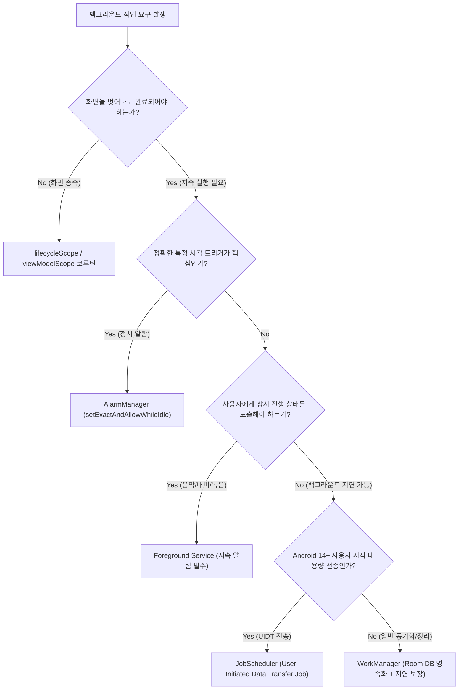

## 백그라운드 작업 계약

이 지도는 Android 백그라운드 실행을 단순한 API 목록이 아니라 **작업의 생존 수명 범위(Scope), 시작 시급성(Urgency), 사용자 가시성(Visibility), 시간 정확성(Exact Time), 그리고 시스템 제약(Constraints & Quotas)**의 5대 계약 축으로 체계화하여 다룬다.



### 주요 메커니즘 및 코드 예시 (Mechanisms & Code Examples)

1. **`WorkManager`**: 지연 가능하고 신뢰성 있는(Persistent & Deferrable) 작업의 기본 선택. 앱 프로세스 종료 및 기기 재부팅 후에도 제약 충족 시 자동 복구.
2. **`Foreground Service`**: 사용자가 실시간으로 인지해야 하는 지속 작업. 상단 Ongoing Notification 필수, 5초 내 등록 실패 시 크래시.
3. **`JobScheduler UIDT` (Android 14+)**: 사용자가 직접 요청한 대용량 다운로드/업로드를 즉시 실행하는 시스템 작업.
4. **`AlarmManager`**: 하드웨어 RTC 타이머를 이용해 정확한 시각에 프로세스를 깨우는 시각 중심 트리거.

```kotlin
// 1. WorkManager 지연 작업 제출
val syncWork = OneTimeWorkRequestBuilder<SyncWorker>()
    .setConstraints(Constraints.Builder().setRequiredNetworkType(NetworkType.CONNECTED).build())
    .build()
WorkManager.getInstance(context).enqueue(syncWork)

// 2. AlarmManager 정밀 알람 예약
val alarmManager = context.getSystemService(AlarmManager::class.java)
if (Build.VERSION.SDK_INT < Build.VERSION_CODES.S || alarmManager.canScheduleExactAlarms()) {
    alarmManager.setExactAndAllowWhileIdle(AlarmManager.RTC_WAKEUP, triggerAtMillis, pendingIntent)
}
```

### 관찰 신호 및 CLI 검증 (Observation Signals)

```bash
# 1. JobScheduler 에 등록된 작업 및 제약조건/할당량 덤프
adb shell dumpsys jobscheduler

# 2. 실행 중인 포그라운드 서비스 및 FGS 타입 덤프
adb shell dumpsys activity services

# 3. 예약된 알람 목록 및 트리거 시각 덤프
adb shell dumpsys alarm

# 4. WorkManager 진단 브로드캐스트 요청 (디버그 빌드)
adb shell am broadcast -a "androidx.work.diagnostics.REQUEST_DIAGNOSTICS" -p "<package_name>"
```

### 읽는 순서 (Recommended Reading Order)

1. [Android 백그라운드 실행은 보장, 지연, 사용자 가시성으로 선택한다](./background-execution-selection.md): 백그라운드 실행 분류 원칙 및 아키텍처 가이드.
2. [백그라운드 실행 수단은 실패 비용으로 결정한다](./background-api-selection.md): 요구사항별 구체적 결정 매트릭스, 체크포인트 복구, 디버깅 CLI.
3. [백그라운드 제한은 작업 상태를 영속적으로 설계하게 만든다](./background-restrictions-state.md): Doze, App Standby, 멱등성 및 상태 복구 설계.
4. [WorkManager 는 지연 가능한 보장 작업의 기본 선택이다](./work-manager.md): WorkSpec, 재시도 백오프, stopReason, 테스트 헬퍼.
5. [Foreground Service (지속 백그라운드 작업 계약)](./foreground-service.md): FGS 타입 선언, Android 12+ 시작 제한, Android 15+ 6시간 타임아웃.
6. [JobScheduler (JobSchedulerService)](./job-scheduler.md): 4대 제약조건, 배치 최적화, JobService 수명주기.
7. [AlarmManager 는 시간 자체가 기능인 이벤트에 쓴다](./alarm-manager.md): Exact Alarm 권한(`SCHEDULE_EXACT_ALARM`), PendingIntent identity 충돌.

### 문제 분류 (Troubleshooting Matrix)

| 관찰한 문제 | 먼저 확인할 경계 | 점검 CLI / 진단 신호 |
| :--- | :--- | :--- |
| 화면을 닫으면 작업이 취소됨 | `viewModelScope` 코루틴에 무거운 작업 배치 | WorkManager 전환 필요 |
| Worker 가 예약되었으나 실행되지 않음 | 미충족된 Constraint(Wi-Fi, 배터리) 또는 Quota 고갈 | `dumpsys jobscheduler` |
| `startForegroundService` 호출 시 크래시 | Android 12+ 백그라운드 시작 제한 또는 5초 타임아웃 | `ForegroundServiceStartNotAllowedException` |
| 정시 알람이 제시간에 울리지 않음 | `SCHEDULE_EXACT_ALARM` 권한 미승인 또는 Inexact API 사용 | `dumpsys alarm` |
| Doze 진입 시 네트워크 전송 중단 | Doze 화이트리스트 부재 또는 지연 설계 누락 | `dumpsys deviceidle` |

### 책임 경계 (Architectural Boundaries)

- **스케줄러의 영속성(Persistence)** 은 예약 정보의 보존을 의미하며, 프로세스 메모리 상주나 즉각적 실행을 보장하는 것이 아니다.
- OS 는 배터리 상태, Doze, Standby Bucket, 발열, 메모리 압박에 따라 언제든지 작업을 중단시킬 수 있으므로 모든 백그라운드 작업은 **체크포인트 저장 및 멱등적 재개(Idempotency)** 를 기본으로 설계해야 한다.

### 노트 목록 (Topic Notes)

- [Android 백그라운드 실행은 보장, 지연, 사용자 가시성으로 선택한다](./background-execution-selection.md)
- [백그라운드 실행 수단은 실패 비용으로 결정한다](./background-api-selection.md)
- [백그라운드 제한은 작업 상태를 영속적으로 설계하게 만든다](./background-restrictions-state.md)
- [WorkManager 는 지연 가능한 보장 작업의 기본 선택이다](./work-manager.md)
- [Foreground Service (지속 백그라운드 작업 계약)](./foreground-service.md)
- [JobScheduler (JobSchedulerService)](./job-scheduler.md)
- [AlarmManager 는 시간 자체가 기능인 이벤트에 쓴다](./alarm-manager.md)
- [알림과 FCM 메시징 계약](./notification-messaging.md)

검증일: 2026-08-24. [Android Background Work 공식 가이드](https://developer.android.com/develop/background-work/background-tasks) 및 AOSP 프레임워크 동작 기준 검증 완료.

