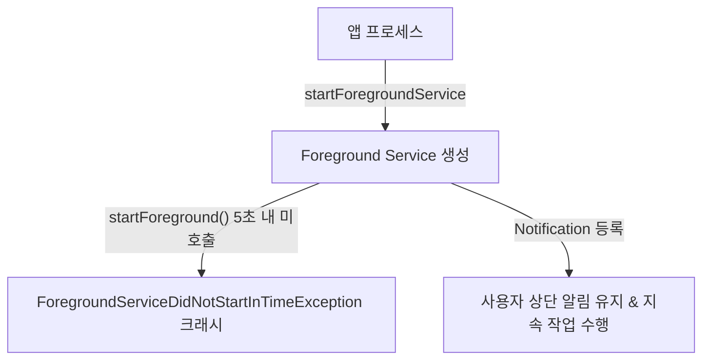

## Foreground Service (지속 백그라운드 작업 계약)

### 1. 개요 (Overview)

**Foreground Service (포그라운드 서비스)** 는 음악 재생, GPS 내비게이션, 운동 추적처럼 사용자가 지속적인 진행을 눈으로 인지해야 하는 백그라운드 작업을 실행하기 위한 Android 시스템 서비스 계약이다.

앱이 백그라운드로 전환되어도 OS 에 의해 프로세스가 수거되지 않으려면 반드시 지속 알림(Notification)을 등록해야 한다.

---

#### 초보자를 위한 쉽게 이해하는 비유

- **포그라운드 서비스 (경광등을 켜고 달리는 공사 차량)**:
  - 도로(OS)에서 차를 멈추지 않고 계속 작업(연속 백그라운드 작업)하려면 상단 알림창에 경광등(지속 알림 Notification)을 켜서 시민(사용자)에게 작업 중임을 항상 알려야 하는 규약.

---

### 2. 핵심 운영 원칙 및 버전별 제약

1. **Foreground Service Type 선언 (Android 14+ / target 34+)**:
   - `camera`, `microphone`, `location`, `mediaPlayback` 등 작업 성격에 맞는 서비스 타입을 매니페스트에 선언해야 하며, 불일치 시 예외가 발생한다.
2. **백그라운드 시작 제한 (Android 12+ / target 31+)**:
   - 앱이 백그라운드에 상주하는 동안에는 특별한 예외 조항을 제외하고 FGS 를 새로 시작할 수 없다 (`ForegroundServiceStartNotAllowedException`).
3. **타임아웃 제한 (Android 15+ / target 35+)**:
   - `dataSync` 및 `mediaProcessing` 타입은 24 시간 중 총 6 시간 제한을 받으며, `onTimeout()` 발생 시 즉시 상태를 저장하고 중지해야 한다.

---

### 3. 사용자와 시스템의 계약

- 작업이 끝나는 즉시 `stopSelf()` 또는 `stopForeground(STOP_FOREGROUND_REMOVE)` 를 호출하여 알림을 제거해야 한다.
- 사용자에게 가치가 없는 단순 파일 다운로드나 주기 동기화는 FGS 가 아닌 [WorkManager](work-manager.md) 로 처리해야 한다.

---

### 4. 연결 문서 (Related Links)

- [JobScheduler 및 백그라운드 스케줄러](../../job-scheduler.md)
- [WorkManager 예약 작업](work-manager.md)
- [Push Notification & FCM](../../../02_app_framework/push-notification-and-fcm.md)
