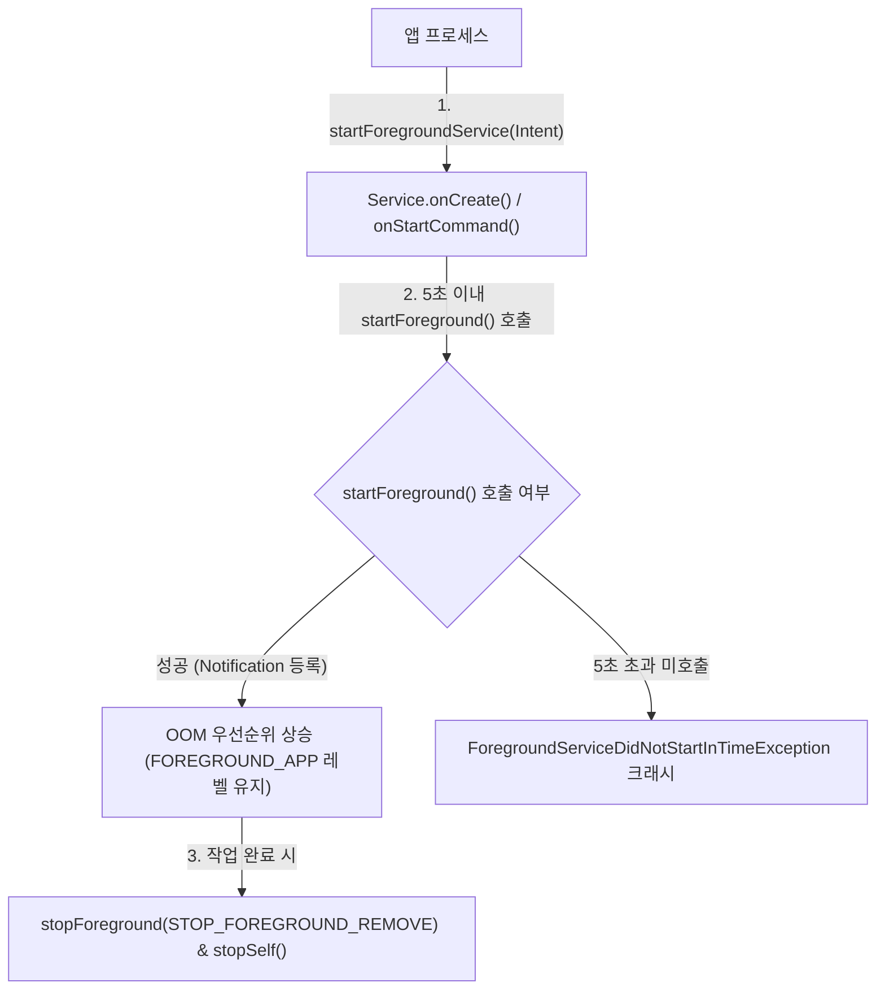

## Foreground Service (지속 백그라운드 작업 계약)

### 1. 개요 (Overview)

**Foreground Service (포그라운드 서비스, FGS)** 는 음악 재생, GPS 내비게이션, 통화, 피트니스 추적처럼 **사용자가 현재 진행 중임을 명확히 인지하고 있어야 하는 지속적인 백그라운드 작업**을 실행하기 위한 Android 시스템 서비스 계약이다.

앱 프로세스가 백그라운드로 내려가더라도 시스템에 의해 우선적으로 회수(OOM Kill)되지 않으려면, 서비스 시작 후 5초 이내에 반드시 사용자에게 상시 노출되는 **지속 알림(Ongoing Notification)** 을 등록해야 한다.

---

#### 초보자를 위한 쉽게 이해하는 비유

- **포그라운드 서비스 (경광등을 켜고 달리는 공사/구급 차량)**:
  - 도로(OS)에서 일반 차량(앱 프로세스)이 정차하거나 견인(OOM Kill)되지 않고 계속 달리기 위해 상단 알림창에 경광등(지속 알림 Notification)을 켜서 시민(사용자)에게 "지금 중요한 작업 중"임을 항상 알리는 규약.



---

### 2. 핵심 운영 원칙 및 버전별 진화

#### 1) Foreground Service Type 필수 선언 (Android 14+ / API 34+)
- `AndroidManifest.xml` 과 `startForeground()` 호출 시 작업 성격에 부합하는 `foregroundServiceType` 을 반드시 명시해야 하며, 해당 타입에 맞는 선행 런타임 권한이 요구된다:
  - `location`: `ACCESS_FINE_LOCATION` 또는 `ACCESS_COARSE_LOCATION`
  - `mediaPlayback`: 미디어 재생 세션 유지
  - `camera` / `microphone`: 포그라운드 액티비티에서만 시작 가능
  - `dataSync`: 데이터 전송 (WorkManager 또는 UIDT 우선 검토 권장)
  - `shortService`: 최대 3분 이내 완료 작업 (타입 전용)

#### 2) 백그라운드 시작 제한 (Android 12+ / API 31+)
- 앱이 백그라운드 상태인 동안에는 원칙적으로 `startForegroundService()` 를 호출할 수 없으며, 시도 시 `ForegroundServiceStartNotAllowedException` 이 발생한다.
- 고우선순위 FCM 푸시 수신, Exact Alarm 트리거, 특정 시스템 브로드캐스트 수신 등 명시적 예외 조건에서만 백그라운드 FGS 시작이 허용된다.

#### 3) 타임아웃 제한 및 `onTimeout()` (Android 15+ / API 35+)
- `dataSync` 및 `mediaProcessing` 타입은 **24시간 동안 총 6시간의 누적 실행 시간 한도**를 적용받는다.
- 한도 초과 시 시스템은 서비스의 `onTimeout(startId, fgsType)` 콜백을 호출하며, 앱은 즉시 상태를 영속화하고 `stopSelf()` 를 호출해야 한다. 무응답 시 ANR 및 강제 종료된다.

---

### 3. 표준 구현 코드 (Kotlin Example)

```kotlin
class LocationTrackingService : Service() {
    private val notificationId = 1001

    override fun onStartCommand(intent: Intent?, flags: Int, startId: Int): Int {
        val notification = createNotification()

        // Android 14+ 타입 지정 startForeground
        if (Build.VERSION.SDK_INT >= Build.VERSION_CODES.Q) {
            ServiceCompat.startForeground(
                this,
                notificationId,
                notification,
                ServiceInfo.FOREGROUND_SERVICE_TYPE_LOCATION
            )
        } else {
            startForeground(notificationId, notification)
        }

        startLocationUpdates()
        return START_STICKY
    }

    // Android 15+ FGS 타임아웃 대응
    override fun onTimeout(startId: Int, fgsType: Int) {
        saveTrackingCheckpoint()
        stopForeground(STOP_FOREGROUND_REMOVE)
        stopSelf()
    }

    override fun onDestroy() {
        stopLocationUpdates()
        super.onDestroy()
    }

    override fun onBind(intent: Intent?): IBinder? = null

    private fun createNotification(): Notification {
        // 지속 알림 생성 (채널 중요도 HIGH/DEFAULT)
        return NotificationCompat.Builder(this, "tracking_channel")
            .setContentTitle("위치 추적 중")
            .setContentText("실시간 이동 경로를 기록하고 있습니다.")
            .setSmallIcon(R.drawable.ic_location)
            .setOngoing(true)
            .build()
    }
}
```

---

### 4. 관측 신호 및 CLI 명령어 (CLI Verification)

```bash
# 1. 실행 중인 모든 포그라운드 서비스 및 FGS 타입 덤프
adb shell dumpsys activity services <package_name> | grep -E "isForeground=|foregroundServiceType="

# 2. 시스템 알림창에 등록된 FGS 알림 확인
adb shell dumpsys notification --noredact | grep -A 5 "LocationTrackingService"

# 3. Android 15+ FGS 타임아웃 시뮬레이션
adb shell cmd activity timeout-service <package_name>/<service_class_name>
```

---

### 5. 연관 문서 (Related Links)

- [백그라운드 작업 계약](background-work.md)
- [Android 백그라운드 실행은 보장, 지연, 사용자 가시성으로 선택한다](background-execution-selection.md)
- [WorkManager 지연 가능한 보장 작업](work-manager.md)
- [JobScheduler 및 백그라운드 스케줄러](job-scheduler.md)
- [Android 알림은 권한과 채널이 표시 가능성을 결정한다](notification-permission-channel.md)
- [system_server 표준 레퍼런스](../../01_system_internals/boot-and-runtime/system-server/system-server.md)

