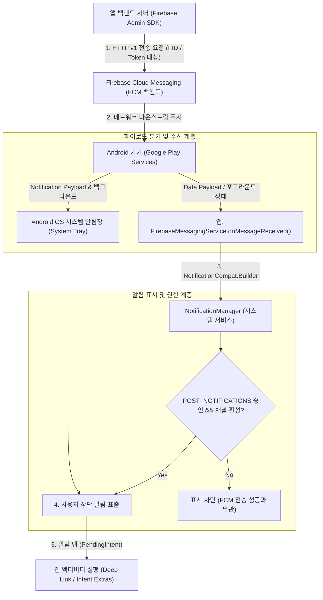

## 알림과 FCM 메시징 계약

이 지도는 **서버 메시지 전송(FCM), 앱 인스턴스 식별(FID/Token), 페이로드 해석(Notification vs Data Payload), Android 알림 권한 및 채널(`POST_NOTIFICATIONS`), 그리고 운영 관측**이라는 5가지 독립된 계층을 체계적으로 분리하여 다룬다.



### 주요 메커니즘 및 코드 예시 (Mechanisms & Code Examples)

1. **전송과 표시의 엄격한 분리**: FCM 은 메시지 라우팅 전송망이며, Android Notification 은 로컬 디스플레이 UI 다. 둘의 성공 여부는 완전히 독립적이다.
2. **`FID` (Firebase Installation ID) & Token**: 사용자 계정이 아닌 특정 앱 인스턴스(기기+설치)를 가리킨다.
3. **Payload 분기**: `notification` 페이로드는 백그라운드 시 시스템이 자동 표시하고, `data` 페이로드는 항상 `onMessageReceived()` 로 앱에 전달된다.
4. **`POST_NOTIFICATIONS` (Android 13+) & Channels (Android 8+)**: 권한이 거부되거나 채널이 차단되면 FCM 전송이 성공해도 알림창에 뜨지 않는다.

```kotlin
// 1. FirebaseMessagingService 구현 패턴
class MyFirebaseMessagingService : FirebaseMessagingService() {
    override fun onMessageReceived(remoteMessage: RemoteMessage) {
        // Data Payload 추출
        val data = remoteMessage.data
        val messageId = data["message_id"]

        // 긴 비즈니스 동기화 작업은 WorkManager 위임
        if (data["sync_required"] == "true") {
            enqueueSyncWorker(messageId)
        }

        // 로컬 알림 생성 및 게시
        showNotification(remoteMessage)
    }

    override fun onNewToken(token: String) {
        // 새 인스턴스 토큰을 백엔드 서버에 동기화
        sendTokenToServer(token)
    }
}
```

### 관찰 신호 및 CLI 검증 (Observation Signals)

```bash
# 1. 특정 패키지의 게시된 알림, 알림 채널 목록 및 중요도 덤프
adb shell dumpsys notification --noredact | grep -A 10 "<package_name>"

# 2. Android 13+ 알림 런타임 권한 승인 상태 확인
adb shell dumpsys package <package_name> | grep -A 5 "android.permission.POST_NOTIFICATIONS"

# 3. 테스트 알림 채널 차단 시뮬레이션
adb shell cmd notification set_bubbles <package_name> 0
```

### 읽는 순서 (Recommended Reading Order)

1. [FCM은 메시지 전송 서비스이지 비즈니스 실행 보장이 아니다](./fcm-delivery-guarantee.md): 전송과 실행 보장의 분리, 멱등성 설계.
2. [FCM 등록 식별자는 사용자 계정이 아니라 앱 인스턴스를 가리킨다](./fcm-registration-token.md): FID 및 토큰 수명주기, 서버 정리 정책.
3. [FCM notification payload와 data payload는 처리 지점이 다르다](./fcm-payload-handling.md): 포그라운드/백그라운드 수신 분기표, 4KB 제한.
4. [Android 알림은 권한과 채널이 표시 가능성을 결정한다](./notification-permission-channel.md): `POST_NOTIFICATIONS`, 채널 중요도, FGS notice.
5. [FCM high priority는 사용자 가시 알림에만 정당화된다](./fcm-high-priority.md): Doze 우회 조건, 우선순위 강등 방지.
6. [FCM 운영은 전달, 표시, 탭, 복구를 분리해 관측한다](./fcm-delivery-lifecycle.md): 종단간 관측 지표 및 문제 격리.

### 문제 분류 (Troubleshooting Matrix)

| 증상 | 먼저 확인할 경계 | 점검 CLI / 진단 신호 |
| :--- | :--- | :--- |
| FCM 서버 전송은 성공인데 앱 콜백/알림 무반응 | 메시지 타입(`notification` 백그라운드), 기기 연결 상태 | `dumpsys notification` |
| `onMessageReceived` 는 오는데 화면에 알림이 안 뜸 | `POST_NOTIFICATIONS` 미승인 또는 해당 채널 차단 | `dumpsys package` 권한 덤프 |
| 알림을 눌렀는데 잘못된 화면이 열림 | `PendingIntent` 내 Intent extras 파싱 또는 flag 누락 | Logcat Activity 시작 로그 |
| 특정 사용자 기기에만 푸시가 누락됨 | 오래된 등록 토큰(270일 만료) 또는 계정-FID 매핑 불일치 | 백엔드 `UNREGISTERED` 응답 확인 |
| high priority 푸시가 Doze 상태에서 지연됨 | 사용자 가시 알림 미발행으로 인한 구글 인프라 우선순위 강등 | FCM 전달 통계 지표 대조 |

### 책임 경계 (Architectural Boundaries)

- **FCM 백엔드**는 메시지 라우팅 전송을 담당하고, **앱 서버**는 사용자와 기기 인스턴스의 매핑 및 보안 권한을 담당한다.
- **수신 콜백(`onMessageReceived`)** 은 장시간 비즈니스 연산 컨테이너가 아니며, 지속 작업은 반드시 [WorkManager](work-manager.md) 로 위임해야 한다.
- 알림 표시 권한(`POST_NOTIFICATIONS`)과 채널은 클라이언트 로컬 정책이며, FCM 서버는 클라이언트의 표시 성공 여부를 직접 인지하지 못한다.

### 노트 목록 (Topic Notes)

- [FCM은 메시지 전송 서비스이지 비즈니스 실행 보장이 아니다](./fcm-delivery-guarantee.md)
- [FCM 등록 식별자는 사용자 계정이 아니라 앱 인스턴스를 가리킨다](./fcm-registration-token.md)
- [FCM notification payload와 data payload는 처리 지점이 다르다](./fcm-payload-handling.md)
- [Android 알림은 권한과 채널이 표시 가능성을 결정한다](./notification-permission-channel.md)
- [FCM high priority는 사용자 가시 알림에만 정당화된다](./fcm-high-priority.md)
- [FCM 운영은 전달, 표시, 탭, 복구를 분리해 관측한다](./fcm-delivery-lifecycle.md)

관련 지도: [백그라운드 작업 계약](background-work.md)

검증일: 2026-08-24. [Firebase Cloud Messaging 공식 문서](https://firebase.google.com/docs/cloud-messaging) 및 [Android 알림 가이드](https://developer.android.com/develop/ui/views/notifications)를 기준으로 최신 전송/표시 계약 검증 완료.

