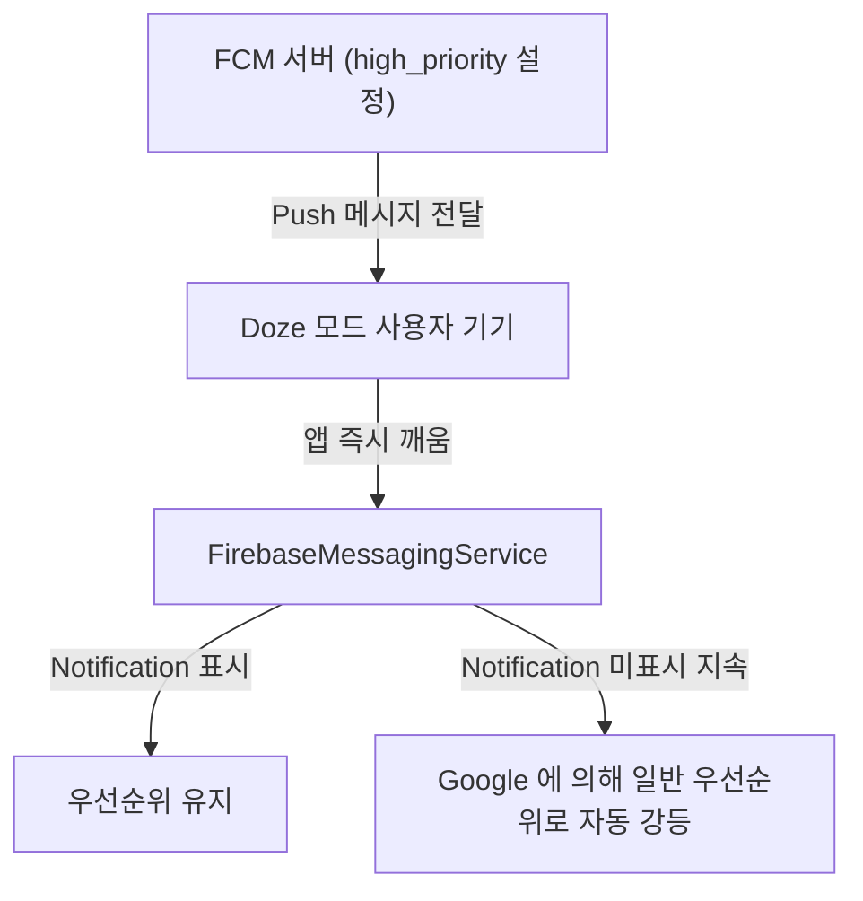

# Fcm High Priority

## 1. 개요 (Overview)

### 초보자를 위한 쉽게 이해하는 비유
* **FCM High Priority (긴급 신호 사이렌)**:
  - Doze 모드로 잠든 앱을 즉시 깨우는 긴급 사이렌 메시지로, 반드시 사용자 화면에 눈에 보이는 알림(User-visible Notification)을 띄워야만 구글이 우선순위 강등을 방지해 주는 규약.



---

---

## FCM high priority 는 사용자 가시 알림에만 정당화된다

상위 문서: [Android 시스템 서비스와 기기 기능 지도](../../android-system-services-and-device-capabilities.md)

관련 지도: [알림과 FCM 메시징 계약](./notification-messaging.md)

관련 노트: [FCM은 메시지 전송 서비스이지 비즈니스 실행 보장이 아니다](./fcm-delivery-guarantee.md), [Android 알림은 권한과 채널이 표시 가능성을 결정한다](./notification-permission-channel.md)

### normal 과 high

Android FCM downstream 메시지의 전송 우선순위는 normal 과 high 로 나뉜다.

normal 은 기본값이며 기기가 Doze 상태면 배터리 절약을 위해 전달이 지연될 수 있다.

UI 동기화, 새 이메일, 주기적 데이터 갱신처럼 즉시성이 낮은 작업은 normal 을 사용한다.

high 는 FCM 이 Doze 중에도 즉시 전달을 시도하는 시간 민감한 사용자 가시 콘텐츠용이다.

HTTP v1 API 에서는 `android` 객체의 `priority` 필드로 지정한다.

```json
"android": {
  "priority": "high"
}
```

### high 의 조건

high priority 는 앱 코드를 무제한 실행시키는 권한이 아니다.

짧은 콜백 시간 안에 사용자에게 실제로 보이는 알림을 게시하는 흐름과 함께 사용해야 한다.

FCM 은 개별 앱 인스턴스의 최근 동작을 보고 사용자 표시로 이어지지 않는 high 메시지를 낮출 수 있다.

따라서 데이터 동기화만을 위해 모든 메시지를 high 로 보내지 않는다.

### 수신 콜백의 한계

`onMessageReceived` 는 짧은 실행 창을 가지며 프로세스 시작, 메인 스레드 차단, 이전 작업에 영향을 받는다.

콜백 안에서 큰 파일 다운로드, 긴 API 체인, 복잡한 DB 마이그레이션을 수행하지 않는다.

즉시 필요한 최소 처리만 하고, 지속 작업은 WorkManager 같은 수명주기 인식 작업으로 예약한다.

작업 예약 전에는 payload 의 이벤트 ID 로 중복 작업을 합치거나 취소할 수 있게 한다.

### 전달 실패와 재동기화

메시지가 누락되거나 여러 메시지가 합쳐질 수 있으므로 FCM 을 데이터베이스 변경 로그로 간주하지 않는다.

`onDeletedMessages` 가 오면 서버와 전체 동기화를 수행하는 복구 경로를 둔다.

앱이 오랫동안 메시지를 받지 않았으면 해당 콜백이 호출되지 않을 수 있으므로 앱 시작 동기화도 필요하다.

### 운영 판단표

| 목적 | 권장 방식 |
| --- | --- |
| 사용자에게 즉시 알려야 함 | high + 실제 사용자 알림 |
| 화면 상태를 나중에 맞춤 | normal + 재동기화 |
| 긴 백그라운드 작업 | 수신 후 WorkManager 예약 |
| 생명·안전이 걸린 경보 | FCM 을 단일 안전 장치로 사용하지 않음 |

### 배터리와 정책의 균형

high 는 사용자가 알아야 할 사건과 직접 연결하고, 단순 프리페치나 분석 업로드에는 사용하지 않는다.

Doze 해제 직후에도 네트워크가 안정적이라고 가정하지 말고 작업 재시도를 설계한다.

제조사별 배터리 최적화 정책으로 Android 동작이 더 제한될 수 있음을 운영 문서에 남긴다.

### 참고

- [FCM 메시지 우선순위](https://firebase.google.com/docs/cloud-messaging/android-message-priority)
- [메시지 우선순위 설정](https://firebase.google.com/docs/cloud-messaging/customize-messages/setting-message-priority)

검증일: 2026-08-03. high priority 의 Doze 전달 시도, 짧은 처리 시간, 사용자 표시가 없을 때의 하향 가능성을 Firebase 공식 문서에서 확인했다.


## 4. 연결 문서 (Related Links)
- [Push Notification & FCM 표준 레퍼런스](../../../02_app_framework/architecture/app-components/push-notification-and-fcm.md)
- [JobScheduler 표준 레퍼런스](../../job-scheduler.md)
