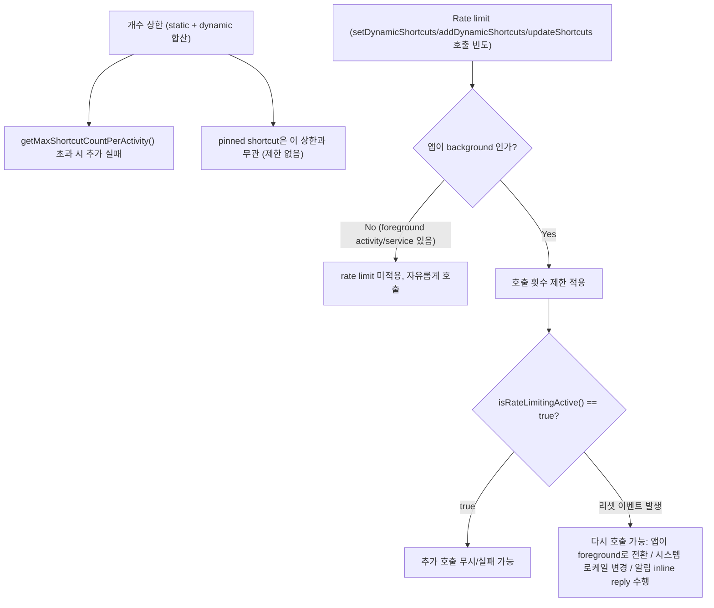

## ShortcutManager는 동적 shortcut 개수를 제한하고 백그라운드 갱신에 rate limit을 건다

상위 문서: [Android 시스템 서비스와 기기 기능 지도](../../android-system-services-and-device-capabilities.md)
관련 지도: [App Shortcuts 접근 계약](app-shortcuts.md)

### 핵심 정의

**ShortcutManager**(앱 숏컷의 생성·갱신 및 시스템 차원의 백그라운드 빈도 제약을 관리하는 Android 시스템 서비스)는 두 가지 서로 다른 제약을 건다. 하나는 "몇 개까지 만들 수 있는가"라는 개수 상한이고, 다른 하나는 "얼마나 자주 갱신 API를 호출할 수 있는가"라는 **rate limit**(호출 비율 제한: 시스템 자원 및 배터리 과소비를 막기 위해 단위 시간당 API 호출 횟수를 제한하는 방어 메커니즘)이다.

> "Each app's launcher icon can contain, at most, a number of static and dynamic shortcuts combined that is equal to the value returned by `getMaxShortcutCountPerActivity`. There isn't a limit to the number of pinned shortcuts that an app can create."

### 메커니즘

**개수 상한**은 빌드 리소스로 고정된 **static shortcut**과 코드로 생성하는 **dynamic shortcut**을 합친 값에만 적용된다. `ShortcutManagerCompat.getMaxShortcutCountPerActivity(context)`가 반환하는 값은 런처/기기에 따라 다를 수 있으므로 하드코딩하지 않는다. **Pinned shortcut**(사용자가 홈 화면에 아이콘을 직접 고정하여 런처가 소유권을 갖는 숏컷)은 이 상한과 무관하게 개수 제한이 없다 — pin은 launcher가 소유하는 별도 카운트이기 때문이다.

**Rate limiting**은 `setDynamicShortcuts()`, `addDynamicShortcuts()`, `updateShortcuts()`처럼 shortcut을 바꾸는 메서드에 걸린다. 단, 이 제한은 앱이 백그라운드일 때만 적용된다.

> "When using the `setDynamicShortcuts`, `addDynamicShortcuts`, or `updateShortcuts` methods, you might only be able to call these methods a specific number of times in a background app — an app with no activities or services in the foreground. The limit on the specific number of times you can call these methods is called rate limiting."

Rate limiting이 걸렸는지는 `isRateLimitingActive()`로 확인한다.

> "When rate limiting is active, `isRateLimitingActive` returns true."

Rate limiting은 특정 이벤트가 발생하면 초기화된다.

> "However, rate limiting is reset during certain events, so even background apps can call `ShortcutManager` methods until the rate limit is reached again. These events include the following: An app comes to the foreground. The system locale changes. The user performs the inline reply action on a notification."

이 초기화 이벤트 목록에서 중요한 함의는, 앱이 포그라운드에 있는 동안에는 rate limit이 문제가 되지 않는다는 것이다. 제약은 오직 "포그라운드 Activity/Service 없이 백그라운드에서 shortcut을 계속 갱신하려는" 시나리오에만 적용된다.

### 코드 예시

```kotlin
fun pushRecentChatShortcut(context: Context, chat: RecentChat): Boolean {
    val shortcutManager = context.getSystemService(ShortcutManager::class.java)

    // 백그라운드에서 반복 갱신 중이라면 먼저 rate limit 상태를 확인한다.
    if (shortcutManager != null && shortcutManager.isRateLimitingActive) {
        // 지금은 갱신을 미루고, 포그라운드 복귀 시 재시도하도록 큐에 남긴다.
        return false
    }

    val maxCount = ShortcutManagerCompat.getMaxShortcutCountPerActivity(context)
    val currentDynamic = ShortcutManagerCompat.getDynamicShortcuts(context)

    val shortcut = ShortcutInfoCompat.Builder(context, chat.id)
        .setShortLabel(chat.title)
        .setIntent(Intent(context, ChatActivity::class.java).setAction(Intent.ACTION_VIEW))
        .build()

    // static shortcut 개수까지 합쳐 상한을 넘지 않도록 오래된 항목을 먼저 정리한다.
    if (currentDynamic.size >= maxCount) {
        val oldest = currentDynamic.minByOrNull { it.rank }
        oldest?.let { ShortcutManagerCompat.removeDynamicShortcuts(context, listOf(it.id)) }
    }

    return ShortcutManagerCompat.pushDynamicShortcut(context, shortcut)
        .let { true }
}
```

### 다이어그램



### 판단 기준

- 백그라운드에서 반복적으로 shortcut을 갱신하는 로직(예: 서버 푸시를 받을 때마다 최근 항목 갱신)에는 항상 `isRateLimitingActive()`를 먼저 확인하고, 걸려 있으면 갱신을 지연시키거나 다음 포그라운드 진입 시로 미룬다.
- 개수 상한에 도달했을 때 무작정 추가를 실패시키지 말고, 오래된/우선순위가 낮은 dynamic shortcut을 제거한 뒤 새 항목을 추가하는 정책을 미리 설계한다.
- pinned shortcut은 개수 제한이 없다고 해서 무한정 pin을 유도하는 UX를 설계하지 않는다 — 사용자 홈 화면의 실제 공간은 여전히 유한하다.

### 경계

- 이 노트는 개수/rate limit 계약까지만 다룬다. static/dynamic/pinned의 소유권과 lifecycle 차이는 [static/dynamic/pinned shortcut은 소유권과 lifecycle이 다르다](shortcut-ownership-lifecycles.md)가 다룬다.
- Google 검색/어시스턴트 같은 Google 표면에 shortcut을 노출하는 별도 경로(Google Shortcuts Integration Library)의 세부는 이 노트가 다루지 않는다.

### 관찰 가능한 신호

개발/테스트 중 rate limit에 걸리면 다음으로 즉시 초기화할 수 있다.

```
adb shell cmd shortcut reset-throttling [--user <user-id>]
```

또는 기기 설정의 개발자 옵션에서 "Reset ShortcutManager rate-limiting"을 선택해도 같은 효과를 얻는다. `isRateLimitingActive()`가 `true`를 반환하는 상태에서 `pushDynamicShortcut()`을 호출하면 반환값이 갱신 실패를 나타내며, 이 시점에 위 명령으로 리셋한 뒤 재시도하면 정상적으로 갱신되는 것으로 rate limit이 원인이었음을 확인할 수 있다.

### 공식 문서

- [Manage shortcuts](https://developer.android.com/develop/ui/views/launch/shortcuts/managing-shortcuts)

검증일: 2026-08-04.
