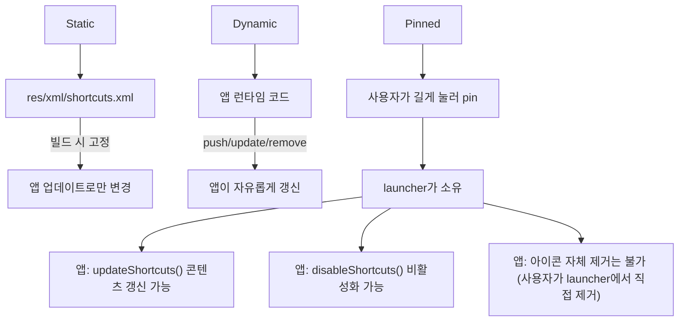

## static/dynamic/pinned shortcut은 소유권과 lifecycle이 다르다

상위 문서: [Android 시스템 서비스와 기기 기능 지도](../../android-system-services-and-device-capabilities.md)
관련 지도: [App Shortcuts 접근 계약](./app-shortcuts.md)

### 핵심 정의

**App Shortcuts**(앱 아이콘 길게 누르기 메뉴나 시스템 검색에서 특정 화면으로 즉시 연결하는 단축 경로)는 세 종류로 나뉘고, 이 셋은 이름만 비슷할 뿐 "누가 만들고, 누가 갱신하고, 누가 지울 수 있는가"라는 소유권과 생명주기(lifecycle)가 모두 다르다.

> "Static shortcuts are defined in a resource file that is packaged into an APK or app bundle."
>
> "Dynamic shortcuts can be pushed, updated, and removed by your app only at runtime."
>
> "Pinned shortcuts can be added to supported launchers at runtime if the user grants permission." ... "Your app can't remove pinned shortcuts, but it can disable them."

### 메커니즘

**Static shortcut**은 빌드 시점에 XML 리소스로 고정된다. 개발자가 앱을 업데이트해 리소스를 바꾸지 않는 한 내용이 바뀌지 않는다. 런타임 코드는 static shortcut을 추가/삭제할 수 없다 — 오직 리소스 선언만이 static shortcut의 정본이다.

**Dynamic shortcut**은 정반대로 오직 런타임 코드로만 관리되는 동적 단축 경로다. 앱이 AndroidX의 **ShortcutManagerCompat**(AndroidX에서 제공하는 하위 버전 호환용 ShortcutManager 래퍼 라이브러리)의 `setDynamicShortcuts()`, `pushDynamicShortcut()`, `removeDynamicShortcuts()`를 호출해 추가/갱신/삭제하며, 리소스 파일에는 선언되지 않는다. 최근에 연 문서, 최근 대화 상대처럼 사용 패턴에 따라 계속 바뀌는 항목에 맞는 모델이다.

**Pinned shortcut**은 소유권이 앱에서 사용자(런처)로 넘어가는 유일한 종류다. 사용자가 static/dynamic shortcut을 길게 눌러 홈 화면에 "고정"하면, 그 순간부터 launcher가 아이콘의 존재 자체를 소유한다. 앱은 이후 그 shortcut의 콘텐츠(라벨, 아이콘, 대상 Intent)를 `updateShortcuts()`로 갱신하거나 `disableShortcuts()`로 비활성화할 수는 있지만, 홈 화면에서 아이콘 자체를 제거할 권한은 없다. 제거는 사용자가 직접 launcher에서 수행해야 한다.

이 소유권 이전은 shortcut ID를 매개로 이뤄진다. static/dynamic shortcut이 pin되면 launcher는 그 shortcut의 ID를 별도로 기억한다. 앱이 나중에 같은 ID의 dynamic shortcut을 삭제해도, 이미 pin된 사본은 launcher에 남아있고 앱은 그 사본을 `updateShortcuts()`로 계속 갱신할 수 있다 — pin된 사본은 원본 dynamic shortcut의 lifecycle과 분리된 별도 개체다.

### 코드 예시

Static shortcut(리소스 선언, `res/xml/shortcuts.xml`):

```xml
<shortcuts xmlns:android="http://schemas.android.com/apk/res/android">
    <shortcut
        android:shortcutId="compose"
        android:enabled="true"
        android:icon="@drawable/ic_compose"
        android:shortcutShortLabel="@string/compose_short_label">
        <intent
            android:action="android.intent.action.VIEW"
            android:targetPackage="com.example.app"
            android:targetClass="com.example.app.ComposeActivity" />
    </shortcut>
</shortcuts>
```

Dynamic shortcut(런타임 코드로만 관리):

```kotlin
val shortcut = ShortcutInfoCompat.Builder(context, "recent_chat_42")
    .setShortLabel("최근 대화")
    .setIcon(IconCompat.createWithResource(context, R.drawable.ic_chat))
    .setIntent(Intent(context, ChatActivity::class.java).setAction(Intent.ACTION_VIEW))
    .build()

ShortcutManagerCompat.pushDynamicShortcut(context, shortcut)
// 삭제도 오직 코드로만: 리소스에는 이 shortcut이 존재하지 않는다.
ShortcutManagerCompat.removeDynamicShortcuts(context, listOf("recent_chat_42"))
```

Pinned shortcut(사용자 동의가 필요한 요청):

```kotlin
if (ShortcutManagerCompat.isRequestPinShortcutSupported(context)) {
    val pinShortcutInfo = ShortcutInfoCompat.Builder(context, "recent_chat_42")
        .setShortLabel("최근 대화")
        .setIntent(Intent(context, ChatActivity::class.java).setAction(Intent.ACTION_VIEW))
        .build()
    ShortcutManagerCompat.requestPinShortcut(context, pinShortcutInfo, /* resultIntent = */ null)
}

// pin된 이후에는 삭제가 아니라 콘텐츠 갱신 또는 비활성화만 가능하다.
ShortcutManagerCompat.updateShortcuts(context, listOf(updatedShortcutInfo))
ShortcutManagerCompat.disableShortcuts(context, listOf("recent_chat_42"), "더 이상 사용할 수 없음")
```

### 다이어그램



### 판단 기준

- 앱 업데이트 없이는 바뀌지 않는 핵심 진입점(작성, 검색 등)은 static shortcut으로 선언한다.
- 사용 이력이나 컨텍스트에 따라 계속 바뀌는 항목(최근 문서, 최근 대화)은 dynamic shortcut으로 관리한다.
- 사용자가 자주 쓰는 특정 항목을 홈 화면에 직접 노출하고 싶어할 만한 기능이면 `requestPinShortcut()`으로 pin을 제안하되, pin 이후에는 앱이 그 아이콘을 강제로 없앨 수 없다는 것을 UX 설계에 반영한다(대신 `disableShortcuts()`로 눌렀을 때 안내 메시지를 띄우는 방식을 쓴다).

### 경계

- 이 노트는 세 종류의 소유권/lifecycle 차이까지만 다룬다. 개수 상한과 rate limit은 [ShortcutManager는 동적 shortcut 개수를 제한하고 백그라운드 갱신에 rate limit을 건다](shortcut-manager-rate-limits.md)가 다룬다.
- shortcut이 실행하는 Intent가 어떤 Task로 열리는지의 일반 Intent/Task 계약은 이 노트가 반복하지 않는다.

### 관찰 가능한 신호

`adb shell cmd shortcut get-shortcuts --user 0 <패키지명>`(또는 기기별 지원 여부에 따라 `dumpsys shortcut`)로 현재 앱의 static/dynamic/pinned shortcut 목록과 각각의 `isPinned()`/`isDynamic()`/`isDeclaredInManifest()` 플래그를 확인할 수 있다. pin된 shortcut을 앱이 `removeDynamicShortcuts()`로 지워도 이 출력에서 `isPinned() == true`인 사본이 남아있는 것을 관찰하면 소유권 분리를 직접 확인할 수 있다.

### 공식 문서

- [Shortcuts overview](https://developer.android.com/develop/ui/views/launch/shortcuts)
- [Manage shortcuts](https://developer.android.com/develop/ui/views/launch/shortcuts/managing-shortcuts)

검증일: 2026-08-04.
