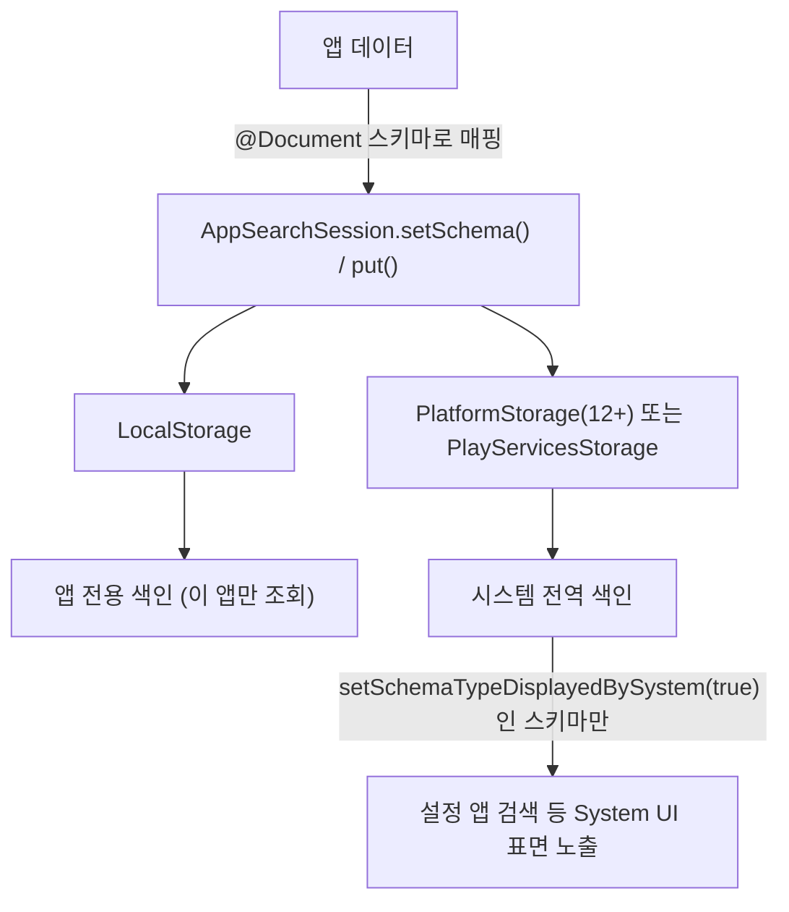

## AppSearch는 클라우드 검색 엔진이 아니라 온디바이스 검색 색인이다

상위 문서: [Android 시스템 서비스와 기기 기능 지도](../../android-system-services-and-device-capabilities.md)
관련 지도: [AppSearch 접근 계약](./appsearch.md)

### 핵심 정의

공식 문서는 **AppSearch**(앱 내부 데이터의 빠른 조회를 지원하는 로컬 구조화 데이터 전문 검색 솔루션)를 다음과 같이 정의한다.

> "AppSearch is a high-performance on-device search solution for managing locally stored, structured data. It contains APIs for indexing data and retrieving data using full-text search. Applications can use AppSearch to offer custom in-app search capabilities, allowing users to search for content even while offline."

즉 AppSearch는 서버로 쿼리를 보내는 클라우드 검색 서비스가 아니라, 기기 안에 구조화된 데이터를 색인해 오프라인에서도 **전문 검색**(full-text search: 문서 내의 모든 단어를 검색용 키워드로 추출·색인하여 정교하게 검색하는 기술)이 가능하게 하는 라이브러리다. Firebase 같은 원격 검색 백엔드와 혼동하면 안 된다.

### 메커니즘

AppSearch 세션은 세 가지 저장소(storage) 구현 중 하나로 연다.

- `LocalStorage`: 앱 전용 샌드박스 디렉토리에 색인을 저장한다. 이 앱만 조회할 수 있다.
- `PlatformStorage`(Android 12+): 시스템 서버가 호스팅하는 시스템 전역 중앙 색인이다.
- `PlayServicesStorage`(모든 API 레벨): Google Play services가 호스팅하는 시스템 전역 중앙 색인이다.

`PlatformStorage`나 `PlayServicesStorage`로 색인한 데이터라도 자동으로 시스템 UI에 노출되지는 않는다. 공식 문서는 다음과 같이 설명한다.

> "Additionally with `PlatformStorage`, data that is indexed can be displayed on System UI surfaces. Applications can opt out of some or all of their data being displayed on System UI surfaces."

즉 System UI(설정 앱 검색 등) 노출은 옵트인이며, 스키마 타입별로 `setSchemaTypeDisplayedBySystem()`을 명시적으로 켜야 한다.

### 코드 예시

```kotlin
@Document
data class Note(
    @Document.Namespace val namespace: String,
    @Document.Id val id: String,
    @Document.Score val score: Int,
    @Document.StringProperty(
        indexingType = AppSearchSchema.StringPropertyConfig.INDEXING_TYPE_PREFIXES
    )
    val text: String,
)

// System UI 검색 표면에 이 스키마 타입을 노출할지 명시적으로 설정한다.
val setSchemaRequest = SetSchemaRequest.Builder()
    .addDocumentClasses(Note::class.java)
    .setSchemaTypeDisplayedBySystem("Note", /* displayed = */ true)
    .build()
```

### 다이어그램



### 판단 기준

- 앱 안에서만 검색이 필요하면 `LocalStorage`로 충분하다.
- 설정 앱 검색이나 향후 Assistant 연동처럼 시스템 전역 검색에 데이터가 노출돼야 하면 `PlatformStorage`(Android 12+) 또는 `PlayServicesStorage`를 선택하고, 노출을 원하는 스키마 타입마다 `setSchemaTypeDisplayedBySystem()`을 켠다.
- 민감한 데이터를 담은 스키마 타입은 기본값(비노출)을 유지해 의도치 않게 System UI에 노출되지 않게 한다.

### 경계

- 이 노트는 저장소 선택과 System UI 노출 계약만 다룬다. 스키마 변경 시 마이그레이션 계약은 [Document 스키마 변경은 명시적 마이그레이션이 없으면 호환되지 않는 데이터를 삭제한다](./document-schema-changes-require-explicit-migration-or-forceoverride-deletes-data.md)가 다룬다.
- AppSearch는 클라우드 동기화 서비스가 아니다. 여러 기기 간 데이터 동기화가 필요하면 별도의 백엔드 동기화 계약이 필요하며 이 노트의 범위가 아니다.
- 전문 검색 랭킹 알고리즘의 내부 구현(토크나이저, relevance scoring 세부)은 다루지 않는다.

### 관찰 가능한 신호

`LocalStorage`만 사용한 상태에서는 설정 앱 검색이나 다른 시스템 UI 표면에 해당 데이터가 절대 나타나지 않는다 — 이는 저장소 선택 자체의 문제이지 `setSchemaTypeDisplayedBySystem()` 설정 여부와 무관하다. `PlatformStorage`/`PlayServicesStorage`를 쓰고도 데이터가 안 보이면 해당 스키마 타입에 `setSchemaTypeDisplayedBySystem(type, true)`를 호출했는지 먼저 확인한다.

### 공식 문서

- [AppSearch overview](https://developer.android.com/guide/topics/search/appsearch)

검증일: 2026-08-05.
