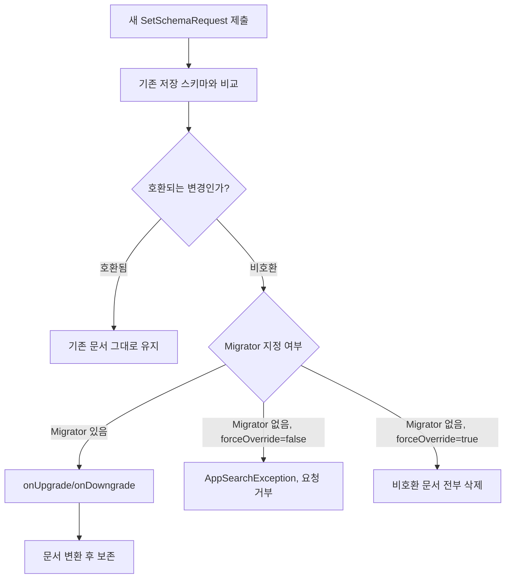

## Document 스키마 변경은 명시적 마이그레이션이 없으면 호환되지 않는 데이터를 삭제한다

상위 문서: [Android 시스템 서비스와 기기 기능 지도](../../android-system-services-and-device-capabilities.md)
관련 지도: [AppSearch 접근 계약](./appsearch.md)

### 핵심 정의

`SetSchemaRequest`(AppSearch 색인 데이터베이스의 스키마 구조와 버전을 등록하는 요청 개체)를 처음 호출하면 제공한 스키마가 `AppSearchSession` 데이터베이스에 그대로 저장된다. 이후 호출은 새로 제공한 스키마를 이전에 저장된 스키마와 비교해 기존 문서를 어떻게 처리할지 결정한다. 이 비교에서 호환되지 않는 변경(예: 필드 삭제, 타입 변경)이 발견되면, **Migrator**(스키마 버전을 올리거나 내릴 때 구버전 문서를 신버전 포맷으로 변환하는 마이그레이션 핸들러)를 지정하지 않는 한 해당 스키마 타입의 기존 문서는 삭제 대상이 된다.

### 메커니즘

스키마 호환성 처리는 세 가지 경로로 갈린다.

- **호환되는 변경**(예: 새 필드 추가): 별도 조치 없이 기존 문서가 유지된다.
- **비호환 변경 + `forceOverride` 미설정**: `SetSchemaRequest`가 거부되고 `AppSearchException`이 발생한다.
- **비호환 변경 + `forceOverride(true)`**: 새 스키마와 호환되지 않는 기존 문서가 전부 삭제된 뒤 새 스키마가 저장된다.
- **비호환 변경 + `Migrator` 지정**: `Migrator`가 기존 **GenericDocument**(AppSearch 데이터베이스 내에서 엔티티 구조를 표준 형태로 나타내는 개체)를 새 스키마 버전으로 변환해 데이터를 보존한다. `Migrator`는 스키마에 부여한 버전 번호(`setVersion()`)가 이전에 저장된 버전과 다를 때만 `onUpgrade()`/`onDowngrade()`로 트리거된다.

즉 스키마 버전을 올릴 때 필드를 삭제하거나 타입을 바꿨다면, `Migrator`를 등록하지 않고 `forceOverride(true)`만 켜는 배포는 사용자의 기존 색인 데이터를 조용히 지우는 결과로 이어진다.

### 코드 예시

```kotlin
val setSchemaRequest = SetSchemaRequest.Builder()
    .addDocumentClasses(Note::class.java)
    .setVersion(2) // 이전에 저장된 버전과 다르면 마이그레이션이 트리거된다.
    .setMigrator(
        "Note",
        object : Migrator(startVersion = 1, targetVersion = 2) {
            override fun shouldMigrate(currentVersion: Int, finalVersion: Int) =
                currentVersion < finalVersion

            override fun onUpgrade(
                currentVersion: Int,
                finalVersion: Int,
                document: GenericDocument,
            ): GenericDocument {
                // v1 문서를 v2 스키마 형태로 변환해 반환한다.
                return GenericDocument.Builder<GenericDocument.Builder<*>>(document)
                    .build()
            }

            override fun onDowngrade(
                currentVersion: Int,
                finalVersion: Int,
                document: GenericDocument,
            ): GenericDocument = document
        },
    )
    .build()
```

### 다이어그램



### 판단 기준

- 필드를 추가만 하는 변경은 대개 안전하며 별도 조치가 필요 없다.
- 필드를 삭제하거나 타입을 바꾸는 변경은 배포 전에 반드시 `Migrator`를 작성해 기존 데이터를 새 버전으로 옮길지, 데이터 손실을 감수하고 `forceOverride(true)`로 밀어붙일지 결정해야 한다.
- 사용자가 직접 만든 데이터(메모, 즐겨찾기 등)를 담은 스키마는 `forceOverride`만으로 처리하면 안 되며 `Migrator`를 우선 검토한다. 순수 캐시성 데이터는 `forceOverride`로 재구축해도 무방하다.

### 경계

- 이 노트는 스키마 버전 비교와 마이그레이션 계약만 다룬다. 저장소 선택과 System UI 노출 계약은 [AppSearch는 클라우드 검색 엔진이 아니라 온디바이스 검색 색인이다](appsearch-on-device-indexing.md)가 다룬다.
- 검색 쿼리 문법이나 랭킹 튜닝은 이 노트의 범위가 아니다.

### 관찰 가능한 신호

`SetSchemaResponse.getMigrationFailures()`는 마이그레이션 중 저장에 실패한 문서 목록을 `SetSchemaResponse.MigrationFailure`로 돌려준다. `getIncompatibleTypes()`로는 이번 요청에서 비호환으로 판정된 스키마 타입 이름을 확인할 수 있다. `Migrator` 없이 비호환 변경을 `forceOverride` 없이 배포하면 `setSchema()` 호출 자체가 `AppSearchException`을 던지므로, 이 예외 발생 여부로 스키마 변경이 안전한지 배포 전에 확인할 수 있다.

### 공식 문서

- [AppSearch overview](https://developer.android.com/guide/topics/search/appsearch)
- [SetSchemaResponse.MigrationFailure](https://developer.android.com/reference/androidx/appsearch/app/SetSchemaResponse.MigrationFailure)

검증일: 2026-08-05.
