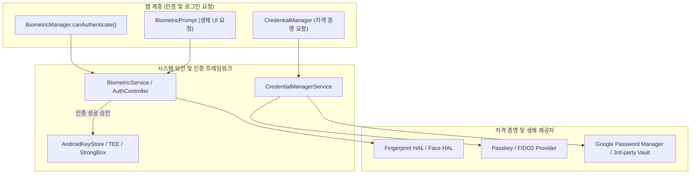

## 생체 인증/자격 증명 계약

이 지도는 생체 인증 표준 UI 를 제공하고 키 해제를 담당하는 **BiometricPrompt**, 프롬프트 표시 전 기기의 하드웨어 상태를 확인하는 사전 검증 API 인 **BiometricManager**, 그리고 비밀번호·패스키·SSO 로그인을 통합 시트로 다루는 **CredentialManager**라는 세 핵심 계약을 분리한다. 실제 물리 키 저장 및 암호화 알고리즘 자체는 다루지 않는다.

### 주요 메커니즘 및 코드 예시 (Mechanisms & Code Examples)

- **BiometricManager**: 하드웨어 가용성과 등록 여부를 `canAuthenticate()` 로 확인.
- **BiometricPrompt**: 시스템이 제공하는 인증 UI 표시 및 `CryptoObject` 를 통한 키 해제.
- **CredentialManager**: `GetCredentialRequest` 를 통해 패스키와 비밀번호 등을 단일 인터페이스로 요청.

```kotlin
// BiometricPrompt 예시
val biometricPrompt = BiometricPrompt(activity, executor, callback)
val promptInfo = BiometricPrompt.PromptInfo.Builder()
    .setTitle("생체 인증")
    .setAllowedAuthenticators(BiometricManager.Authenticators.BIOMETRIC_STRONG)
    .setNegativeButtonText("취소")
    .build()
biometricPrompt.authenticate(promptInfo) // 암호화 연동 시 cryptoObject 전달
```

### 아키텍처 다이어그램



### 관찰 신호 (Observation Signals)

- **ADB 및 dumpsys 진단**:
  ```bash
  # 1. 생체 인증 서비스 상태 및 센서 강도/등록 여부 덤프
  adb shell dumpsys biometric
  # 2. 지문 하드웨어 센서 상태 확인
  adb shell dumpsys fingerprint
  # 3. 얼굴 인식 센서 상태 확인
  adb shell dumpsys face
  ```
- **Logcat 로그 확인**:
  ```bash
  adb logcat -s BiometricService BiometricPrompt FingerprintService CredentialManager
  ```

### 읽는 순서

1. [BiometricPrompt는 인증 UI와 키 사용 승인을 함께 처리한다](biometric-prompt-key-auth.md) 에서 인증과 crypto 객체의 관계를 본다.
2. [BiometricManager.canAuthenticate는 실행 전에 확인해야 하는 사전 조건이다](biometric-manager-preconditions.md) 에서 프롬프트를 띄우기 전 실패를 막는 법을 본다.
3. [CredentialManager는 비밀번호/패스키/연동 로그인을 하나의 API로 통합한다](credential-manager-unification.md) 에서 로그인 흐름 통합 모델을 본다.

### 문제 분류

| 증상 | 먼저 확인할 경계 |
| --- | --- |
| 생체 인증 버튼이 있는데 프롬프트가 안 뜸 | `canAuthenticate()` 사전 확인을 건너뛰었는지, 등록된 생체 정보가 있는지 |
| 인증은 성공했는데 암호화 작업이 실패 | crypto 객체 바인딩과 키 무효화(생체 정보 변경) 여부 |
| 로그인 UI 에 패스키 옵션이 안 보임 | CredentialManager 통합 여부, 서버 측 패스키 지원 |

### 책임 경계

- 생체 인증은 "사용자가 맞다는 것을 확인"하는 계층이고, 실제 암호화 키 보호는 암호화 스토리지(Keystore)가 담당한다. BiometricPrompt 는 이 둘을 연결하는 다리다.
- CredentialManager 는 여러 로그인 수단을 통합하는 UX 계층이며, 서버 측 인증 로직 자체를 대체하지 않는다.

### 노트 목록

- [BiometricPrompt는 인증 UI와 키 사용 승인을 함께 처리한다](biometric-prompt-key-auth.md)
- [BiometricManager.canAuthenticate는 실행 전에 확인해야 하는 사전 조건이다](biometric-manager-preconditions.md)
- [CredentialManager는 비밀번호/패스키/연동 로그인을 하나의 API로 통합한다](credential-manager-unification.md)

### 공식 문서

- [BiometricPrompt 문서](https://developer.android.com/identity/sign-in/biometric-auth)
- [CredentialManager 문서](https://developer.android.com/identity/sign-in/credential-manager)

검증일: 2026-08-03. [BiometricPrompt 문서](https://developer.android.com/identity/sign-in/biometric-auth)와 [CredentialManager 문서](https://developer.android.com/identity/sign-in/credential-manager) 를 기준으로 확인했다.
