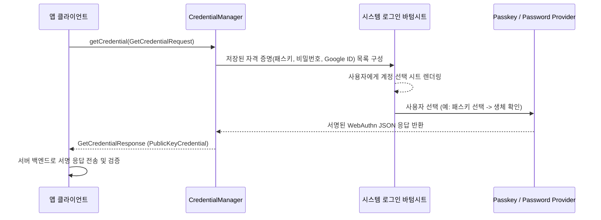

## CredentialManager는 비밀번호/패스키/연동 로그인을 하나의 API로 통합한다

상위 문서: [Android 시스템 서비스와 기기 기능 지도](../../android-system-services-and-device-capabilities.md)
관련 지도: [생체 인증/자격 증명 계약](biometrics-credential.md)

### 핵심 정의

`CredentialManager`(Jetpack Credentials)는 저장된 비밀번호, **패스키**(Passkey: 비밀번호 없이 기기의 생체 인증이나 PIN으로 FIDO2/WebAuthn 공개키 기반 서명을 수행하여 로그인하는 인증 방식), Google 계정 같은 **연동 로그인**(federated sign-in: 외부 신원 제공자를 통해 인증받는 SSO 방식)을 앱이 각각 다른 API로 따로 다루지 않고 하나의 요청/응답 흐름으로 통합한 API다. 사용자는 하나의 시스템 로그인 시트에서 어떤 방식으로 로그인할지 선택한다.

### 메커니즘

앱은 `CredentialManager.getCredential()`을 호출하면서 지원하려는 자격 증명 옵션들(`GetPasswordOption`, `GetPublicKeyCredentialOption`(패스키), `GetGoogleIdOption` 등)을 함께 전달한다. 시스템은 기기에 저장된 자격 증명(비밀번호 관리자, 패스키 등)을 조회해 사용자에게 선택 UI로 보여주고, 선택된 방식에 따라 인증을 수행한 뒤 앱에 결과를 반환한다. 패스키는 기기의 생체 인증(BiometricPrompt와 유사한 흐름)으로 개인 키 사용을 승인하는 방식으로 동작하며, 서버는 공개 키 기반 서명을 검증한다.

### 다이어그램



### 요청과 결과 분기

```kotlin
suspend fun signIn(context: Context, passkeyRequestJson: String) {
    val manager = CredentialManager.create(context)
    val request = GetCredentialRequest.Builder()
        .addCredentialOption(GetPasswordOption())
        .addCredentialOption(GetPublicKeyCredentialOption(passkeyRequestJson))
        .build()

    when (val credential = manager.getCredential(context, request).credential) {
        is PasswordCredential -> submitPassword(credential.id, credential.password)
        is PublicKeyCredential -> submitWebAuthnResponse(credential.authenticationResponseJson)
        is CustomCredential -> handleVerifiedCustomCredential(credential)
        else -> showUnsupportedCredential()
    }
}
```

challenge와 RP ID는 서버가 발급하고, 반환 JSON은 서버에서 challenge·origin/RP ID·서명을 검증한다. `CustomCredential`은 type과 payload를 provider 문서대로 검증하기 전 신뢰하지 않는다. 사용자 취소와 저장된 후보 없음도 별도 `GetCredentialException` subtype으로 처리한다.

### 판단 기준

- 신규 로그인 플로우를 설계할 때 비밀번호 전용 흐름 대신 패스키를 1차 옵션으로 제공하는 것을 우선 검토한다. 패스키는 피싱에 강하고 사용자 마찰이 적다.
- 기존 비밀번호 로그인 사용자를 위한 하위 호환 경로(비밀번호 옵션)를 CredentialManager 흐름에서 제거하지 않고 함께 등록한다.
- 서버 측에서 패스키(WebAuthn) 등록/검증을 지원하지 않는다면 클라이언트에서 패스키 옵션을 노출해도 실제로 사용할 수 없다는 점을 백엔드 로드맵과 맞춰 확인한다.

### 경계

- 이 노트는 로그인 자격 증명 통합 API까지 다룬다. 생체 인증 자체의 UI/키 결합 메커니즘은 [BiometricPrompt는 인증 UI와 키 사용 승인을 함께 처리한다](biometric-prompt-key-auth.md)가 다룬다.
- 서버 측 WebAuthn 검증 로직이나 OAuth/OIDC 프로토콜 세부는 이 지도의 범위 밖이다.

### 관찰 가능한 신호

`getCredential()` 실패는 `GetCredentialException`의 하위 타입(사용자 취소, 자격 증명 없음, 지원되지 않는 옵션 등)으로 구분된다.

```bash
# 1. CredentialManager 시스템 서비스 덤프
adb shell dumpsys credential

# 2. CredentialManager 및 FIDO2 관련 logcat 필터링
adb logcat -s CredentialManager CredentialProvider Passkey
```

### 공식 문서

- https://developer.android.com/identity/sign-in/credential-manager
- https://developer.android.com/identity/sign-in/passkeys

검증일: 2026-08-06. Credential Manager의 suspend 호출, credential subtype 분기, WebAuthn 서버 검증 경계를 보강했다.
