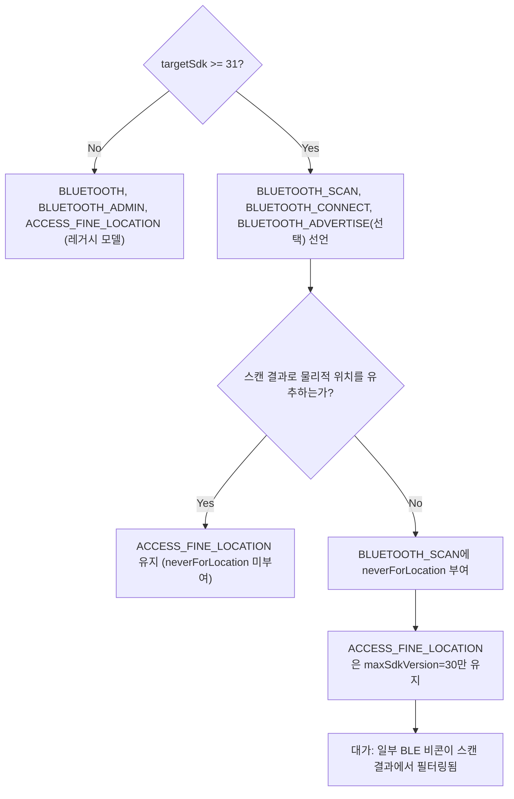

## Android 12+ Bluetooth 런타임 권한은 조건부로만 위치 권한을 대체한다

상위 문서: [Android 시스템 서비스와 기기 기능 지도](../../android-system-services-and-device-capabilities.md)
관련 지도: [Bluetooth 접근 계약](./bluetooth-contracts.md)

### 핵심 정의

Android 12(API 31)부터 기존 `BLUETOOTH`/`BLUETOOTH_ADMIN` manifest 권한이 세 개의 런타임 권한으로 나뉘었다. 공식 문서는 targetSdk 31+ 앱에 다음을 요구한다.

> "1. If your app looks for Bluetooth devices, such as BLE peripherals, declare the `BLUETOOTH_SCAN` permission. 2. If your app makes the current device discoverable to other Bluetooth devices, declare the `BLUETOOTH_ADVERTISE` permission. 3. If your app communicates with already-paired Bluetooth devices, declare the `BLUETOOTH_CONNECT` permission."

이 세 권한은 기존처럼 `ACCESS_FINE_LOCATION`을 자동으로 요구하지 않는다. 다만 완전히 독립적이지도 않다 — 위치를 유추하는 데 스캔 결과를 쓰는 앱은 여전히 위치 권한이 필요하다.

### 메커니즘

Android 11 이하에서는 BLE 스캔이 위치를 유추하는 데 악용될 수 있다는 이유로 `ACCESS_FINE_LOCATION`이 필수였다.

> "`ACCESS_FINE_LOCATION` is necessary because, on Android 11 and lower, a Bluetooth scan could potentially be used to gather information about the location of the user."

Android 12+는 이 결합을 끊는다. 앱이 스캔 결과로 물리적 위치를 유추하지 않는다고 선언하면 `ACCESS_FINE_LOCATION` 없이 `BLUETOOTH_SCAN`만으로 스캔할 수 있다.

> "If your app uses Bluetooth scan results to derive physical location, declare the `ACCESS_FINE_LOCATION` permission. Otherwise, you can strongly assert that your app doesn't derive physical location and set `android:maxSdkVersion` to 30 for the `ACCESS_FINE_LOCATION` permission."

이 선언은 `BLUETOOTH_SCAN`에 `android:usesPermissionFlags="neverForLocation"`을 붙이는 것으로 이뤄지며, 대가가 있다.

> "If you include `neverForLocation` in your `android:usesPermissionFlags`, some BLE beacons are filtered from the scan results."

즉 위치 권한을 완전히 없애는 대신 일부 위치 유추가 가능한 비콘이 스캔 결과에서 걸러진다. 이는 완전한 대체가 아니라 "위치를 쓰지 않겠다"는 선언과 그에 따른 기능 축소를 맞바꾸는 조건부 대체다.

### 코드 예시

```xml
<manifest>
    <!-- targetSdk 30 이하 기기 호환용. Android 12+ 에서는 무시된다. -->
    <uses-permission android:name="android.permission.BLUETOOTH"
                     android:maxSdkVersion="30" />
    <uses-permission android:name="android.permission.BLUETOOTH_ADMIN"
                     android:maxSdkVersion="30" />

    <!-- Android 12+ 런타임 권한 -->
    <uses-permission android:name="android.permission.BLUETOOTH_SCAN"
                     android:usesPermissionFlags="neverForLocation" />
    <uses-permission android:name="android.permission.BLUETOOTH_CONNECT" />

    <!-- 스캔 결과로 위치를 유추하지 않는다고 강하게 단언할 수 있을 때만
         maxSdkVersion=30으로 낮춰 Android 12+에서는 요청하지 않는다. -->
    <uses-permission android:name="android.permission.ACCESS_FINE_LOCATION"
                     android:maxSdkVersion="30" />
</manifest>
```

### 다이어그램



### 판단 기준

- 위치 기반 기능(근접 알림, 실내 측위)이 없다면 `neverForLocation`을 선언해 사용자에게 위치 권한을 요청하지 않는다.
- 스캔 결과를 위치 추정에 조금이라도 쓴다면 `neverForLocation`을 선언하지 말고 `ACCESS_FINE_LOCATION`을 정상적으로 요청한다. 선언 후 실제로 위치를 유추하면 정책 위반이다.
- `BLUETOOTH_CONNECT`는 이미 페어링된 기기와의 통신에, `BLUETOOTH_SCAN`은 새 기기 탐색에 필요하다는 것을 구분해서 최소 권한만 선언한다.

### 경계

- 이 노트는 권한 선언 조건까지만 다룬다. `BluetoothGatt` 연결 자체의 상태 관리는 [BluetoothGatt 콜백 기반 연결은 명시적 상태 머신이 필요하다](./bluetoothgatt-callback-connection-needs-an-explicit-state-machine.md)가 다룬다.
- permission/AppOps 공통 모델 자체는 [시스템 서비스 접근 공통 계약](../../service-lookup/service-lookup-contracts/service-lookup-contracts.md)이 다루며, 이 노트는 Bluetooth 권한에 고유한 위치 대체 조건만 다룬다.

### 관찰 가능한 신호

권한 없이 스캔/연결 API를 호출하면 `SecurityException`이 발생한다. `adb shell dumpsys package <패키지명>`의 `runtime permissions` 섹션에서 `android.permission.BLUETOOTH_SCAN`, `BLUETOOTH_CONNECT`의 `granted` 여부를 확인할 수 있다.

### 공식 문서

- [Bluetooth permissions](https://developer.android.com/develop/connectivity/bluetooth/bt-permissions)

검증일: 2026-08-04. Android 12+ Bluetooth 권한 조건은 targetSdk 및 정책 변경에 따라 달라질 수 있으므로 릴리스 시 원문을 다시 확인한다.
