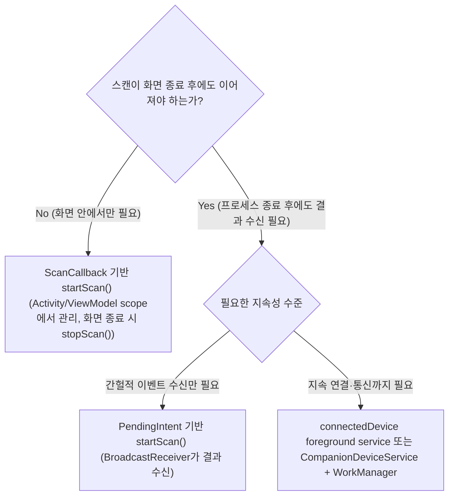

## BLE 백그라운드 스캔은 배터리 제약을 받으며 ScanFilter가 필요하다

상위 문서: [Android 시스템 서비스와 기기 기능 지도](../../android-system-services-and-device-capabilities.md)
관련 지도: [Bluetooth 접근 계약](./bluetooth-contracts.md)

### 핵심 정의

**BLE 스캔**(주변의 Bluetooth Low Energy 기기가 브로드캐스팅하는 광고 패킷을 탐지하는 동작)은 무선 라디오 모듈을 계속 켜 두는 동작이라 배터리 비용이 매우 크다. 공식 문서는 앱 프로세스가 살아있는 한 화면 상태와 무관하게 스캔 API 자체는 계속 쓸 수 있다고 설명하지만, 그 방식을 무조건 허용하지는 않는다.

> "There is no limitation on using either of these APIs while the app is not visible, but they do both need your app process to be alive."

문제는 "프로세스가 살아있어야 한다"는 전제다. 시스템은 백그라운드 프로세스를 임의로 종료할 수 있으므로, 앱이 프로세스 생존에 의존한 채 주기적으로 스캔을 반복하는 설계는 신뢰할 수 없다.

### 메커니즘

공식 문서는 배터리 효율을 위해 무제한 반복 스캔 대신 두 가지 방향을 권장한다.

> "Scheduling periodic scans to find devices is discouraged. That approach is less efficient because it starts the app process periodically regardless of whether a device is in range."
>
> "Call `startScan()` with a `PendingIntent` object instead of a `ScanCallback` object to get notified when a device matching your filter is scanned."

`PendingIntent`(시스템이나 다른 프로세스가 앱을 대신해 지정된 Intent를 실행하도록 권한을 전달하는 래퍼 객체) 기반 `startScan()`은 스캔 결과 콜백을 프로세스가 죽어 있어도 시스템이 broadcast로 전달하게 만든다. 이는 6장(Binder/coroutine/durable scheduler)이 설명한 것과 같은 원리다 — 화면이나 현재 프로세스의 lifetime이 아니라 시스템이 보장하는 durable한 전달 수단에 위임하는 것이다. 지속적으로 연결이 필요한 시나리오에는 `WorkManager`, `connectedDevice` 타입 foreground service, `CompanionDeviceService` 같은 durable한 실행 수단을 조합해야 한다.

**ScanFilter**(원하는 서비스 UUID나 기기 명칭을 가진 패킷만 필터링하여 수신하는 객체)는 스캔 자체의 무분별한 결과 수신을 줄이는 두 번째 축이다. 필터 없이 스캔하면 주변의 모든 BLE 기기 광고 패킷이 콜백으로 전달되어 처리 비용이 커진다. 서비스 UUID나 기기 이름으로 필터링하면 원하는 기기만 결과로 받는다.

### 코드 예시

```kotlin
val scanFilter = ScanFilter.Builder()
    .setServiceUuid(ParcelUuid(MY_SERVICE_UUID))
    .build()

val scanSettings = ScanSettings.Builder()
    .setScanMode(ScanSettings.SCAN_MODE_LOW_POWER)
    .build()

// 프로세스가 죽어도 결과를 받아야 한다면 ScanCallback 대신
// PendingIntent 기반 오버로드를 사용한다.
val pendingIntent = PendingIntent.getBroadcast(
    context,
    0,
    Intent(context, BleScanReceiver::class.java),
    PendingIntent.FLAG_UPDATE_CURRENT or PendingIntent.FLAG_MUTABLE,
)

bluetoothLeScanner.startScan(
    listOf(scanFilter),
    scanSettings,
    pendingIntent,
)
```

### 다이어그램



### 판단 기준

- 화면이 떠 있는 동안만 필요한 일회성 기기 탐색이면 `ScanCallback` 기반 스캔으로 충분하다.
- 백그라운드에서 특정 기기의 등장을 감지만 하면 되면 `PendingIntent` 기반 스캔으로 프로세스 생존 의존을 없앤다.
- 감지 이후 지속적인 GATT 연결·통신까지 이어져야 하면 스캔 결과 수신을 넘어 durable한 실행 수단(foreground service 등)으로 연결한다.
- `ScanFilter` 없이 스캔을 시작하지 않는다. 필터가 넓을수록 배터리와 콜백 처리 비용이 커진다.

### 경계

- 이 노트는 스캔 단계의 배터리/백그라운드 제약과 필터링까지 다룬다. 스캔으로 찾은 기기에 실제로 연결한 뒤의 상태 관리는 [BluetoothGatt 콜백 기반 연결은 명시적 상태 머신이 필요하다](./bluetoothgatt-callback-connection-needs-an-explicit-state-machine.md)가 다룬다.
- 스캔에 필요한 `BLUETOOTH_SCAN` 권한과 위치 권한 대체 조건은 [Android 12+ Bluetooth 런타임 권한은 조건부로만 위치 권한을 대체한다](./android-12-bluetooth-runtime-permissions-conditionally-replace-location-permission.md)가 다룬다.
- Doze/App Standby가 백그라운드 작업 전반을 제한하는 일반 조건은 `04_system_services/background-and-notifications/background-work-contracts`가 다룬다. 이 노트는 BLE 스캔에 고유한 API 선택만 다룬다.

### 관찰 가능한 신호

`adb shell dumpsys bluetooth_manager`에서 현재 활성 스캔 클라이언트 수와 각 클라이언트의 필터 설정을 확인할 수 있다. `ScanFilter` 없이 여러 스캔이 겹치면 이 출력에서 클라이언트 수가 비정상적으로 늘어난 것을 볼 수 있다. `PendingIntent` 기반 스캔이 정상 동작하면 앱 프로세스를 강제 종료(`adb shell am kill <패키지명>`)한 뒤에도 대상 기기가 나타났을 때 `BroadcastReceiver`가 시스템에 의해 다시 기동되어 콜백을 받는다.

### 공식 문서

- [Communicate with a BLE device in the background](https://developer.android.com/develop/connectivity/bluetooth/ble/background)
- [Find BLE devices](https://developer.android.com/develop/connectivity/bluetooth/ble/find-ble-devices)

검증일: 2026-08-04.
