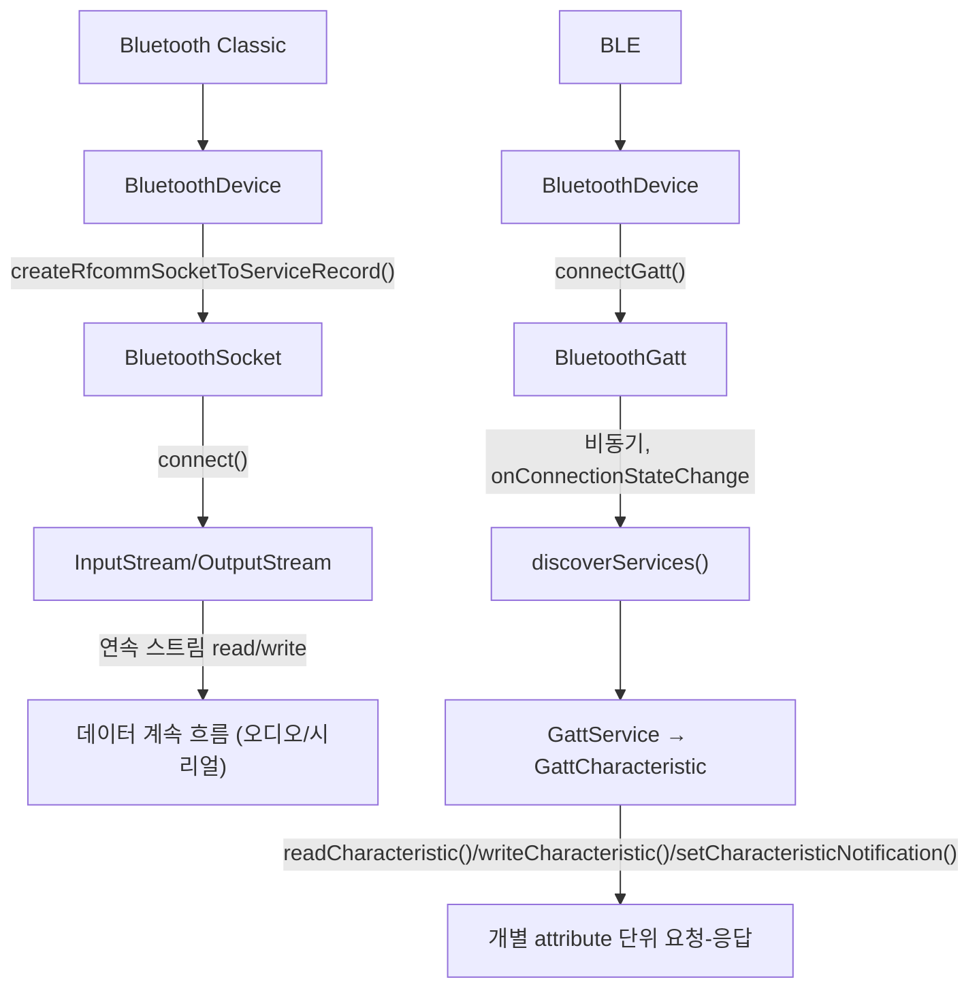

## Bluetooth Classic과 BLE(GATT)는 서로 다른 연결 모델이다

상위 문서: [Android 시스템 서비스와 기기 기능 지도](../../android-system-services-and-device-capabilities.md)
배경 지식: [소켓(Sockets) 개념](../../../../../linux/sockets.md)
관련 지도: [Bluetooth 접근 계약](./bluetooth-contracts.md)

### 핵심 정의

Bluetooth Classic과 Bluetooth Low Energy(BLE)는 같은 "Bluetooth" 브랜드 아래 있지만 앱이 다루는 API와 연결 모델이 다르다. 공식 문서는 용도로 구분한다.

> "Classic Bluetooth is the right choice for more battery-intensive operations, which include streaming and communicating between devices. For Bluetooth devices with low power requirements, consider using Bluetooth Low Energy connections."

### 메커니즘

Classic Bluetooth는 **BluetoothSocket**(Classic Bluetooth 환경에서 RFCOMM 스트림 프로토콜을 통해 양방향 소켓 통신을 다루는 객체)을 통해 RFCOMM 채널을 여는 스트림 기반 연결이다. 공식 문서는 Bluetooth Classic API의 역할을 다음과 같이 설명한다.

> "Using the Bluetooth APIs, an app can perform the following: Establish RFCOMM channels. ... Transfer data to and from other devices."

`BluetoothSocket`은 TCP `Socket`과 유사하게 `InputStream`/`OutputStream`으로 바이트 스트림을 주고받는다. 연결이 유지되는 동안 지속적으로 데이터가 흐르는 오디오 스트리밍(A2DP), 시리얼 통신(SPP) 같은 프로파일에 맞는 모델이다.

BLE는 반대로 attribute 기반 모델이다. **BluetoothGatt**(BLE 환경에서 GATT 프로필의 서비스 및 특성 데이터를 비동기로 읽고 쓰는 엔티티)를 통해 원격 기기의 GATT 서버가 노출하는 service와 characteristic을 UUID로 찾아 개별적으로 읽기/쓰기/구독(notify)한다. 연결 자체는 유지되지만 실제 데이터 교환은 스트림이 아니라 개별 attribute 단위의 요청-응답이며, 연결 파라미터(interval)를 조정해 저전력을 유지한다. 두 모델은 앱 코드 수준에서 공유하는 클래스가 거의 없다 — Classic은 `BluetoothSocket`, BLE는 `BluetoothGatt`/`BluetoothGattCallback`이 진입점이다.

### 코드 예시

Classic 연결(RFCOMM 소켓, 스트림 기반):

```kotlin
val device: BluetoothDevice = adapter.getRemoteDevice(macAddress)
val socket: BluetoothSocket =
    device.createRfcommSocketToServiceRecord(MY_UUID)
socket.connect()
val output = socket.outputStream
output.write(payload) // 연결이 유지되는 동안 스트림으로 계속 전송
```

BLE 연결(GATT, attribute 기반):

```kotlin
val gatt: BluetoothGatt =
    device.connectGatt(context, /* autoConnect = */ false, gattCallback)

// onConnectionStateChange에서 STATE_CONNECTED를 받은 뒤에야
// discoverServices()로 service/characteristic UUID를 탐색해야 한다.
gatt.discoverServices()
```

### 다이어그램



### 판단 기준

- 스트리밍 오디오, 파일 전송처럼 지속적인 처리량이 필요하면 Classic 프로파일을 고른다.
- 센서 값, 상태 통지처럼 작은 데이터를 저전력으로 간헐 전송하면 BLE를 고른다.
- 기기가 두 모델을 모두 지원(Bluetooth Dual Mode)해도 앱은 목적에 맞는 모델의 API만 사용해야 하며, 하나의 연결 객체로 두 모델을 오갈 수 없다.

### 경계

- 이 노트는 두 연결 모델의 API 차이까지만 다룬다. BLE GATT 연결 이후의 콜백 기반 상태 관리는 [BluetoothGatt 콜백 기반 연결은 명시적 상태 머신이 필요하다](./bluetoothgatt-callback-connection-needs-an-explicit-state-machine.md)가 다룬다.
- Android 12+ 권한 선언 차이는 [Android 12+ Bluetooth 런타임 권한은 조건부로만 위치 권한을 대체한다](./android-12-bluetooth-runtime-permissions-conditionally-replace-location-permission.md)가 다룬다.
- `A2DP`, `HFP` 같은 프로파일별 코덱 세부나 페어링 UI 흐름은 다루지 않는다.

### 관찰 가능한 신호

`adb shell dumpsys bluetooth_manager`로 현재 활성화된 프로파일 연결(Classic)과 GATT 클라이언트 연결(BLE) 목록을 구분해 확인할 수 있다. Classic 소켓 연결 실패는 `IOException`으로, BLE GATT 작업 실패는 `onConnectionStateChange`/`onCharacteristicWrite` 같은 콜백의 `status` 파라미터(0이 아니면 실패)로 보고된다는 점에서 오류 보고 경로 자체가 다르다.

### 공식 문서

- [Bluetooth overview](https://developer.android.com/develop/connectivity/bluetooth)
- [About BLE support](https://developer.android.com/develop/connectivity/bluetooth/ble/ble-overview)
- [Connect to a GATT server](https://developer.android.com/develop/connectivity/bluetooth/ble/connect-gatt-server)

검증일: 2026-08-04.
