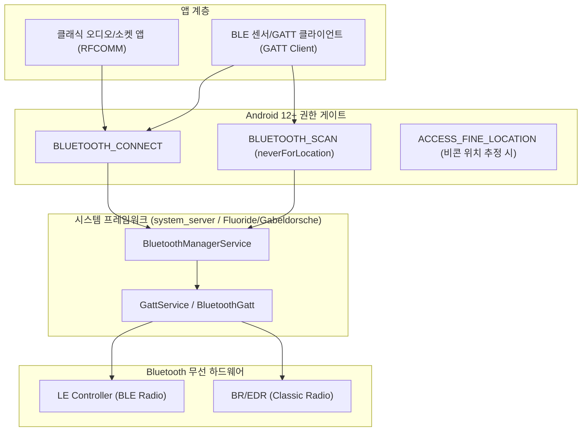

## Bluetooth 접근 계약

이 지도는 Android 앱이 Bluetooth 기기와 통신할 때 마주치는 계약을 연결 모델 선택, Android 12+ 권한 재설계, GATT 연결 상태 관리, BLE 스캔의 배터리/백그라운드 제약으로 나눈다. **Bluetooth Classic**(RFCOMM 소켓 기반으로 오디오/대용량 직렬 데이터를 스트리밍 전송하는 모델)과 **BLE**(Bluetooth Low Energy GATT 기반으로 개별 속성을 읽고 쓰며 저전력 동작하는 모델)는 이름만 같은 별개의 연결 모델이며, 이 차이를 모르면 권한 설계와 연결 코드 모두 잘못된 모델을 기준으로 작성하게 된다.

### 주요 메커니즘 및 코드 예시 (Mechanisms & Code Examples)

- **Bluetooth Classic**: `BluetoothSocket` (RFCOMM)을 통한 지속적 양방향 직렬 스트림 통신.
- **BLE (GATT)**: `BluetoothGattCallback` 상태 머신을 통한 Service/Characteristic 비동기 단일 오퍼레이션 순차 실행.
- **Android 12+ 런타임 권한**: `BLUETOOTH_SCAN` (`neverForLocation`), `BLUETOOTH_CONNECT`, `BLUETOOTH_ADVERTISE` 세분화.

```kotlin
// BluetoothManager 및 스캐너 획득
val bluetoothManager = getSystemService(Context.BLUETOOTH_SERVICE) as BluetoothManager
val bluetoothAdapter = bluetoothManager.adapter
val bleScanner = bluetoothAdapter.bluetoothLeScanner

// BLE 스캔 필터 및 설정 (저전력 배칭 모드)
val scanFilter = ScanFilter.Builder().setServiceUuid(ParcelUuid(MY_SERVICE_UUID)).build()
val scanSettings = ScanSettings.Builder()
    .setScanMode(ScanSettings.SCAN_MODE_LOW_POWER)
    .setReportDelay(5000) // 5초 배치 수신
    .build()

bleScanner?.startScan(listOf(scanFilter), scanSettings, scanCallback)
```

### 아키텍처 다이어그램



### 관찰 신호 (Observation Signals)

- **ADB 및 dumpsys 진단**:
  ```bash
  # 1. 블루투스 어댑터 상태, 본딩된 기기, GATT 클라이언트/서버 덤프
  adb shell dumpsys bluetooth_manager
  # 2. 블루투스 스택 상태 세부 덤프
  adb shell dumpsys bluetooth
  # 3. 블루투스 런타임 권한 승인 현황 확인
  adb shell dumpsys package <package_name> | grep -E "BLUETOOTH_SCAN|BLUETOOTH_CONNECT"
  ```
- **Logcat 로그 확인**:
  ```bash
  adb logcat -s BluetoothAdapter BluetoothLeScanner BluetoothGatt
  ```

### 읽는 순서

1. [Bluetooth Classic과 BLE(GATT)는 서로 다른 연결 모델이다](bluetooth-classic-vs-ble-gatt.md) 에서 두 연결 모델의 API 표면과 선택 기준을 먼저 본다.
2. [Android 12+ Bluetooth 런타임 권한은 조건부로만 위치 권한을 대체한다](bluetooth-runtime-permissions.md)에서 `BLUETOOTH_SCAN`/`BLUETOOTH_CONNECT`와 `ACCESS_FINE_LOCATION` 의 관계를 확인한다.
3. [BluetoothGatt 콜백 기반 연결은 명시적 상태 머신이 필요하다](bluetooth-gatt-state-machine.md) 에서 비동기 콜백이 왜 상태 추적을 강제하는지 본다.
4. [BLE 백그라운드 스캔은 배터리 제약을 받으며 ScanFilter가 필요하다](ble-background-scanning.md) 에서 스캔 지속성과 배터리 사이의 트레이드오프를 본다.

### 문제 분류

| 증상 또는 질문 | 먼저 확인할 경계 |
| --- | --- |
| 오디오 스트리밍은 되는데 GATT 기기가 안 붙는다 | Classic 프로파일과 BLE GATT 를 같은 API 로 다루고 있는지 |
| `SecurityException`이 스캔/연결 시점에 발생 | targetSdk 31+ 에서 `BLUETOOTH_SCAN`/`BLUETOOTH_CONNECT`를 선언했는지, `neverForLocation` 조건을 잘못 판단했는지 |
| `connectGatt()` 호출은 성공했는데 이후 통신이 실패 | 콜백 기반 상태를 실제로 추적하지 않고 연결됐다고 가정했는지 |
| 화면을 끄면 BLE 스캔이 멈춘다 | 백그라운드 스캔에 `PendingIntent` 기반 API 나 foreground service 를 쓰고 있는지 |

### 책임 경계

- 이 지도는 앱이 Bluetooth 기기에 접근하는 연결/권한/상태 계약만 다룬다. `A2DP`, `HFP` 같은 특정 프로파일의 오디오 코덱 세부나 페어링 UI 흐름의 세부 구현은 다루지 않는다.
- Wi-Fi, 셀룰러, VPN 같은 IP 기반 connectivity 는 네트워크 스택이 담당한다. Bluetooth 는 IP 스택을 거치지 않는 별도 무선 기술이므로 이 지도가 별도로 다룬다.
- GATT 서비스/characteristic 의 데이터 파싱이나 특정 벤더 프로토콜 해석은 이 지도의 범위가 아니다.

### 노트 목록

- [Bluetooth Classic과 BLE(GATT)는 서로 다른 연결 모델이다](bluetooth-classic-vs-ble-gatt.md)
- [Android 12+ Bluetooth 런타임 권한은 조건부로만 위치 권한을 대체한다](bluetooth-runtime-permissions.md)
- [BluetoothGatt 콜백 기반 연결은 명시적 상태 머신이 필요하다](bluetooth-gatt-state-machine.md)
- [BLE 백그라운드 스캔은 배터리 제약을 받으며 ScanFilter가 필요하다](ble-background-scanning.md)

### 공식 문서

- [Bluetooth overview](https://developer.android.com/develop/connectivity/bluetooth)
- [Bluetooth permissions](https://developer.android.com/develop/connectivity/bluetooth/bt-permissions)
- [Connect to a GATT server](https://developer.android.com/develop/connectivity/bluetooth/ble/connect-gatt-server)
- [Communicate with a BLE device in background](https://developer.android.com/develop/connectivity/bluetooth/ble/background)

검증일: 2026-08-04. Bluetooth Classic/BLE 모델, Android 12+ 런타임 권한 및 GATT 상태 머신 계약을 공식 문서를 기준으로 확인했다.
