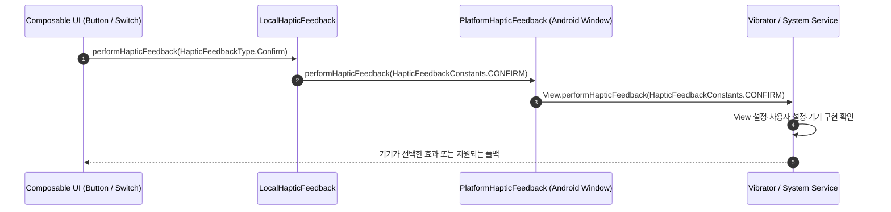

## HapticFeedbackType 은 UX 인터랙션 의미를 플랫폼 햅틱에 전달한다

Jetpack Compose 의 `HapticFeedbackType` 및 안드로이드 View 의 `HapticFeedbackConstants` 는 개발자가 개별 모터 진동수나 파형을 직접 계산하지 않고도, **사용자의 UX 행동 맥락(Confirm, Reject, Toggle, Gesture 등)에 따라 OS 표준 촉각 패턴을 일관되게 전달**할 수 있도록 설계된 상위 햅틱 시맨틱 API 계약이다.

---

### 1. 개념 및 핵심 명제 (What)

- **상위 햅틱 추상화 (Semantic Haptic Mapping)**: `LocalHapticFeedback.current.performHapticFeedback(type)` 호출은 하드웨어 모터 제어 이전에 **"이 조작이 어떤 UX 용도인가?"**를 OS 에 전달한다.
- **구현 세부는 기기별로 다름**: Compose 구현은 타입을 대응하는 `HapticFeedbackConstants` 동작으로 전달한다. 프레임워크와 기기 구현이 실제 촉각 효과와 폴백을 고르므로 특정 `VibrationEffect` 상수와 1:1로 대응한다고 가정하지 않는다.

---

### 2. HapticFeedbackType 13 가지 전수 가이드 및 UX 사용 시점 (Why & When)

| HapticFeedbackType 상수          | 의미 및 촉각 특징                    | 권장 UX 사용 시점 (Use Cases)                                             |
| :----------------------------- | :---------------------------- | :------------------------------------------------------------------ |
| **`Confirm`**                  | 작업 성공, 완료, 승인 확정 피드백          | 결제 완료, 폼 제출 성공, 체크마크 완료 애니메이션 실행 시                                  |
| **`Reject`**                   | 작업 실패, 거절, 오류 경고 피드백          | 비밀번호 입력 오류, 입력 검증 실패, 권한 거부 알림 시                                    |
| **`ToggleOn`**                 | 스위치/토글 버튼을 **ON(켜짐)** 상태로 전환  | Switch, Checkbox, Filter Chip 을 켜짐으로 변경할 때                          |
| **`ToggleOff`**                | 스위치/토글 버튼을 **OFF(꺼짐)** 상태로 전환 | Switch, Checkbox 를 꺼짐으로 변경할 때                                       |
| **`LongPress`**                | 항목을 길게 누름(Long Click)         | 컨텍스트 메뉴 열기, 항목 선택 모드 진입, Drag 앤 Drop 활성화 시                          |
| **`ContextClick`**             | 객체 보조 클릭 (우클릭 / 팝업 메뉴)        | 팝업 툴바 표시, 콤보박스 열기, 3-Dot 메뉴 터치 시                                    |
| **`GestureEnd`**               | 제스처 입력 동작 완료                  | 가상 키보드 제스처 스와이프 완성, 드래그 드롭 놓기 완료 시                                  |
| **`GestureThresholdActivate`** | 스와이프 제스처의 임계선(Threshold) 돌파   | Pull-to-refresh 에서 '손을 놓으면 새로고침' 영역 도달 시, Swipe-to-dismiss 임계선 통과 시 |
| **`SegmentTick`**              | 단계별 조작 틱 (불연속 지점 이동)          | Slider 단계(Step) 변경시, Wheel Picker 항목 1 단위 변경 시                      |
| **`SegmentFrequentTick`**      | 매우 촘촘하고 연속적인 조작 틱             | TimePicker 시계 바늘 드래그, 수치 스크롤바 연속 회전 시                               |
| **`TextHandleMove`**           | 텍스트 커서/선택 핸들 드래그 이동           | 텍스트 필드 내 선택 커서를 글자/단어 단위로 끄집어 이동할 때                                 |
| **`KeyboardTap`**              | 소프트 자판 키 입력                   | 가상 키보드 글자 버튼 클릭시 (타이핑 촉각 제공)                                        |
| **`VirtualKey`**               | 화면 상의 가상 시스템 키 입력             | 화면 하단 가상 네비게이션 키, 화면 고정 액션 버튼 터치 시                                  |

---

### 3. HapticFeedbackConstants (View Framework) vs HapticFeedbackType (Compose) 차이와 구조

| 구분 | `android.view.HapticFeedbackConstants` (OS Framework) | `androidx.compose.ui.hapticfeedback.HapticFeedbackType` (Compose) |
| :--- | :--- | :--- |
| **소속 계층** | 안드로이드 OS View 프레임워크 저수준 API (Java) | Jetpack Compose UI 프레임워크 고수준 래퍼 (Kotlin) |
| **데이터 타입** | Primitive `int` 정수형 상수 모음 | Kotlin Type-Safe inline value class |
| **노출 범위** | 시스템 내부 전용(`@hide`) 및 플래그 포함 전체 | 일반 일반 앱 개발에 유용한 표준 13 종 전용 정제 |
| **실행 방식** | `view.performHapticFeedback(int feedbackConstant, int flags)` | `LocalHapticFeedback.current.performHapticFeedback(type)` |

Android용 Compose 구현은 `PlatformHapticFeedback`을 거쳐 대응하는 `HapticFeedbackConstants`를 `View.performHapticFeedback()`에 전달한다. 그 뒤 실제 파형과 강도는 SDK 버전, 시스템 정책, 기기 하드웨어 구현에 따라 달라질 수 있다. 이는 앱이 직접 `VibrationEffect.createPredefined()`를 호출하는 경로와 별개의 API 계약이다.

---

### 4. HapticFeedbackConstants 의 특수 플래그(Flags) 및 시스템 전용(`@hide`) 상수

안드로이드 OS 프레임워크의 `HapticFeedbackConstants` 에는 일반 3rd-party 앱이 다루는 햅틱 외에도 **OS 시스템 서비스, 가상 키보드(IME), 시스템 UI 및 생체 인증이 다루는 특수 햅틱**이 포함되어 있다.

#### A. 플래그 (Flags)
- **`FLAG_IGNORE_VIEW_SETTING` (`0x0001`)**:
  - 특정 View 객체의 `isHapticFeedbackEnabled = false` 비활성화 설정을 무시하고 강제로 햅틱 피드백을 실행한다.
- **`FLAG_IGNORE_GLOBAL_SETTING` (`0x0002`)**:
  - 사용자가 안드로이드 OS 전체 설정에서 '터치 진동 피드백'을 꺼두었더라도 이를 무시하고 진동을 강제 발생시킨다.
  - **보안 및 UX 정책 변경**: Android 13 (Tiramisu / API 33)부터 일반 앱의 사용이 Deprecated 처리되었으며, **시스템 권한을 가진 특권 앱(Privileged / System App)만 사용**할 수 있도록 제한되었다.

#### B. 시스템 전용 (`@hide`) 주요 햅틱 상수

일반 SDK 에서는 숨겨져(`@hide`) 있지만, 안드로이드 OS 커널 및 시스템 앱이 사용하는 전용 햅틱 패턴이다:

- **`BIOMETRIC_CONFIRM` / `BIOMETRIC_REJECT`**: 지문/얼굴 생체 인증 성공 및 실패 시 시스템 프롬프트가 발사하는 전용 햅틱 파동
- **`ASSISTANT_BUTTON`**: 하드웨어 어시스턴트 전용 버튼 클릭 시 호출
- **`LONG_PRESS_POWER_BUTTON`**: 전원 버튼 길게 누르기 동작 시 물리적 반동 전달
- **`SAFE_MODE_ENABLED`**: 안전 모드(Safe Mode)로 부팅되었을 때 기기가 발사하는 특수 진동
- **`GESTURE_THRESHOLD_DEACTIVATE`**: Pull-to-refresh 나 스와이프 제스처 시 임계선을 넘었다가 다시 cancellation 영역으로 되돌아올 때 발사하는 해제 햅틱

---

### 5. 내부 메커니즘 및 런타임 수명 (How)



1. **시스템 '터치 진동' 설정 연동**:
   - `HapticFeedbackType` 을 사용하는 모든 피드백은 안드로이드 OS 설정의 `Settings.System.HAPTIC_FEEDBACK_ENABLED` (터치 진동) 옵션을 자동 준수한다. 사용자가 터치 진동을 끈 경우 코드가 실행되어도 부작용 없이 조용히 무시된다.
2. **Platform Fallback**:
   - `HapticFeedbackConstants`는 의미(Semantic) 기반이므로 기기의 모터 특성에 맞춰 OS가 가장 적절한 패턴이나 폴백을 알아서 선택한다. 앱이 파형별 지원 여부를 직접 검사할 필요가 없다.
   - 반면 `VibrationEffect.createPredefined()` 같은 저수준 API는 기기가 해당 파형을 지원하지 않으면 진동이 무시될 수 있으므로 `Vibrator.areAllEffectsSupported()` 등으로 미리 확인하고 직접 폴백을 구현해야 한다.

---

### 6. 올바른 구현 코드 예시

```kotlin
@Composable
fun InteractiveFormScreen() {
    val haptic = LocalHapticFeedback.current
    var isChecked by remember { mutableStateOf(false) }
    var sliderValue by remember { mutableFloatStateOf(0f) }

    Column(modifier = Modifier.padding(16.dp)) {
        // 1. Toggle On / Off 햅틱
        Switch(
            checked = isChecked,
            onCheckedChange = { checked ->
                isChecked = checked
                haptic.performHapticFeedback(
                    if (checked) HapticFeedbackType.ToggleOn else HapticFeedbackType.ToggleOff
                )
            }
        )

        // 2. SegmentTick (Slider 단계 변경) 햅틱
        Slider(
            value = sliderValue,
            onValueChange = { newValue ->
                if ((newValue * 10).toInt() != (sliderValue * 10).toInt()) {
                    haptic.performHapticFeedback(HapticFeedbackType.SegmentTick)
                }
                sliderValue = newValue
            },
            valueRange = 0f..1f
        )

        // 3. Confirm / Reject 햅틱
        Button(
            onClick = {
                if (sliderValue > 0.5f) {
                    haptic.performHapticFeedback(HapticFeedbackType.Confirm)
                } else {
                    haptic.performHapticFeedback(HapticFeedbackType.Reject)
                }
            }
        ) {
            Text("제출")
        }
    }
}
```

---

### 7. 관련 문서 및 참조

상위 문서: [Haptics 및 Vibrator 계약](./haptics-and-vibrator-contracts.md)

관련 계약 문서:

- [VibratorManager와 VibrationEffect는 기기의 정밀 햅틱과 진동 파형을 제어한다](./vibrator-manager-and-vibration-effect-control-device-haptics.md)
- [InputManager는 물리 입력 장치를 이벤트 소스로 추상화한다](../input-accessibility-contracts/inputmanager-abstracts-physical-input-devices-as-event-sources.md)

공식 가이드: [Jetpack Compose HapticFeedbackType](https://developer.android.com/reference/kotlin/androidx/compose/ui/hapticfeedback/HapticFeedbackType), [android.view.HapticFeedbackConstants](https://developer.android.com/reference/android/view/HapticFeedbackConstants)

검증일: 2026-08-06. Android haptics guide와 `HapticFeedbackConstants` API를 기준으로 의미 기반 상수와 실제 `VibrationEffect`가 1:1 대응하지 않음을 반영했다.
