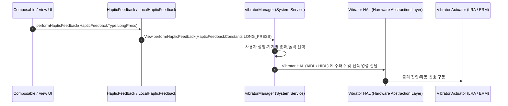

## Haptics 및 Vibrator 계약

안드로이드의 촉각 피드백(Haptic Feedback)과 터치 진동 시스템은 단순한 온/오프 물리 진동기를 넘어, 사용자 인터랙션의 물리적 몰입감을 제공하는 핵심 장치 기능(Device Capability) 계약을 구성한다. 안드로이드 OS 는 `Vibrator` 및 `VibratorManager` 시스템 서비스를 통해 액추에이터(ERM, LRA 등) 하드웨어를 추상화하며, Compose UI 및 View 시스템의 `HapticFeedback` API 와 연결된다.

---

### 1. 개념 및 핵심 명제 (What)

- **2 계층 피드백 아키텍처**:
  - **UI/시스템 햅틱 계층**: `HapticFeedbackConstants` (View) 및 `LocalHapticFeedback` (Jetpack Compose)을 통해 클릭, 롱클립, 텍스트 선택, 모드 전환 등 OS 표준 햅틱 패턴을 간편하게 요청한다.
  - **저수준 Vibrator 시스템 서비스 계층**: `VibratorManager` (Android 12+ / API 31+) 및 `VibrationEffect` 를 통해 커스텀 진동 진폭, 파형(Waveform), 진동수(Frequency), 파동 컴포지션(Primitive Effects)을 정밀 제어한다.
- **권한 및 샌드박스 계약**:
  - `View.performHapticFeedback()`/Compose `LocalHapticFeedback`의 의미 기반 피드백은 `VIBRATE` 권한이 필요 없다.
  - `VibrationEffect.createPredefined()`를 포함해 `Vibrator.vibrate(effect)`를 직접 호출하는 경로는 `android.permission.VIBRATE` (`normal` 보호 수준) 선언이 필요하다.

---

### 2. 왜 필요한가? (Why)

1. **사용자 경험(UX) 및 촉각 확신성 제공**: 화면을 보지 않거나 터치감이 없는 가상 키보드/UI 조작 시, 물리적 스위치를 누르는 듯한 인지적 확신(Tactile Confirmation)을 주어 오작동을 방지한다.
2. **하드웨어 액추에이터 파편화 수용**: 안드로이드 기기는 구형 편심 회전 질량 모터(ERM: Eccentric Rotating Mass)부터 현대적인 선형 공성 액추에이터(LRA: Linear Resonant Actuator)까지 하드웨어 특성이 다양하다. `VibrationEffect` 및 `VibratorAttributes` 시스템은 하드웨어 능력치(`hasVibrator()`, `hasAmplitudeControl()`)에 따라 진동 패턴을 안전하게 폴백(Fallback) 처리한다.

---

### 3. 시스템 동작 메커니즘 (How)



1. **Android 12 (API 31) 전후의 서비스 획득 이원화**:
   - Android 12 이상: `Context.getSystemService(VibratorManager::class.java).defaultVibrator` 를 통해 단일 및 다중 진동기 통합 관리
   - Android 11 이하: `Context.getSystemService(Vibrator::class.java)` 레거시 전용 서비스 획득
2. **사용 목적 분리 (`VibratorAttributes`)**:
   - `VibrationAttributes.createForUsage(USAGE_TOUCH)`: 터치 피드백용 (시스템 설정의 '터치 진동' 온/오프 토글 연동)
   - `VibrationAttributes.createForUsage(USAGE_ALARM)` / `USAGE_NOTIFICATION`: 알람 및 알림용 (무음 모드 및 시스템 알림 부피 설정 연동)

---

### 4. 표준 구현 코드 예시

```kotlin
// 1. Compose UI 계층의 표준 햅틱 피드백 (터치 피드백 표준)
@Composable
fun HapticSampleButton() {
    val haptic = LocalHapticFeedback.current

    Button(
        onClick = {
            // 표준 클릭 햅틱 발생
            haptic.performHapticFeedback(HapticFeedbackType.LongPress)
        }
    ) {
        Text("햅틱 반응 버튼")
    }
}

// 2. VibratorManager 를 통한 정밀 커스텀 진동 효과 (API 31+)
fun triggerCustomVibration(context: Context) {
    val vibratorManager = context.getSystemService(Context.VIBRATOR_MANAGER_SERVICE) as VibratorManager
    val vibrator = vibratorManager.defaultVibrator

    if (!vibrator.hasVibrator()) return

    if (Build.VERSION.SDK_INT >= Build.VERSION_CODES.S) {
        // 프리미어 햅틱 파동 컴포지션 (Tick + Click 연쇄 효과)
        val effect = VibrationEffect.startComposition()
            .addPrimitive(VibrationEffect.Composition.PRIMITIVE_TICK, 0.5f, 0)
            .addPrimitive(VibrationEffect.Composition.PRIMITIVE_CLICK, 1.0f, 50)
            .compose()

        val attributes = VibrationAttributes.createForUsage(VibrationAttributes.USAGE_TOUCH)
        vibrator.vibrate(effect, attributes)
    } else {
        // 레거시 폴백 (원샷 진동)
        @Suppress("DEPRECATION")
        val effect = VibrationEffect.createOneShot(100, VibrationEffect.DEFAULT_AMPLITUDE)
        vibrator.vibrate(effect)
    }
}
```

---

### 5. 관련 문서 및 참조

- 상위 문서: [Android System Services & Device Capabilities](../../android-system-services-and-device-capabilities.md)
- 관련 계약 문서:
  - [HapticFeedbackType은 UX 인터랙션 의미를 플랫폼 햅틱에 전달한다](./haptic-feedback-types-map-ux-interactions-to-platform-patterns.md)
  - [VibratorManager와 VibrationEffect는 기기의 정밀 햅틱과 진동 파형을 제어한다](./vibrator-manager-and-vibration-effect-control-device-haptics.md)
  - [InputManager는 물리 입력 장치를 이벤트 소스로 추상화한다](../input-accessibility-contracts/inputmanager-abstracts-physical-input-devices-as-event-sources.md)
  - [권한 보호 수준은 누가 접근을 승인받는지를 정의한다](../../../05_security_privacy/permissions-and-sandbox/permission-contracts/permission-protection-level-defines-who-can-grant-access.md)
- 공식 가이드: [Android Haptics Overview](https://developer.android.com/develop/ui/views/haptics/haptics-overview), [Vibrator API](https://developer.android.com/reference/android/os/Vibrator)

검증일: 2026-08-06. HapticFeedback의 의미 기반 경로와 직접 `Vibrator` 경로의 권한·구현 차이를 Android haptics guide로 재확인했다.
