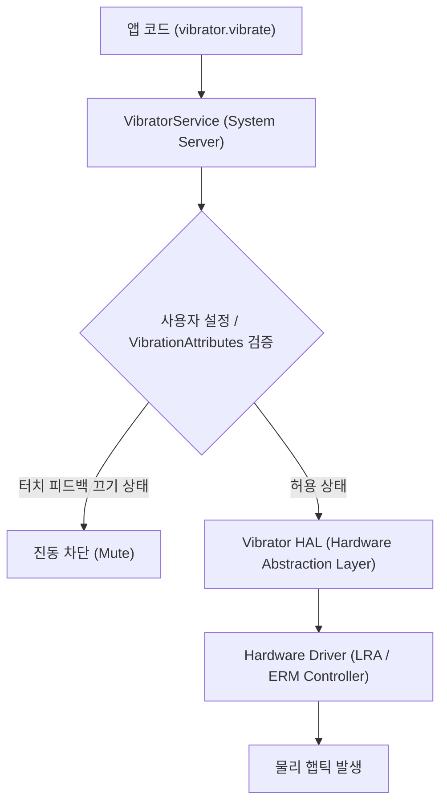

## VibratorManager 와 VibrationEffect 는 기기의 정밀 햅틱과 진동 파형을 제어한다

안드로이드의 햅틱 피드백 조작 체계는 단순한 무시간/무패턴 물리 모터 구동 방식에서 벗어나, `VibratorManager` 와 `VibrationEffect` API 를 통해 **진폭(Amplitude), 파형(Waveform), 프리미티브 컴포지션(Primitive Composition)**ㅑ 을 세밀히 조합하는 정밀 햅틱 엔진 아키텍처로 진화했다.

---

### 1. 개념 및 핵심 명제 (What)

- **VibratorManager (API 31+)**: 단일 진동 모터뿐만 아니라 최신 스마트폰, 가상현실(VR) 컨트롤러, 멀티 진동 하드웨어 장치들을 `CombinedVibration` 형태로 통합 추상화하는 시스템 서비스다.
- **VibrationEffect (API 26+)**: 진동 실행 단위 객체로, 단순히 밀리초(ms) 단위로 켜고 꺼지는 레거시 `vibrate(long milliseconds)` 메서드를 대체한다.
  - **OneShot Effect**: 지정된 시간과 진폭(`0~255` 또는 `DEFAULT_AMPLITUDE`)으로 단발성 진동을 생성한다.
  - **Waveform Effect**: 시간 및 진폭 배열(`timings[]`, `amplitudes[]`)을 받아 커스텀 진동 패턴 및 반복(Repeat) 스케줄을 실행한다.
  - **Predefined Effect**: OS 차원에서 튜닝된 표준 햅틱 패턴(`EFFECT_CLICK`, `EFFECT_DOUBLE_CLICK`, `EFFECT_HEAVY_CLICK`, `EFFECT_TICK`)을 가져와 기기별 최적화된 촉감을 보장한다.
  - **Primitive Composition**: LRA 모터 특성을 활용해 `PRIMITIVE_TICK`, `PRIMITIVE_CLICK`, `PRIMITIVE_THUD`, `PRIMITIVE_SPIN` 등의 세부 물리 파동 조각을 시차 및 척도(Scale)를 지정하여 복합 합성한다.

---

### 2. 왜 정밀 VibrationEffect 가 필요한가? (Why)

1. **하드웨어 제약 및 파편화 문제 해결**: 구형 모터(ERM)는 반응 속도가 느려 복잡한 햅틱을 표현하기 어렵고, 최신 LRA 모터는 즉각적인 정밀 파동 조작이 가능하다. `VibrationEffect.startComposition()` API 는 하드웨어가 지원하지 않을 경우 자동으로 가장 유사한 프리셋 패턴으로 안전하게 폴백(Fallback)한다.
2. **시스템 설정과의 조화 (System Sound & Haptics Policy)**: `VibrationAttributes` 를 명시함으로써, 사용자가 안드로이드 설정에서 '터치 진동 피드백'만 껐을 경우 알람/전화 벨소리 진동에는 영향을 주지 않고 터치 햅틱만 선별적으로 차단되도록 보장한다.

---

### 3. 내부 메커니즘 (How)



1. **하드웨어 기능 조회 검증 절차**:
   - `vibrator.hasVibrator()`: 물리 진동 모터 존재 여부 확인
   - `vibrator.hasAmplitudeControl()`: 세밀한 진폭 조절(0~255) 지원 여부 확인
   - `vibrator.areAllPrimitivesSupported(PRIMITIVE_CLICK, PRIMITIVE_TICK)`: 특정 프리미티브 햅틱 합성 지원 여부 검증

---

### 4. 올바른 구현 패턴 예시

```kotlin
fun playAdvancedHaptic(context: Context) {
    val vibrator = if (Build.VERSION.SDK_INT >= Build.VERSION_CODES.S) {
        val vibratorManager = context.getSystemService(Context.VIBRATOR_MANAGER_SERVICE) as VibratorManager
        vibratorManager.defaultVibrator
    } else {
        @Suppress("DEPRECATION")
        context.getSystemService(Context.VIBRATOR_SERVICE) as Vibrator
    }

    if (!vibrator.hasVibrator()) return

    // 1. 하드웨어가 햅틱 컴포지션을 지원하는지 확인
    val supportsComposition = Build.VERSION.SDK_INT >= Build.VERSION_CODES.R &&
            vibrator.areAllPrimitivesSupported(
                VibrationEffect.Composition.PRIMITIVE_CLICK,
                VibrationEffect.Composition.PRIMITIVE_TICK
            )

    val effect = if (supportsComposition && Build.VERSION.SDK_INT >= Build.VERSION_CODES.R) {
        // 프리미티브 합성 햅틱 (가장 고품질의 촉감 제공)
        VibrationEffect.startComposition()
            .addPrimitive(VibrationEffect.Composition.PRIMITIVE_TICK, 0.4f)
            .addPrimitive(VibrationEffect.Composition.PRIMITIVE_CLICK, 1.0f, 40)
            .compose()
    } else {
        // 프리셋 사전 정의 효과 폴백
        VibrationEffect.createPredefined(VibrationEffect.EFFECT_CLICK)
    }

    // 2. 터치 목적 속성 부여 및 실행
    val attributes = VibrationAttributes.createForUsage(VibrationAttributes.USAGE_TOUCH)
    vibrator.vibrate(effect, attributes)
}
```

---

### 5. 관련 문서 및 참조

상위 문서: [Haptics 및 Vibrator 계약](./haptics-and-vibrator-contracts.md)

관련 계약 문서:

- [InputManager는 물리 입력 장치를 이벤트 소스로 추상화한다](../input-accessibility-contracts/inputmanager-abstracts-physical-input-devices-as-event-sources.md)
- [Android System Services & Device Capabilities](../../android-system-services-and-device-capabilities.md)

공식 가이드: [Android Haptics - Vibrator API](https://developer.android.com/develop/ui/views/haptics/haptics-overview)

검증일: 2026-08-05. VibratorManager 및 VibrationEffect 최신 공식 API 사양 검증 완료.
