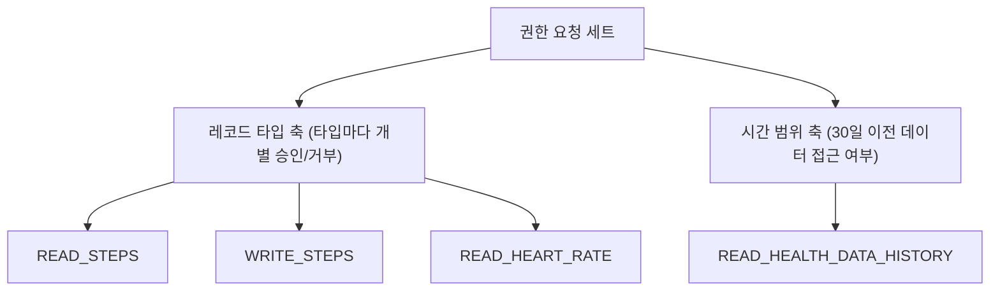

## Health Connect 권한은 레코드 타입별로 개별 부여된다

상위 문서: [Android 시스템 서비스와 기기 기능 지도](../../android-system-services-and-device-capabilities.md)
관련 지도: [Health Connect 접근 계약](./health-connect.md)

### 핵심 정의

Health Connect 에는 "건강 데이터 접근을 허용한다"는 단일 권한이 없다. 권한은 `android.permission.health.READ_STEPS`, `android.permission.health.WRITE_HEART_RATE` 처럼 `{READ|WRITE}_{레코드 타입}` 형태로 개별 부여된다. 사용자는 앱이 요청한 레코드 타입 목록 중 일부만 승인할 수 있다.

### 메커니즘

앱은 매니페스트에 필요한 레코드 타입의 권한을 각각 선언하고, 런타임에 Health Connect 의 권한 화면을 통해 요청한다.

```xml
<uses-permission android:name="android.permission.health.READ_STEPS"/>
<uses-permission android:name="android.permission.health.WRITE_STEPS"/>
<uses-permission android:name="android.permission.health.READ_HEART_RATE"/>
```

```kotlin
val permissions = setOf(
    HealthPermission.getReadPermission(StepsRecord::class),
    HealthPermission.getWritePermission(StepsRecord::class),
    HealthPermission.getReadPermission(HeartRateRecord::class),
)

val granted = client.permissionController.getGrantedPermissions()
if (!granted.containsAll(permissions)) {
    // 부분 승인을 항상 가정한다 — 걸음 수는 허용, 심박수는 거부될 수 있다
    requestPermissionsLauncher.launch(permissions)
}
```

기본적으로 read 권한은 승인 시점 기준 최근 30일 데이터까지만 접근할 수 있다. 그보다 오래된 이력이 필요하면 별도의 배경 이력 읽기 권한(`PERMISSION_READ_HEALTH_DATA_HISTORY`: 권한 승인 시점 이전 30일보다 앞선 과거 전체 이력 데이터 접근을 확장 허가하는 특수 권한)을 추가로 요청해야 한다 — 이 권한은 레코드 타입과 무관하게 "과거 데이터 접근 범위"를 확장하는 별개의 축이다.

### 다이어그램



### 판단 기준

- 권한 요청은 화면이 실제로 그 레코드 타입을 쓰는 시점에 맞춰 최소한으로 나눈다. 앱이 쓰지도 않는 레코드 타입까지 한 번에 요청하면 사용자가 전체를 거부할 확률이 올라간다.
- 부분 승인은 예외가 아니라 기본 시나리오로 설계한다 — "걸음 수는 보이는데 심박수 화면은 빈 상태"를 정상 UI 상태로 처리해야 한다.
- 과거 데이터 마이그레이션/백필이 필요한 기능만 배경 이력 읽기 권한을 별도로 요청하고, 일반 조회 화면에는 요청하지 않는다.

### 경계

- 이 노트는 권한 요청·승인 모델까지만 다룬다. Health Connect 자체가 온디바이스 저장소이지 클라우드 서비스가 아니라는 위치 모델은 [Health Connect는 클라우드 동기화가 아니라 앱 간 공유 온디바이스 저장소다](health-connect-on-device-storage.md)가 다룬다.
- 일반 런타임 권한(카메라, 위치 등)의 foreground/background 분리 모델과는 별개 시스템이다. Health Connect 권한은 `PermissionController` API 로만 확인·요청한다.

### 관찰 가능한 신호

`client.permissionController.getGrantedPermissions()` 로 실제 승인된 권한 집합을 조회해, 요청한 전체 집합과 차집합을 구하면 어떤 레코드 타입이 거부됐는지 코드로 바로 확인할 수 있다. 권한 없이 특정 레코드 타입을 `readRecords()` 하면 `SecurityException` 이 발생한다.

### 공식 문서

- [Health Connect permissions](https://developer.android.com/health-and-fitness/guides/health-connect/develop/get-started)
- [Read data from Health Connect](https://developer.android.com/health-and-fitness/guides/health-connect/develop/read-data)

검증일: 2026-08-04. 레코드 타입별 권한 문자열 형식과 30일 이력 제한, `PERMISSION_READ_HEALTH_DATA_HISTORY` 배경 이력 권한을 공식 문서로 확인했다.
