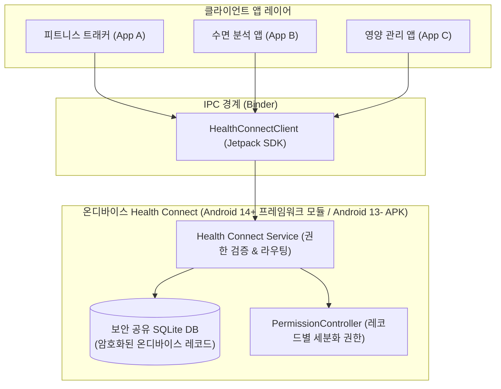

## Health Connect 접근 계약

이 지도는 **Health Connect**(사용자의 권한 승인 하에 다양한 피트니스·건강 앱들이 건강 데이터 레코드를 읽고 쓸 수 있도록 공유 저장소를 제공하는 플랫폼 라이브러리)를 "건강 데이터를 클라우드로 동기화하는 서비스"가 아니라 "기기 안에서 여러 앱이 공유하는 permission-scoped 데이터 저장소"로 다룬다. 앱이 직접 만드는 로컬 DB(Room 등)와 달리 Health Connect 의 레코드는 다른 앱도(사용자가 허용하면) 읽고 쓸 수 있으므로, 소유권과 권한 모델이 일반적인 앱 데이터 계층과 근본적으로 다르다.

### 주요 메커니즘 및 코드 예시 (Mechanisms & Code Examples)

Health Connect 클라이언트는 기기 내 전용 시스템 서비스/공유 APK와 IPC로 통신하며, SDK 가용성 확인 후 클라이언트를 초기화하고 레코드 단위의 CRUD 및 변경 토큰(Change Token) 기반 동기화를 수행한다.

```kotlin
// 1. Health Connect SDK 지원 상태 확인
val availability = HealthConnectClient.getSdkStatus(context)
if (availability == HealthConnectClient.SDK_AVAILABLE) {
    val healthConnectClient = HealthConnectClient.getOrCreate(context)
    
    // 2. 권한 확인 및 레코드 읽기
    val grantedPermissions = healthConnectClient.permissionController.getGrantedPermissions()
    if (HealthPermission.getReadPermission(StepsRecord::class) in grantedPermissions) {
        val response = healthConnectClient.readRecords(
            ReadRecordsRequest(
                recordType = StepsRecord::class,
                timeRangeFilter = TimeRangeFilter.between(startTime, endTime)
            )
        )
        for (stepRecord in response.records) {
            println("Steps: ${stepRecord.count} from ${stepRecord.startTime} to ${stepRecord.endTime}")
        }
    }
}
```

### 아키텍처 다이어그램



### 관찰 신호 (Observation Signals)

- **ADB 패키지 및 서비스 확인**:
  ```bash
  # Health Connect 패키지 설치 확인 (Android 13 이하)
  adb shell pm list packages | grep healthconnect
  # 프레임워크 덤프 확인 (Android 14+)
  adb shell dumpsys activity service com.google.android.apps.healthdata
  # Health Connect 전용 권한 설정 화면 실행
  adb shell am start -a android.health.connect.action.HEALTH_HOME_SETTINGS
  ```
- **Logcat 모니터링**:
  ```bash
  adb logcat -s HealthConnectClient HealthDataService
  ```

### 읽는 순서

1. [Health Connect는 클라우드 동기화가 아니라 앱 간 공유 온디바이스 저장소다](health-connect-on-device-storage.md)에서 데이터가 어디에 있고 누가 접근하는지부터 본다.
2. [Health Connect 권한은 레코드 타입별로 개별 부여된다](health-connect-record-permissions.md)에서 왜 "건강 데이터 접근 허용" 같은 단일 권한이 없는지 본다.

### 문제 분류

| 증상 또는 질문 | 먼저 확인할 경계 |
| --- | --- |
| 걸음 수는 읽히는데 심박수는 읽히지 않는다 | 레코드 타입별 권한을 개별로 선언·요청했는지(`READ_STEPS` 와 `READ_HEART_RATE` 는 별개) |
| 기기에서 Health Connect 관련 API 호출이 전부 실패한다 | Health Connect 앱 자체가 설치·지원되는 기기인지(`HealthConnectClient.getSdkStatus()`) |
| 30일 이전 데이터가 조회되지 않는다 | `PERMISSION_READ_HEALTH_DATA_HISTORY` 배경 읽기 권한을 별도로 요청했는지 |
| 다른 헬스 앱이 기록한 데이터가 우리 앱에 안 보인다 | 사용자가 실제로 그 레코드 타입에 대한 read 권한을 우리 앱에 부여했는지(Health Connect 는 기본적으로 앱별 데이터를 격리하지 않는다) |

### 책임 경계

- 이 지도는 Health Connect 클라이언트 API(권한, 레코드 CRUD, 변경 동기화)만 다룬다. 특정 웨어러블 센서가 걸음/심박수를 어떻게 측정하는지는 [센서 접근 계약](../sensors/sensor.md)이 다룬다.
- Wear OS 자체의 Tile/Complication UI 표면은 Wear OS 플랫폼 영역이 다룬다. 이 지도는 그 데이터가 Health Connect 를 거쳐 여러 앱에 공유되는 계층만 다룬다.
- FHIR 형식 의료 기록(개인 건강 기록) 연동 같은 고급 기능은 이 지도의 범위 밖이다.

### 노트 목록

- [Health Connect는 클라우드 동기화가 아니라 앱 간 공유 온디바이스 저장소다](health-connect-on-device-storage.md)
- [Health Connect 권한은 레코드 타입별로 개별 부여된다](health-connect-record-permissions.md)

### 공식 문서

- [Health Connect overview](https://developer.android.com/health-and-fitness/guides/health-connect)
- [Get started with Health Connect](https://developer.android.com/health-and-fitness/guides/health-connect/develop/get-started)

검증일: 2026-08-04. Health Connect 클라이언트 아키텍처 및 권한 모델을 공식 문서를 기준으로 확인했다.
