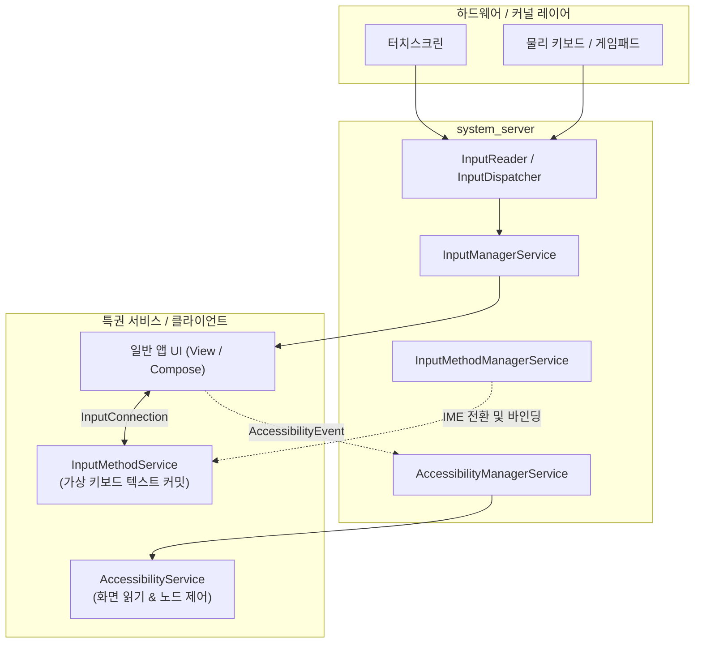

## 입력 장치와 접근성 서비스 계약

이 지도는 물리 입력 장치 추상화를 담당하는 **InputManager**, 다른 앱 화면의 UI 이벤트를 관찰하고 조작하는 보조 기술용 특권 서비스인 **AccessibilityService**, 그리고 가상 키보드 텍스트 입력을 담당하는 **IME**(Input Method Editor, InputMethodService)라는 세 개의 서로 다른 특권 계층을 분리한다.

### 주요 메커니즘 및 코드 예시 (Mechanisms & Code Examples)

- **InputManager**: 물리 하드웨어 입력 장치(마우스, 키보드, 게임패드, 스타일러스) 열거 및 연결 수명주기 감지.
- **AccessibilityService**: 시스템 전역 UI 이벤트 스트림 수신(`AccessibilityEvent`), 가상 뷰 트리 순회(`AccessibilityNodeInfo`), 접근성 액션 실행.
- **InputMethodService**: 포커스된 에디터와의 양방향 IPC(`InputConnection`)를 통한 텍스트 커밋 및 키 이벤트 주입.

```kotlin
// InputManager 장치 조회 예시
val inputManager = getSystemService(Context.INPUT_SERVICE) as InputManager
val deviceIds = inputManager.inputDeviceIds
for (id in deviceIds) {
    val device = inputManager.getInputDevice(id)
    if (device != null && (device.sources and InputDevice.SOURCE_GAMEPAD) != 0) {
        println("Gamepad detected: ${device.name}")
    }
}
```

### 아키텍처 다이어그램



### 관찰 신호 (Observation Signals)

- **ADB 및 dumpsys 진단**:
  ```bash
  # 1. 연결된 물리 입력 장치 및 이벤트 라우팅 덤프
  adb shell dumpsys input
  # 2. 활성화된 접근성 서비스 목록 및 이벤트 구독 설정
  adb shell dumpsys accessibility
  # 3. 현재 활성 IME 및 InputConnection 바인딩 상태
  adb shell dumpsys input_method
  # 4. 활성화된 접근성 서비스 보안 설정 조회
  adb shell settings get secure enabled_accessibility_services
  ```
- **Logcat 로그**:
  ```bash
  adb logcat -s InputReader InputDispatcher AccessibilityService InputMethodService
  ```

### 읽는 순서

1. [InputManager/InputDevice는 물리 입력 장치를 이벤트 소스로 추상화한다](input-manager-physical-devices.md) 에서 키보드/마우스/게임패드가 시스템에 어떻게 보이는지 본다.
2. [AccessibilityService는 다른 앱의 UI 이벤트를 관찰하고 조작할 수 있는 특권 서비스다](accessibility-service-ui-inspection.md) 에서 이 특권과 사용자 승인 절차를 본다.
3. [InputMethodService는 AccessibilityService와 다른 별도의 입력 계약이다](input-method-service.md) 에서 두 특권 서비스를 혼동하지 않는 법을 본다.

### 문제 분류

| 증상 | 먼저 확인할 경계 |
| --- | --- |
| 외부 키보드/게임패드 입력이 인식 안 됨 | InputDevice 소스 타입과 앱의 키 이벤트 처리 범위 |
| 접근성 서비스가 설치됐는데 동작 안 함 | 사용자가 설정에서 서비스를 명시적으로 활성화했는지 |
| 커스텀 키보드 앱이 시스템 기본 키보드로 안 잡힘 | IME 등록과 사용자의 기본 키보드 선택 여부 |

### 책임 경계

- AccessibilityService 와 InputMethodService 는 둘 다 사용자의 명시적 활성화가 필요한 특권 서비스이지만 목적이 다르다. 하나가 다른 하나의 대체재가 아니다.
- 입력 장치 추상화(InputManager)는 하드웨어 종류를 가리는 계층이고, 그 위에서 무엇을 할 수 있는지는 일반 앱 권한 범위 안에 있다.

### 노트 목록

- [InputManager/InputDevice는 물리 입력 장치를 이벤트 소스로 추상화한다](input-manager-physical-devices.md)
- [AccessibilityService는 다른 앱의 UI 이벤트를 관찰하고 조작할 수 있는 특권 서비스다](accessibility-service-ui-inspection.md)
- [InputMethodService는 AccessibilityService와 다른 별도의 입력 계약이다](input-method-service.md)

### 공식 문서

- [AccessibilityService 문서](https://developer.android.com/guide/topics/ui/accessibility/service)
- [InputMethod 개발 가이드](https://developer.android.com/develop/ui/views/touch-and-input/creating-input-method)
- [InputManager](https://developer.android.com/reference/android/hardware/input/InputManager)

검증일: 2026-08-03. [AccessibilityService 문서](https://developer.android.com/guide/topics/ui/accessibility/service)와 [InputMethod 개발 가이드](https://developer.android.com/develop/ui/views/touch-and-input/creating-input-method) 를 기준으로 확인했다.
