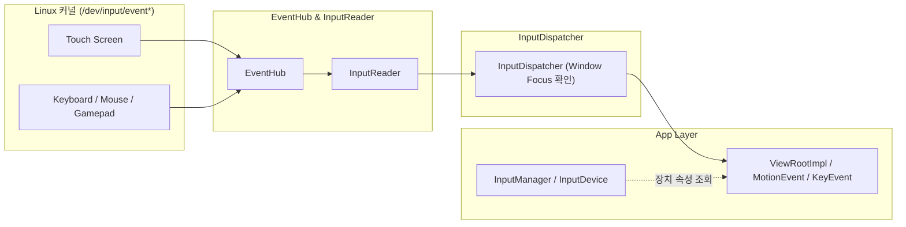

## InputManager/InputDevice는 물리 입력 장치를 이벤트 소스로 추상화한다

상위 문서: [Android 시스템 서비스와 기기 기능 지도](../../android-system-services-and-device-capabilities.md)
관련 지도: [입력 장치와 접근성 서비스 계약](input-accessibility.md)

### 핵심 정의

터치스크린, 물리 키보드, 마우스, 게임패드, 스타일러스는 모두 **InputDevice**(시스템에 연결된 하드웨어 입력 기기를 단일 인터페이스로 추상화한 객체)로 다뤄지며, 각 장치는 소스 타입 비트마스크(`SOURCE_TOUCHSCREEN`, `SOURCE_KEYBOARD`, `SOURCE_MOUSE`, `SOURCE_GAMEPAD`, `SOURCE_STYLUS` 등)로 자신이 생성하는 이벤트 종류를 나타낸다. `InputManager.getInputDeviceIds()`로 현재 연결된 장치 목록을 조회할 수 있다.

### 메커니즘

물리 입력은 커널 입력 서브시스템에서 시작해 시스템 서버 내부의 **InputReader**(커널 드라이버로부터 raw 입력 이벤트를 읽어 표준 형식으로 다듬는 컴포넌트)와 **InputDispatcher**(처리된 입력 이벤트를 윈도우 포커스에 맞게 대상 앱으로 디스패치하는 컴포넌트)를 거쳐 `MotionEvent`/`KeyEvent`로 앱에 전달된다. 앱은 이벤트의 소스 타입을 확인해 같은 좌표 기반 이벤트라도 터치인지 마우스/스타일러스인지 구분할 수 있다. 예를 들어 스타일러스는 필압(`getPressure()`)과 기울기 정보를 함께 전달할 수 있다.

게임패드/키보드 같은 비-포인터 장치는 `KeyEvent`로 전달되며, 여러 장치가 동시에 연결된 경우 각 이벤트는 `getDeviceId()`로 어느 장치에서 왔는지 구분할 수 있다.

### 다이어그램



### 연결 변화와 이벤트 소스 확인

```kotlin
private val listener = object : InputManager.InputDeviceListener {
    override fun onInputDeviceAdded(id: Int) = refreshDevice(id)
    override fun onInputDeviceChanged(id: Int) = refreshDevice(id)
    override fun onInputDeviceRemoved(id: Int) = removeDevice(id)
}

override fun onStart() {
    super.onStart()
    inputManager.registerInputDeviceListener(listener, mainHandler)
    inputManager.inputDeviceIds.forEach(::refreshDevice)
}

override fun onStop() {
    inputManager.unregisterInputDeviceListener(listener)
    super.onStop()
}
```

changed 콜백에서는 이전 객체를 재사용하지 말고 `getInputDevice(id)`를 다시 조회한다. 이벤트의 source는 비트마스크로 검사하고, 연결 해제 직후 조회가 null인 경쟁 조건을 허용한다.

### 판단 기준

- 터치 전용으로 설계된 UI에 외부 키보드/게임패드 대응을 추가할 때는 포커스 이동과 방향키 탐색을 별도로 처리해야 한다. 터치 제스처가 자동으로 키 입력에 대응되지 않는다.
- 스타일러스 전용 기능(필압 기반 그리기 등)은 `getToolType()`으로 실제 스타일러스 입력인지 손가락 터치인지 구분한 뒤 분기한다.
- 여러 입력 장치가 연결된 대화면/데스크톱 환경(`07_platforms`의 large-screen, ChromeOS)에서는 한 세션에 여러 `InputDevice`가 동시에 활성일 수 있다는 점을 테스트에 포함한다.

### 경계

- 이 노트는 입력 장치 추상화까지 다룬다. 이 이벤트를 가로채 다른 앱을 조작하는 특권 서비스는 [AccessibilityService는 다른 앱의 UI 이벤트를 관찰하고 조작할 수 있는 특권 서비스다](accessibility-service-ui-inspection.md)가 다룬다.
- 텍스트 입력을 위한 소프트 키보드 자체의 계약은 [InputMethodService는 AccessibilityService와 다른 별도의 입력 계약이다](input-method-service.md)가 다룬다.

### 관찰 가능한 신호

`adb shell dumpsys input`으로 현재 연결된 입력 장치 목록과 각 장치의 소스 타입, 최근 이벤트 라우팅 대상을 확인할 수 있다.

```bash
# 1. 연결된 물리 입력 장치 목록 및 드라이버 정보 덤프
adb shell dumpsys input | grep -A 10 "Input Devices"

# 2. 실시간 입력 이벤트 라우팅 및 윈도우 포커스 디스패치 상태 확인
adb shell dumpsys input | grep -A 8 "FocusedApplication"
```

### 공식 문서

- https://developer.android.com/develop/ui/views/touch-and-input/game-controllers/controller-input
- https://developer.android.com/reference/android/view/InputDevice

검증일: 2026-08-06. 장치 add/change/remove 수명주기와 source bitmask 판별 흐름을 InputManager API로 보강했다.
