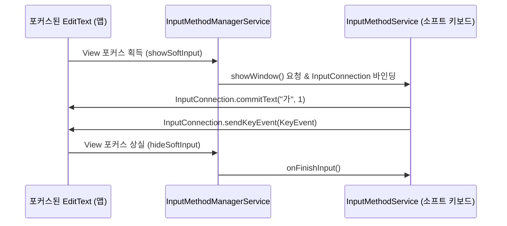

## InputMethodService는 AccessibilityService와 다른 별도의 입력 계약이다

상위 문서: [Android 시스템 서비스와 기기 기능 지도](../../android-system-services-and-device-capabilities.md)
관련 지도: [입력 장치와 접근성 서비스 계약](./input-accessibility.md)

### 핵심 정의

`InputMethodService`(IME, 소프트웨어 가상 키보드)는 텍스트 입력 필드에 문자를 생성해 넣고 커서를 제어하는 것을 전담하는 특권 서비스다. 다른 앱의 화면 전체를 관찰하거나 임의의 UI 액션을 수행하는 `AccessibilityService`와 목적과 권한 범위가 다르다. 두 서비스는 각각 별도의 시스템 설정 화면(기본 키보드 선택, 접근성 서비스 활성화)에서 독립적으로 관리된다.

### 메커니즘

포커스가 있는 텍스트 필드는 **InputConnection**(텍스트 편집 뷰와 현재 활성화된 IME 사이에서 텍스트 전달, 커서 이동, 조합 문자 입력을 처리하는 통신 통로)을 통해 현재 활성 IME와 통신한다. IME는 이 연결을 통해서만 텍스트를 커밋하거나 커서를 이동할 수 있으며, 텍스트 필드가 아닌 임의의 화면 요소를 클릭하거나 다른 앱의 상태를 읽는 것은 이 API의 범위 밖이다. 사용자가 기본 키보드를 전환하면 새 IME가 이 `InputConnection`을 이어받는다.

### 다이어그램



### 선언과 안전한 커밋 흐름

```xml
<service
    android:name=".KeyboardService"
    android:exported="true"
    android:permission="android.permission.BIND_INPUT_METHOD">
    <intent-filter>
        <action android:name="android.view.InputMethod" />
    </intent-filter>
    <meta-data android:name="android.view.im" android:resource="@xml/method" />
</service>
```

```kotlin
fun commitKey(text: CharSequence) {
    currentInputConnection?.commitText(text, 1)
}

override fun onFinishInput() {
    clearComposingAndSuggestionState()
    super.onFinishInput()
}
```

`InputConnection`은 현재 editor와 함께 바뀌는 단기 핸들이다. 캐시하지 말고 매 작업 때 확인하며 null 또는 false 반환을 editor 종료 경쟁으로 처리한다. password variation과 `IME_FLAG_NO_PERSONALIZED_LEARNING`에서는 입력을 학습·로그·원격 전송하지 않는다.

### 판단 기준

- 커스텀 키보드 앱을 만든다면 접근성 서비스 권한을 요구할 필요가 없다. IME 선언과 사용자의 기본 키보드 선택만으로 충분하다.
- 반대로 화면 전체를 관찰해야 하는 자동화·보조 기능(예: 특정 앱 화면 변화 감지)에는 IME가 아니라 `AccessibilityService`가 맞는 도구다. 목적에 맞지 않는 서비스를 선택하면 필요한 정보에 접근할 수 없다.
- IME가 수집하는 입력 내용(특히 비밀번호 필드)은 `EditorInfo.IME_FLAG_NO_PERSONALIZED_LEARNING` 같은 신호와 `inputType`(`TYPE_TEXT_VARIATION_PASSWORD`)을 존중해 개인정보를 보호해야 한다.

### 경계

- 이 노트는 IME의 범위를 다룬다. 다른 앱을 광범위하게 관찰/조작하는 특권은 [AccessibilityService는 다른 앱의 UI 이벤트를 관찰하고 조작할 수 있는 특권 서비스다](accessibility-service-ui-inspection.md)가 다룬다.
- 물리 키보드 입력 이벤트 자체의 추상화는 [InputManager/InputDevice는 물리 입력 장치를 이벤트 소스로 추상화한다](input-manager-physical-devices.md)가 다룬다.

### 관찰 가능한 신호

`adb shell ime list -s`로 설치된 IME 목록과 현재 기본 IME를 확인할 수 있다.

```bash
# 1. 기기에 등록된 IME 목록 확인
adb shell ime list -s

# 2. 현재 활성 IME 바인딩 및 InputConnection 상태 덤프
adb shell dumpsys input_method | grep -A 10 "mCurMethodId"

# 3. 특정 IME 서비스로 기본 키보드 설정
adb shell ime set <ime_component_name>
```

### 공식 문서

- https://developer.android.com/develop/ui/views/touch-and-input/creating-input-method
- https://developer.android.com/reference/android/inputmethodservice/InputMethodService

검증일: 2026-08-06. `BIND_INPUT_METHOD` 보호 선언, InputConnection 수명, 민감 editor 처리 흐름을 보강했다.
