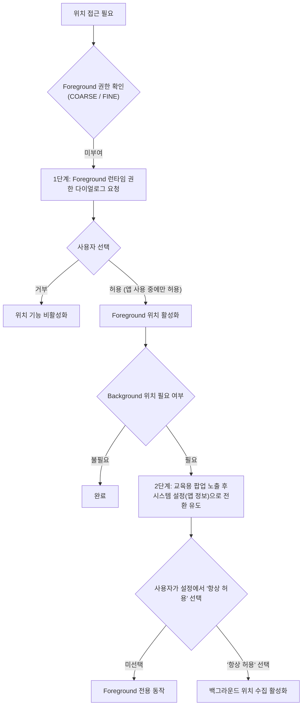

## 위치 권한은 foreground와 background 두 단계로 나뉜다

상위 문서: [Android 시스템 서비스와 기기 기능 지도](../../android-system-services-and-device-capabilities.md)
관련 지도: [위치 접근 계약](./location.md)

### 핵심 정의

Android 10(API 29) 이후 위치 접근은 "앱을 사용하는 동안"(foreground)과 "항상 허용"(background) 두 단계로 나뉜다. `ACCESS_FINE_LOCATION`/`ACCESS_COARSE_LOCATION`만 선언해서는 앱이 백그라운드(사용자가 화면을 보지 않는 상태)에 있을 때 위치를 받을 수 없다. background 접근에는 **ACCESS_BACKGROUND_LOCATION**(앱이 화면에 노출되지 않거나 백그라운드 상태일 때 위치 정보를 수집하기 위해 요구하는 특수 권한)을 추가로 선언하고 별도 승인을 받아야 한다.

### 메커니즘

Android 11(API 30)부터 background 위치 권한은 앱이 직접 시스템 권한 대화상자에서 즉시 요청할 수 없다. 사용자는 설정 화면으로 이동해 "항상 허용"을 수동으로 선택해야 하며, 시스템은 이 흐름을 유도하는 UI만 제공할 수 있다. foreground 권한을 먼저 별도로 요청하고, 그 이후 필요할 때 background 권한을 별도 요청하는 2단계 흐름이 요구된다.

foreground 권한만 있는 상태에서 앱이 백그라운드로 전환되면 위치 콜백은 중단되거나 빈도가 크게 낮아진다.

### 다이어그램



### 단계별 요청 흐름

```kotlin
fun requestLocationAccess() {
    if (!hasForegroundLocation()) {
        foregroundLauncher.launch(arrayOf(ACCESS_COARSE_LOCATION, ACCESS_FINE_LOCATION))
        return
    }
    if (needsBackgroundLocation() && !hasBackgroundLocation()) {
        showBackgroundLocationEducation()
        // 사용자가 명시적으로 계속한 뒤 앱 상세 설정의 "항상 허용"으로 안내한다.
        startActivity(Intent(Settings.ACTION_APPLICATION_DETAILS_SETTINGS).apply {
            data = Uri.parse("package:$packageName")
        })
    }
}
```

API 30+에서는 foreground와 background를 한 번에 요청하지 않는다. 설정에서 돌아오면 `checkSelfPermission(ACCESS_BACKGROUND_LOCATION)`을 다시 읽으며, 설정 이동 자체를 승인으로 간주하지 않는다. foreground service를 쓰더라도 background location 권한·서비스 type·시작 제한은 별도 조건이다.

### 판단 기준

- background 위치가 실제로 필요한 기능(지오펜싱, 백그라운드 트래킹)인지 먼저 검증한다. Play 정책은 background 위치 사용에 정당한 사유 설명을 요구하며, 불필요하게 요청하면 심사에서 거부될 수 있다.
- foreground 권한과 background 권한을 한 번에 요청하지 않는다. targetSdkVersion이 Android 11(API 30) 이상이면 두 권한을 동시에 요청할 경우 시스템이 요청 자체를 무시하고 foreground/background 어느 쪽도 부여하지 않는다.
- 대상 SDK가 낮은 앱은 이 2단계 모델이 적용되지 않을 수 있으므로 `targetSdkVersion`을 함께 확인한다.

### 경계

- 이 노트는 권한 단계 자체를 다룬다. 권한이 승인된 뒤에도 시스템이 실행을 막을 수 있는 AppOps 계층은 [AppOps는 permission 승인 뒤에도 실행 시점 정책을 추가로 거부할 수 있다](../../service-lookup/appops-permission-denial.md)가 다룬다.
- 백그라운드에서 위치를 계속 수집하기 위한 실행 수단(포그라운드 서비스 vs WorkManager) 선택은 백그라운드 작업 계약이 다룬다.

### 관찰 가능한 신호

`adb shell dumpsys package <pkg>`의 runtime permissions에서 `ACCESS_BACKGROUND_LOCATION`의 grant 상태를 확인한다. 앱이 백그라운드 진입 후 위치 콜백이 멈추면 이 권한 부재가 가장 먼저 의심할 지점이다.

```bash
# 1. 앱의 위치 권한 부여 현황 덤프
adb shell dumpsys package <package_name> | grep -E "ACCESS_FINE_LOCATION|ACCESS_COARSE_LOCATION|ACCESS_BACKGROUND_LOCATION"

# 2. 백그라운드 위치 AppOps 거부/허용 상태 확인
adb shell cmd appops get <package_name> ACCESS_BACKGROUND_LOCATION
```

### 공식 문서

- https://developer.android.com/develop/sensors-and-location/location/permissions
- https://developer.android.com/about/versions/11/privacy/location

검증일: 2026-08-06. API 30+의 단계적 요청, 설정 복귀 재검사, foreground-service와 권한의 분리 경계를 보강했다.
