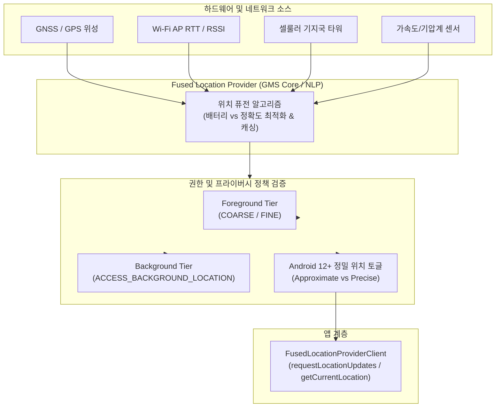

## 위치 접근 계약

이 지도는 Android 위치 접근을 위치 소스 합성, 권한 단계, 정확도/전력 트레이드오프로 분리한다. **FusedLocationProviderClient**(GPS, Wi-Fi, 셀룰러, 기기 센서 등 다양한 측위 소스를 통합 계산하여 최적의 위치 스트림을 산출하는 Google 위치 서비스 클라이언트)는 이 위치 접근의 핵심 구현 엔티티다.

### 주요 메커니즘 및 코드 예시 (Mechanisms & Code Examples)

- **FusedLocationProviderClient**: 배터리 소모와 정확도를 최적화하여 위치 계산. `LocationRequest` 로 우선순위 지정.
- **권한 단계 (Permissions)**: Foreground(`ACCESS_COARSE_LOCATION`, `ACCESS_FINE_LOCATION`)와 Background(`ACCESS_BACKGROUND_LOCATION`) 분리 요청.
- **정확도 선택 (Accuracy Tiers)**: Android 12+ 대략적(Approximate) 및 정밀(Precise) 위치 사용자 선택 처리.

```kotlin
// FusedLocationProviderClient 예시
val fusedLocationClient = LocationServices.getFusedLocationProviderClient(context)
val locationRequest = LocationRequest.Builder(Priority.PRIORITY_HIGH_ACCURACY, 10000)
    .setMinUpdateIntervalMillis(5000)
    .build()

// 권한 확인 후 위치 업데이트 요청
fusedLocationClient.requestLocationUpdates(
    locationRequest,
    locationCallback,
    Looper.getMainLooper()
)
```

### 아키텍처 다이어그램



### 관찰 신호 (Observation Signals)

- **ADB 및 dumpsys 진단**:
  ```bash
  # 1. 시스템 전역 위치 제공자 상태 및 활성 요청 목록 덤프
  adb shell dumpsys location
  # 2. 특정 패키지의 위치 권한 및 AppOps 허용 상태 점검
  adb shell cmd appops get <package_name> COARSE_LOCATION
  adb shell cmd appops get <package_name> FINE_LOCATION
  adb shell cmd appops get <package_name> MONITOR_LOCATION
  ```
- **Logcat 로그**:
  ```bash
  adb logcat -s LocationManagerService FusedLocationProvider LocationCallback
  ```

### 읽는 순서

1. [FusedLocationProviderClient는 여러 위치 소스를 하나의 API로 합성한다](./fused-location-provider.md) 에서 GPS/네트워크/센서를 앱이 직접 고르지 않는 이유를 본다.
2. [위치 권한은 foreground와 background 두 단계로 나뉜다](./location-permission-tiers.md) 에서 승인 UX 와 OS 버전별 차이를 확인한다.
3. [정밀 위치와 대략적 위치는 별도 permission으로 요청한다](precise-vs-approximate-location.md) 에서 Android 12+ 정확도 선택 모델을 본다.

### 문제 분류

| 증상 | 먼저 확인할 경계 |
| --- | --- |
| 위치가 전혀 안 잡힘 | 위치 서비스 on/off, permission grant 상태, 실내/실외 |
| foreground 에서는 되는데 background 에서 안 됨 | background 위치 permission 별도 요청 여부, 대상 SDK |
| 정확도가 기대보다 낮음 | ACCESS_COARSE_LOCATION 만 승인됐는지, 사용자가 "정확한 위치"를 껐는지 |
| 위치 업데이트가 배터리를 많이 씀 | 요청 interval/priority 가 필요 이상으로 높은지 |

### 책임 경계

- 위치 소스 합성(GPS/Wi-Fi/셀/센서)은 FusedLocationProviderClient 의 책임이며 앱이 개별 provider 를 직접 관리할 필요는 없다.
- permission 은 접근 자격을, [AppOps](../../service-lookup/service-lookup.md) 는 실행 시점 허용을 답한다. 위치는 사용자가 세부 화면에서 앱별로 자주 재조정하는 대표적인 영역이다.
- 정확도 선택과 background 접근은 서로 다른 축이다. foreground 에서 coarse 만 받을 수도, background 에서 fine 을 받을 수도 있다.

### 노트 목록

- [FusedLocationProviderClient는 여러 위치 소스를 하나의 API로 합성한다](./fused-location-provider.md)
- [위치 권한은 foreground와 background 두 단계로 나뉜다](./location-permission-tiers.md)
- [정밀 위치와 대략적 위치는 별도 permission으로 요청한다](precise-vs-approximate-location.md)

### 공식 문서

- [위치 데이터 접근 요청](https://developer.android.com/develop/sensors-and-location/location/permissions)
- [FusedLocationProviderClient 문서](https://developers.google.com/android/reference/com/google/android/gms/location/FusedLocationProviderClient)

검증일: 2026-08-03. [위치 데이터 접근 요청](https://developer.android.com/develop/sensors-and-location/location/permissions)과 [FusedLocationProviderClient 문서](https://developers.google.com/android/reference/com/google/android/gms/location/FusedLocationProviderClient) 를 기준으로 확인했다.
