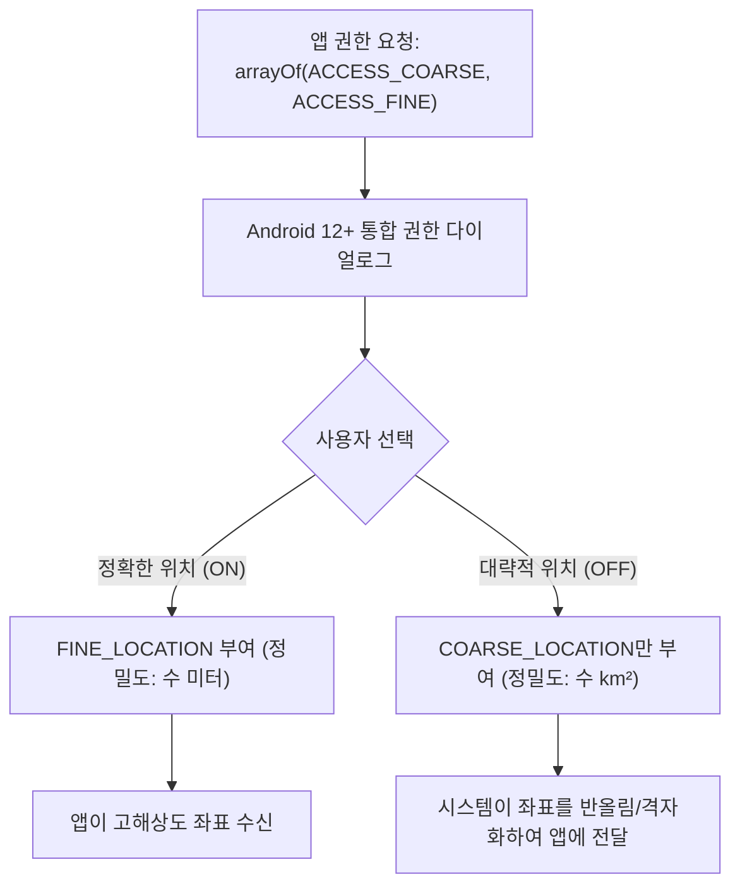

## 정밀 위치와 대략적 위치는 별도 permission으로 요청한다

상위 문서: [Android 시스템 서비스와 기기 기능 지도](../../android-system-services-and-device-capabilities.md)
관련 지도: [위치 접근 계약](./location.md)

### 핵심 정의

Android 12(API 31)부터 사용자는 앱이 위치를 요청할 때 **ACCESS_FINE_LOCATION**(GPS 및 센서를 활용한 반경 수 미터 수준의 정밀 위치 권한)과 **ACCESS_COARSE_LOCATION**(셀 타워/Wi-Fi 기반 수 제곱킬로미터 면적으로 뭉개진 대략적 위치 권한)을 별도로 선택할 수 있다. 앱이 두 permission을 모두 선언해도 사용자는 대략적 위치만 승인할 수 있으며, 이 경우 fine 요청도 coarse 정확도로 강등된 값을 받는다.

### 메커니즘

권한 요청 대화상자에 "정확한 위치"와 "대략적 위치" 두 개의 별도 스위치가 나타난다. 사용자가 대략적 위치만 켜면, 시스템은 `ACCESS_FINE_LOCATION`이 매니페스트에 있어도 좌표를 의도적으로 낮은 해상도로 반올림해 반환한다. 앱 코드 입장에서는 API 호출 자체가 실패하지 않고 조용히 낮은 정확도의 값을 받는 형태로 나타난다.

### 다이어그램



### 권한 결과와 위치 품질 분리

```kotlin
locationPermissionLauncher.launch(
    arrayOf(ACCESS_COARSE_LOCATION, ACCESS_FINE_LOCATION)
)

val hasApproximate = checkSelfPermission(ACCESS_COARSE_LOCATION) == PERMISSION_GRANTED
val hasPrecise = checkSelfPermission(ACCESS_FINE_LOCATION) == PERMISSION_GRANTED
when {
    hasPrecise -> enablePreciseFeatures()
    hasApproximate -> enableRegionLevelFallback()
    else -> disableLocationFeatures()
}
```

Android 12+에서는 fine만 단독 요청하지 말고 coarse와 함께 요청한다. 사용자가 approximate를 선택하면 coarse만 grant될 수 있다. `Location.accuracy`는 개별 fix의 추정 오차이므로 권한 등급 판정 수단이 아니며, 권한 상태와 실제 fix 품질을 각각 확인한다.

### 판단 기준

- precise/approximate 선택은 permission grant 상태로 판정하고, `Location.accuracy`는 현재 fix가 제품 기능에 충분한지 판단하는 별도 품질 신호로 사용한다.
- 지도 상 정밀 마커 표시처럼 fine 정확도가 필수인 기능은 사용자가 coarse만 허용했을 때의 대체 UX(예: 대략적 지역 표시로 전환)를 설계해야 한다.
- 지오펜싱처럼 좁은 반경 판정이 필요한 기능은 대략적 위치로는 신뢰할 수 없다는 점을 요구사항에 명시한다.

### 경계

- 이 노트는 정확도 등급 선택 자체를 다룬다. foreground/background 접근 시점 구분은 [위치 권한은 foreground와 background 두 단계로 나뉜다](./location-permission-tiers.md)가 다룬다.
- 정확도와 배터리 소모 트레이드오프 자체(주기, priority 선택)는 [FusedLocationProviderClient는 여러 위치 소스를 하나의 API로 합성한다](./fused-location-provider.md)가 다룬다.

### 관찰 가능한 신호

권한 대화상자를 실기기/에뮬레이터에서 직접 띄워 "정확한 위치" 스위치를 껐다 켰다 하며 반환되는 `Location.getAccuracy()` 값의 변화를 관찰한다.

```bash
# 1. 위치 정확도 관련 AppOps 상태 점검 (FINE vs COARSE)
adb shell cmd appops get <package_name> FINE_LOCATION
adb shell cmd appops get <package_name> COARSE_LOCATION

# 2. 시스템 위치 매니저의 최근 Fix 정확도 덤프
adb shell dumpsys location | grep -A 5 "Last Known Locations"
```

### 공식 문서

- https://developer.android.com/about/versions/12/behavior-changes-12#approximate-location

검증일: 2026-08-06. coarse+fine 동시 요청과 permission 등급·실제 fix accuracy의 분리를 보강했다.
