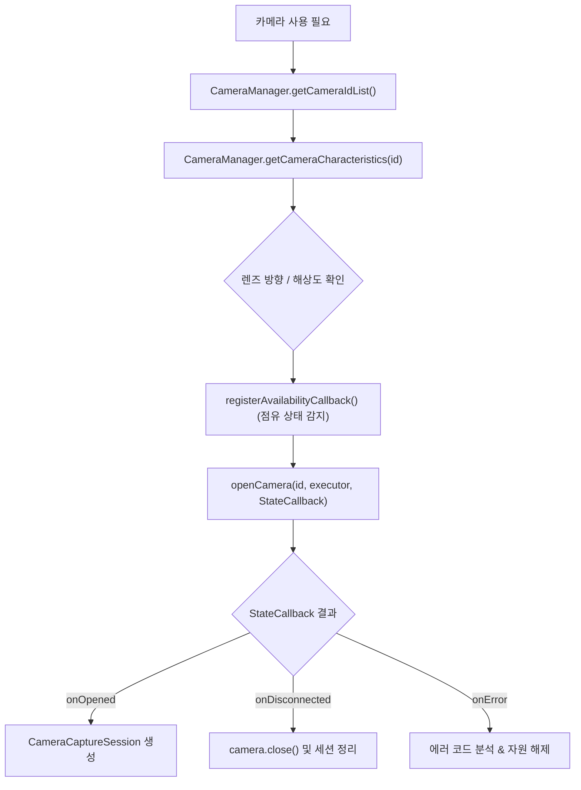

## CameraManager 접근은 가용성 콜백과 캐릭터리스틱 조회로 시작한다

상위 문서: [Android 시스템 서비스와 기기 기능 지도](../../android-system-services-and-device-capabilities.md)
관련 지도: [미디어/오디오/카메라 시스템 서비스 접근 계약](./media-audio-camera.md)

### 핵심 정의

`CameraManager`(기기에 연결된 카메라 장치 목록을 열거하고 가용성을 관리하는 시스템 서비스)는 각 카메라의 `CameraCharacteristics`(해상도, 지원 포맷, 렌즈 방향 등 카메라의 하드웨어 물리 특성을 담은 메타데이터 객체)를 조회하고, `AvailabilityCallback`으로 장치 연결·점유·접근 우선순위 변화를 관찰하도록 설계돼 있다. 단일 카메라 ID의 점유는 경쟁 자원이지만, 기기가 `getConcurrentCameraIds()`로 공개한 카메라 조합은 같은 클라이언트가 동시에 열어 세션을 구성할 수 있다.

### 메커니즘

카메라를 열기 전 `getCameraIdList()`로 카메라 ID 목록을, `getCameraCharacteristics(id)`로 해당 카메라의 능력을 조회한다. `registerAvailabilityCallback()`은 다른 클라이언트의 점유와 해제 등을 `onCameraAvailable()`/`onCameraUnavailable()`로 알린다. 그러나 콜백은 예약(lock)이 아니다. 상태 확인과 `openCamera()` 사이에 연결 상태나 우선순위가 바뀔 수 있고, foreground 우선순위가 더 높은 클라이언트가 낮은 우선순위 클라이언트를 밀어낼 수도 있다. 따라서 최종 성공·실패는 `CameraDevice.StateCallback`과 `CameraAccessException`으로 처리한다.

API 30 이상에서 여러 카메라를 동시에 써야 한다면 `getConcurrentCameraIds()`가 반환하는 조합 내에 속하는지 확인하고, 필요하면 `isConcurrentSessionConfigurationSupported()`로 세션 구성을 검증한다. 단, 동시 카메라 조합(concurrent cameras)을 열 때도 각 카메라 장치는 개별적인 우선순위 경쟁 대상이므로 하나라도 열기에 실패하거나 중간에 회수되면 전체 동시 세션을 안전하게 종료하고 복구하는 로직이 필요하다.

### 다이어그램



### 열기와 종료 흐름

```kotlin
@RequiresPermission(Manifest.permission.CAMERA)
fun openCamera(cameraId: String) {
    cameraManager.openCamera(cameraId, cameraExecutor, object : CameraDevice.StateCallback() {
        override fun onOpened(camera: CameraDevice) {
            activeCamera = camera
            createCheckedCaptureSession(camera)
        }
        override fun onDisconnected(camera: CameraDevice) {
            camera.close()
            if (activeCamera === camera) activeCamera = null
        }
        override fun onError(camera: CameraDevice, error: Int) {
            camera.close()
            if (activeCamera === camera) activeCamera = null
            reportCameraOpenError(error)
        }
    })
}
```

`onOpened()` 전까지 성공으로 표시하지 않고 모든 terminal callback에서 `close()`한다. `SecurityException`, 동기 `CameraAccessException`, callback의 `ERROR_CAMERA_IN_USE`/`ERROR_MAX_CAMERAS_IN_USE`를 각각 권한·우선순위 경쟁 실패·동시 사용 한도 초과로 분류한다. 열려 있던 카메라도 우선순위가 더 높은 클라이언트(예: 포그라운드 전환된 앱)가 요청하면 `onDisconnected()`가 호출되어 강제로 회수된다(priority race).

### 판단 기준

- 가용성 콜백은 사용자 피드백과 재시도 시점을 정하는 힌트로 사용한다. `onCameraAvailable()` 직후의 성공을 보장하지 않으므로 `openCamera()` 결과를 반드시 처리한다.
- 다중 카메라 기기에서는 렌즈 방향, 초점 거리, 지원 해상도가 카메라 ID마다 다르므로 `CameraCharacteristics`를 조회하지 않고 카메라 ID를 하드코딩하지 않는다.
- 대부분의 앱 개발에는 `Camera2`(수동 노출 및 제어를 지원하는 Android 기본 저수준 카메라 API)를 직접 다루기보다 `CameraX`(생명주기 자동 연동과 기기 호환성 추상화를 제공하는 Jetpack 라이브러리)가 제공하는 lifecycle-aware 추상화를 우선 검토한다. Camera2 직접 제어가 필요한 경우만 저수준 API로 내려간다.

### 경계

- 이 노트는 카메라 세션을 열기 전 확인해야 할 시스템 서비스 접근 계약까지 다룬다. 캡처 파이프라인, 이미지 포맷 변환, 인코딩은 `01_system_internals/graphics-and-media`가 다룬다.
- 카메라 permission 승인 이후에도 AppOps가 실행 시점에 거부할 수 있는 계층은 [AppOps는 permission 승인 뒤에도 실행 시점 정책을 추가로 거부할 수 있다](../../service-lookup/appops-permission-denial.md)와 함께 읽는다.

### 관찰 가능한 신호

`adb shell dumpsys media.camera`로 현재 카메라 서비스의 활성 클라이언트, 점유 상태를 확인할 수 있다.

```bash
# 1. 카메라 서비스 활성 클라이언트 및 디바이스 상태 덤프
adb shell dumpsys media.camera

# 2. 카메라 열기 실패 및 예외 로그 필터링
adb logcat -s CameraService CameraDeviceImpl CameraManager
```

### 공식 문서

- https://developer.android.com/media/camera/camera2
- https://developer.android.com/media/camera/camerax
- https://developer.android.com/reference/android/hardware/camera2/CameraManager

검증일: 2026-08-06. 동시 카메라 조합, 접근 우선순위, 가용성 경쟁과 terminal callback 자원 해제를 보강했다.
