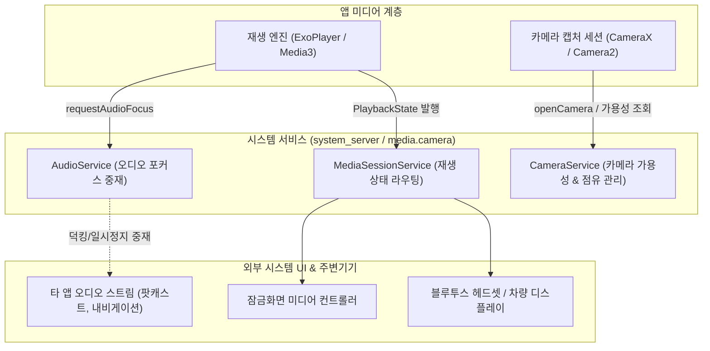

## 미디어/오디오/카메라 시스템 서비스 접근 계약

이 지도는 오디오 포커스 중재(`AudioManager`), 카메라 하드웨어 특성 조회 및 가용성 계약(`CameraManager`), 그리고 재생 상태를 시스템 UI 및 외부 기기에 노출하는 미디어 세션 계약(`MediaSession`)이라는 세 가지 핵심 시스템 서비스 접근 지점을 다룬다. 코덱 및 렌더링 파이프라인 자체는 다루지 않는다.

### 주요 메커니즘 및 코드 예시 (Mechanisms & Code Examples)

- **AudioManager**: `AudioFocusRequest`를 통한 동시 오디오 재생 중재, 일시 정지 및 덕킹(Ducking) 처리.
- **CameraManager**: `CameraCharacteristics` 하드웨어 스펙 조회, `AvailabilityCallback`을 통한 물리 카메라 점유 상태 관찰.
- **MediaSession (Media3)**: `MediaSessionService`를 통해 백그라운드 재생 상태(`PlaybackState`)를 시스템 UI(알림, 잠금화면) 및 블루투스 컨트롤러에 발행.

```kotlin
// AudioManager 오디오 포커스 요청 예시
val audioManager = getSystemService(Context.AUDIO_SERVICE) as AudioManager
val focusRequest = AudioFocusRequest.Builder(AudioManager.AUDIOFOCUS_GAIN)
    .setAudioAttributes(
        AudioAttributes.Builder()
            .setUsage(AudioAttributes.USAGE_MEDIA)
            .setContentType(AudioAttributes.CONTENT_TYPE_MUSIC)
            .build()
    )
    .setOnAudioFocusChangeListener { focusChange ->
        when (focusChange) {
            AudioManager.AUDIOFOCUS_LOSS -> pausePlayback()
            AudioManager.AUDIOFOCUS_LOSS_TRANSIENT_CAN_DUCK -> lowerVolume()
            AudioManager.AUDIOFOCUS_GAIN -> restoreVolume()
        }
    }
    .build()

val result = audioManager.requestAudioFocus(focusRequest)
```

### 아키텍처 다이어그램



### 관찰 신호 (Observation Signals)

- **ADB 및 dumpsys 진단**:
  ```bash
  # 1. 오디오 포커스 스택 및 현재 볼륨/스트림 상태 덤프
  adb shell dumpsys audio | grep -A 15 "Audio Focus stack"
  # 2. 카메라 서비스 활성 클라이언트 및 점유 상태 덤프
  adb shell dumpsys media.camera
  # 3. 활성 미디어 세션 목록 및 PlaybackState 덤프
  adb shell dumpsys media_session
  ```
- **Logcat 로그**:
  ```bash
  adb logcat -s AudioManager AudioFocus CameraManager MediaSession
  ```

### 읽는 순서

1. [AudioManager는 포커스 요청으로 여러 앱의 동시 재생을 조정한다](audio-manager-focus-arbitration.md) 에서 여러 앱이 소리를 낼 때의 중재 모델을 본다.
2. [CameraManager 접근은 가용성 콜백과 캐릭터리스틱 조회로 시작한다](camera-manager-characteristics.md) 에서 카메라를 열기 전에 확인해야 할 것을 본다.
3. [MediaSession은 재생 상태를 시스템 UI와 외부 컨트롤러에 노출하는 계약이다](media-session-controllers.md) 에서 잠금화면/블루투스 컨트롤 연동 모델을 본다.

### 문제 분류

| 증상 | 먼저 확인할 경계 |
| --- | --- |
| 다른 앱 소리와 겹치거나 갑자기 끊김 | audio focus 요청 타입과 focus 변화 콜백 처리 |
| 카메라를 열 수 없음(다른 앱이 사용 중 등) | availability 콜백과 카메라 disconnect 처리 |
| 잠금화면/블루투스에 재생 컨트롤이 안 뜸 | MediaSession 등록과 PlaybackState 갱신 여부 |

### 책임 경계

- 오디오 포커스 조정과 실제 오디오 디코딩/믹싱 파이프라인은 다른 계층이다. 이 지도는 조정 계약만 다룬다.
- 카메라의 프레임 처리, 인코딩, HAL 세부 구현은 미디어 그래픽스 내부가 담당한다.
- MediaSession 은 UI 노출 계약이며 실제 미디어 재생 엔진(ExoPlayer/Media3 등)의 선택과는 독립적이다.

### 노트 목록

- [AudioManager는 포커스 요청으로 여러 앱의 동시 재생을 조정한다](audio-manager-focus-arbitration.md)
- [CameraManager 접근은 가용성 콜백과 캐릭터리스틱 조회로 시작한다](camera-manager-characteristics.md)
- [MediaSession은 재생 상태를 시스템 UI와 외부 컨트롤러에 노출하는 계약이다](media-session-controllers.md)

### 공식 문서

- [오디오 포커스 관리](https://developer.android.com/media/optimize/audio-focus)
- [Camera2 문서](https://developer.android.com/media/camera/camera2)
- [MediaSession 문서](https://developer.android.com/media/media3/session/control-playback)

검증일: 2026-08-03. [오디오 포커스 관리](https://developer.android.com/media/optimize/audio-focus)와 [Camera2 문서](https://developer.android.com/media/camera/camera2) 를 기준으로 확인했다.
