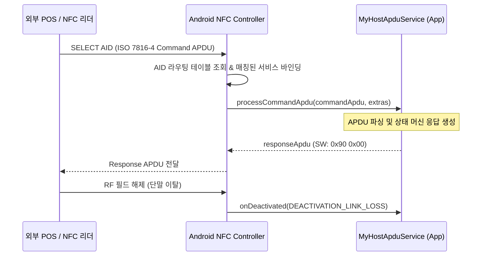

## HCE는 HostApduService가 APDU 거래를 처리하는 모델이다

상위 문서: [Android 시스템 서비스와 기기 기능 지도](../../android-system-services-and-device-capabilities.md)
관련 지도: [NFC와 비접촉 기능 계약](nfc.md)

### 핵심 정의

`HCE`(Host Card Emulation, 호스트 OS 소프트웨어가 스마트카드 역할을 대행하는 기술)는 Secure Element 하드웨어 칩 대신 호스트 CPU가 `HostApduService`를 통해 NFC ISO-DEP(ISO/IEC 14443-4) 카드 에뮬레이션을 처리하는 방식이다. 외부 리더가 보낸 ISO 7816-4 APDU 명령을 앱 서비스가 수신해 응답 바이트를 반환한다.

### 다이어그램



### 코드 예시: HostApduService 구현

```kotlin
class MyCardApduService : HostApduService() {

    override fun processCommandApdu(commandApdu: ByteArray, extras: Bundle?): ByteArray {
        // SELECT AID 명령 확인 (00 A4 04 00 ...)
        return if (isSelectAidCommand(commandApdu)) {
            // 성공 상태 워드 0x90, 0x00 반환
            byteArrayOf(0x01, 0x02, 0x03, 0x90.toByte(), 0x00.toByte())
        } else {
            // 알 수 없는 명령 에러 (0x6F 0x00)
            byteArrayOf(0x6F.toByte(), 0x00.toByte())
        }
    }

    override fun onDeactivated(reason: Int) {
        when (reason) {
            DEACTIVATION_LINK_LOSS -> resetSession()
            DEACTIVATION_DESELECTED -> resetSession()
        }
    }
}
```

```xml
<!-- AndroidManifest.xml 선언 -->
<service
    android:name=".MyCardApduService"
    android:exported="true"
    android:permission="android.permission.BIND_NFC_SERVICE">
    <intent-filter>
        <action android:name="android.nfc.cardemulation.action.HOST_APDU_SERVICE"/>
    </intent-filter>
    <meta-data
        android:name="android.nfc.cardemulation.host_apdu_service"
        android:resource="@xml/apduservice"/>
</service>
```

### 판단 기준

- `processCommandApdu`는 엄격한 타임아웃(통상 수백 ms 이내) 안에 실행되어야 하므로 네트워크 I/O나 무거운 디스크 작업을 동기적으로 수행하지 않는다.
- `android.permission.BIND_NFC_SERVICE`로 서비스 바인딩 권한을 보호하여 악성 앱의 임의 바인딩을 차단한다.

### 경계

- 이 노트는 HCE APDU 처리 계약을 다룬다. 결제 비즈니스 로직 및 토큰 보안은 [비접촉 결제는 NFC 태깅과 별도 엔지니어링 문제다](contactless-payment-boundaries.md)가 다룬다.
- Android 15 거래 전 관찰 모드는 [Android 15 Observe Mode는 HCE 거래 전 폴링을 관찰한다](nfc-observe-mode-android15.md)가 다룬다.

### 관찰 가능한 신호

```bash
# 1. 등록된 HCE 서비스 목록, AID 라우팅 테이블 및 활성 상태 덤프
adb shell dumpsys nfc | grep -A 20 "Host Emulation"

# 2. HostApduService APDU 송수신 로그 실시간 필터링
adb logcat -s HostApduService CardEmulationManager
```

### 공식 문서

- https://developer.android.com/develop/connectivity/nfc/hce
- https://developer.android.com/reference/android/nfc/cardemulation/HostApduService

검증일: 2026-08-03. HostApduService 수명주기 및 AID 라우팅 계약을 공식 문서로 확인했다.
