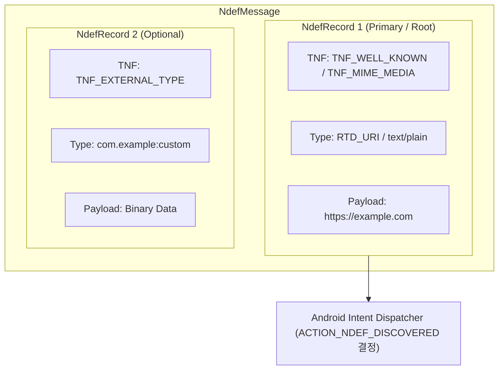

## NDEF는 태그 데이터를 메시지와 레코드로 구조화한다

상위 문서: [Android 시스템 서비스와 기기 기능 지도](../../android-system-services-and-device-capabilities.md)
관련 지도: [NFC와 비접촉 기능 계약](./nfc.md)

### 핵심 정의

`NDEF`(NFC Data Exchange Format, NFC 태그나 기기 간 교환용 경량 바이너리 포맷 규격)는 NFC 데이터를 하나 이상의 표준 레코드로 구조화한다. 하나의 `NdefMessage`는 1개 이상의 `NdefRecord`로 구성되며, 각 레코드는 `TNF`(Type Name Format: 3-bit 헤더), Type, ID, Payload 바이트 배열을 갖는다.

### 다이어그램



### 코드 예시: NDEF 레코드 생성 및 쓰기

```kotlin
fun writeUriToTag(tag: Tag, uri: Uri): Boolean {
    val ndefRecord = NdefRecord.createUri(uri)
    val ndefMessage = NdefMessage(arrayOf(ndefRecord))
    
    val ndef = Ndef.get(tag) ?: return false
    return try {
        ndef.connect()
        if (ndef.isWritable && ndef.maxSize >= ndefMessage.toByteArray().size) {
            ndef.writeNdefMessage(ndefMessage)
            true
        } else {
            false
        }
    } catch (e: Exception) {
        false
    } finally {
        ndef.close()
    }
}
```

### 읽기 흐름과 디스패치

1. `ACTION_NDEF_DISCOVERED` 인텐트에서 `Intent.getParcelableArrayExtra(NfcAdapter.EXTRA_NDEF_MESSAGES)` 추출.
2. 각 `NdefMessage`의 첫 레코드 TNF 및 Type 검증.
3. Payload 디코딩 시 언어 코드 바이트, UTF-8/UTF-16 인코딩 헤더 검증.

### 판단 기준

- 웹 URL은 `NdefRecord.createUri()`를 사용하고, 자체 데이터 교환은 `NdefRecord.createMime()` 또는 Android Application Record(`NdefRecord.createApplicationRecord`)를 조합한다.
- NDEF 태그에는 비밀번호, 개인 인증 토큰 등 민감 정보를 평문으로 기록하지 않는다.

### 경계

- 이 노트는 NDEF 레코드 바이너리 구조 및 입출력을 다룬다. 외부 결제 리더와의 APDU 교환은 [HCE는 HostApduService가 APDU 거래를 처리하는 모델이다](hce-host-apdu-service.md)가 다룬다.

### 관찰 가능한 신호

```bash
# 1. NFC 서비스의 NDEF 디스패치 등록 내역 덤프
adb shell dumpsys nfc | grep -A 10 "Registered NDEF"

# 2. 태그 탭 시 인텐트 발화 로그 확인
adb logcat -s NfcDispatcher TagMonitor
```

### 공식 문서

- https://developer.android.com/develop/connectivity/nfc/nfc
- https://developer.android.com/develop/connectivity/nfc/advanced-nfc

검증일: 2026-08-03. NDEF 메시지/레코드 구조 및 태그 I/O 계약을 공식 문서로 확인했다.
