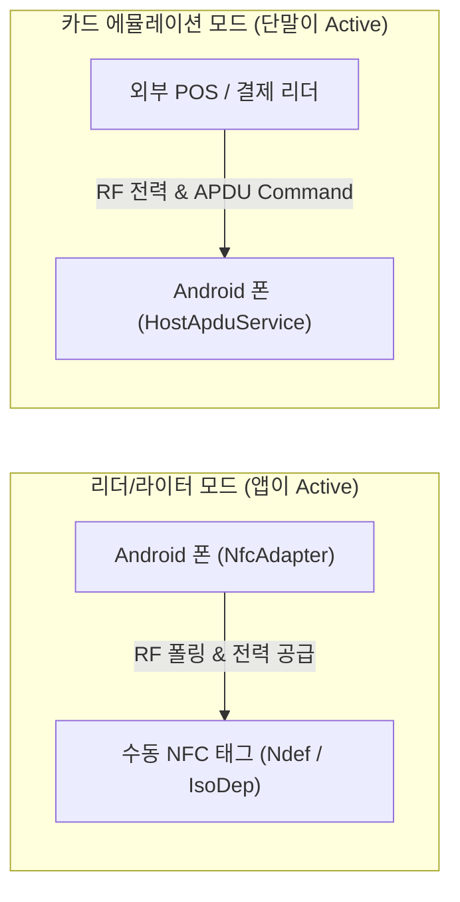

## Android NFC는 리더, 태그, 카드 에뮬레이션 모드로 나뉜다

상위 문서: [Android 시스템 서비스와 기기 기능 지도](../../android-system-services-and-device-capabilities.md)
관련 지도: [NFC와 비접촉 기능 계약](./nfc.md)

### 핵심 정의

`NFC`(Near Field Communication, 13.56MHz 대역을 이용해 약 10cm 이내의 가까운 거리에서 비접촉 무선 데이터 통신을 수행하는 기술)는 가까운 거리에서 장치와 태그가 통신하는 무선 기술이다.
Android NFC는 크게 **리더/라이터 모드(Reader/Writer)**, **P2P/태그 디스패치 모드**, 그리고 **카드 에뮬레이션 모드(HCE)**로 나뉜다.
- 리더/라이터 모드: 휴대전화가 주도적으로 수동 태그(NFC Tag)를 읽거나 쓴다.
- 카드 에뮬레이션 모드: 휴대전화가 외부 리더(POS 단말, 개찰구)에 스마트카드처럼 반응한다.

### 세 가지 문제를 분리하기

1. **태그 디스패치**: 시스템이 발견한 태그의 NDEF 레코드를 해석하여 적절한 액티비티로 인텐트를 라우팅하는 문제.
2. **원시 바이트 통신 (TagTechnology)**: Ndef, IsoDep, NfcA 등 특정 RF 규격 태그와 연결하여 직접 바이트를 교환하는 문제.
3. **카드 에뮬레이션 (HCE)**: 결제/인증 단말과 `APDU`(Application Protocol Data Unit) 명령-응답 패킷을 주고받는 문제.

### 다이어그램



### 코드 예시: 포그라운드 Reader Mode 활성화

```kotlin
// Reader Mode를 활성화하여 액티비티가 포그라운드일 때 즉각 태그 캡처
val nfcAdapter = NfcAdapter.getDefaultAdapter(activity)
val options = Bundle().apply {
    putInt(NfcAdapter.EXTRA_READER_PRESENCE_CHECK_DELAY, 250)
}

val flags = NfcAdapter.FLAG_READER_NFC_A or 
            NfcAdapter.FLAG_READER_NFC_B or 
            NfcAdapter.FLAG_READER_SKIP_NDEF_CHECK

nfcAdapter?.enableReaderMode(
    activity,
    { tag ->
        val isoDep = IsoDep.get(tag)
        isoDep?.use {
            it.connect()
            // ISO-DEP 통신 수행
        }
    },
    flags,
    options
)
```

### 시스템이 앱을 선택하는 방식

NDEF 태그를 발견하면 Android는 첫 레코드의 형식과 타입을 해석한다.
해석 결과가 MIME 타입 또는 URI이면 관련 인텐트를 태그 디스패치로 전달한다.
해석할 수 없거나 NDEF가 아니면 기술 기반 디스패치가 사용될 수 있다.
화면이 잠금 해제된 상태에서 NFC가 켜져 있어야 일반적인 태그 검색이 가능하다.

### 판단 기준 및 설계 원칙

- NDEF로 표현 가능한 데이터는 NDEF를 우선 사용한다.
- 지원 태그 기술을 모를 때는 런타임에 NFC 어댑터와 기술 목록을 확인한다.
- 장치별 안테나 위치, 지원 기술, 태그 품질, 통신 시간 차이를 테스트에 포함한다.
- 결제는 태그 읽기 UX와 분리해 인증, 토큰, 재시도, 오프라인 정책을 설계한다.

### 경계

- 이 노트는 NFC 동작 모드 구분을 다룬다. NDEF 레코드 바이너리 구조는 [NDEF는 태그 데이터를 메시지와 레코드로 구조화한다](ndef-record-structures.md)가 다룬다.
- HCE 서비스 구현은 [HCE는 HostApduService가 APDU 거래를 처리하는 모델이다](hce-host-apdu-service.md)가 다룬다.

### 관찰 가능한 신호

```bash
# 1. NFC 하드웨어 상태 및 등록된 Reader / HCE 모드 덤프
adb shell dumpsys nfc

# 2. NFC 어댑터 활성 여부 확인
adb shell settings get global nfc_on
```

### 공식 문서

- https://developer.android.com/develop/connectivity/nfc
- https://developer.android.com/develop/connectivity/nfc/nfc
- https://developer.android.com/develop/connectivity/nfc/advanced-nfc

검증일: 2026-08-03. NFC 3대 모드 및 ReaderCallback 계약을 공식 문서로 확인했다.
