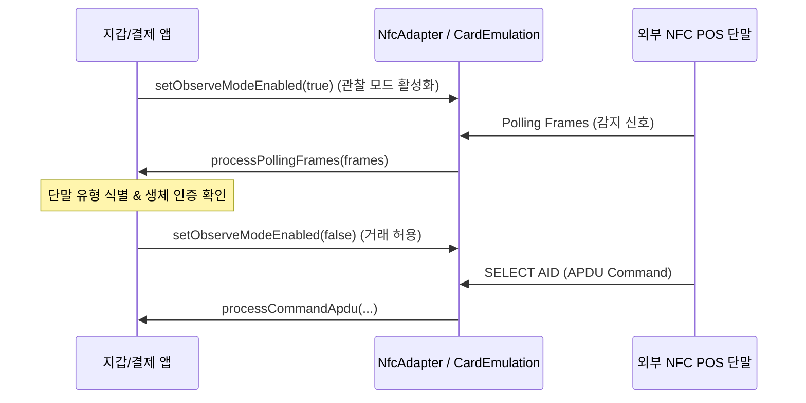

## Android 15 Observe Mode는 HCE 거래 전 폴링을 관찰한다

상위 문서: [Android 시스템 서비스와 기기 기능 지도](../../android-system-services-and-device-capabilities.md)
관련 지도: [NFC와 비접촉 기능 계약](nfc.md)

### 핵심 정의

Android 15(API 35)의 **Observe Mode**(관찰 모드)는 HCE 서비스가 실제 APDU 거래를 시작하기 전에, NFC 리더의 **Polling Loop**(리더가 주위 카드를 감지하기 위해 RF 신호를 주기적으로 송출하는 루프)를 수동으로 관찰하고 준비할 수 있게 하는 기능이다. Observe Mode가 켜진 상태에서는 리더에 응답하지 않고 프레임만 전달받으므로, 생체 인증 확인이나 카드 선택 준비가 끝난 후 관찰 모드를 해제하여 트랜잭션을 시작한다.

### 다이어그램



### 코드 예시: Android 15 Observe Mode 제어

```kotlin
if (Build.VERSION.SDK_INT >= Build.VERSION_CODES.VANILLA_ICE_CREAM) {
    val cardEmulation = CardEmulation.getInstance(nfcAdapter)
    
    // 1. 관찰 모드 활성화
    nfcAdapter.setObserveModeEnabled(true)
    
    // 2. 서비스에 폴링 루프 필터 등록
    val component = ComponentName(context, MyCardApduService::class.java)
    cardEmulation.registerPollingLoopFilterForService(
        component,
        "CUSTOM_POLLING_FRAME_HEX",
        /* autoTransact = */ false
    )
}
```

### 전환 설계 및 기본 지갑 앱

- 관찰 단계에서 수신된 프레임을 기반으로 리더 종류를 판별한다.
- 사용자 인증(생체 인증) 완료 후 `nfcAdapter.setObserveModeEnabled(false)`를 호출해 실제 APDU 거래를 허용한다.
- `RoleManager.ROLE_WALLET`으로 기본 지갑 앱 권한을 확인하여 우선순위를 확보한다.

### 경계

- Observe Mode는 Android 15+ 전용 기능이다. 구형 기기에서는 폴백 처리가 필요하다.
- APDU 트랜잭션 자체의 계약은 [HCE는 HostApduService가 APDU 거래를 처리하는 모델이다](hce-host-apdu-service.md)가 다룬다.

### 관찰 가능한 신호

```bash
# 1. Observe Mode 지원 여부 및 Polling Loop 필터 등록 상태 덤프
adb shell dumpsys nfc | grep -E "Observe Mode|PollingLoopFilters"

# 2. Polling Frame 수신 로그 확인
adb logcat -s NfcService HostApduService PollingLoop
```

### 공식 문서

- [Host-based card emulation과 Observe Mode](https://developer.android.com/develop/connectivity/nfc/hce)
- [RoleManager API](https://developer.android.com/reference/android/app/role/RoleManager)

검증일: 2026-08-03. Observe Mode 및 기본 지갑 역할 API를 공식 문서를 기준으로 확인했다.
