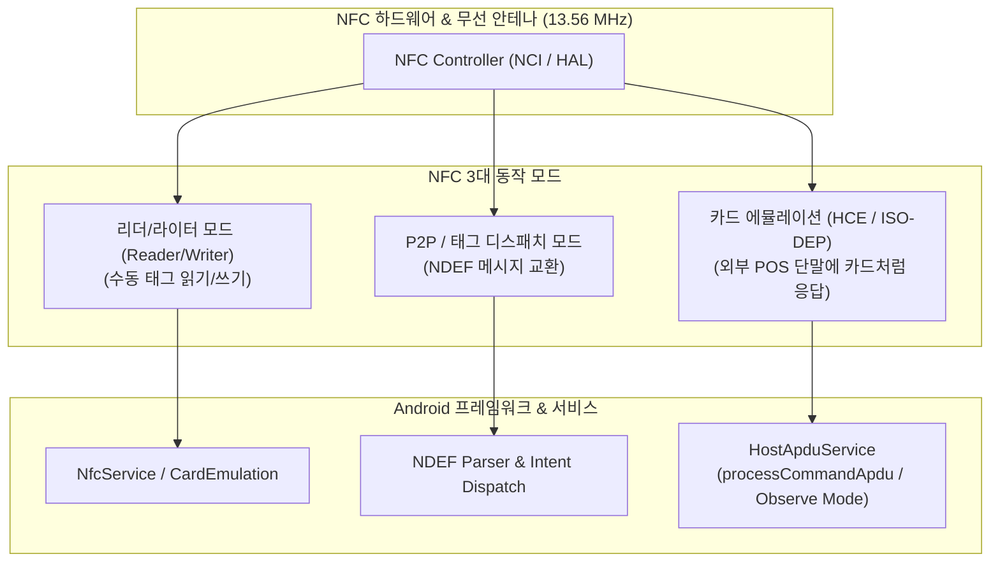

## NFC와 비접촉 기능 계약

이 지도는 Android NFC를 태그 읽기/쓰기(Reader/Writer), 구조화된 레코드 교환(NDEF), 호스트 기반 카드 에뮬레이션(HCE/APDU), Android 15 폴링 관찰(Observe Mode), 그리고 비접촉 결제 엔지니어링 계약으로 분리한다.

### 주요 메커니즘 및 코드 예시 (Mechanisms & Code Examples)

- **Reader Mode**: `NfcAdapter.enableReaderMode`를 통해 시스템 태그 디스패치를 우회하고 포그라운드 액티비티에서 직접 태그와 통신.
- **NDEF**: 표준화된 바이너리 레코드 포맷(`NdefMessage`, `NdefRecord`)을 통한 URI/MIME 데이터 송수신.
- **HCE (Host Card Emulation)**: 물리적 Secure Element 없이 `HostApduService`로 외부 리더의 ISO 7816-4 APDU 명령 처리.
- **Observe Mode (Android 15+)**: 결제 단말과의 거래 전 폴링 루프를 관찰하여 사전 준비 및 최적 카드 활성화.

```kotlin
// NfcAdapter 획득 및 Reader Mode 활성화
val nfcAdapter = NfcAdapter.getDefaultAdapter(context)
if (nfcAdapter?.isEnabled == true) {
    val flags = NfcAdapter.FLAG_READER_NFC_A or NfcAdapter.FLAG_READER_SKIP_NDEF_CHECK
    nfcAdapter.enableReaderMode(
        activity,
        { tag ->
            val isoDep = IsoDep.get(tag)
            isoDep?.use {
                it.connect()
                val response = it.transceive(byteArrayOf(0x00, 0xA4.toByte(), 0x04, 0x00, 0x00))
                println("Tag response: ${response.toHexString()}")
            }
        },
        flags,
        null
    )
}
```

### 아키텍처 다이어그램



### 관찰 신호 (Observation Signals)

- **ADB 및 dumpsys 진단**:
  ```bash
  # 1. NFC 어댑터 상태, 등록된 HCE 서비스 및 AID 라우팅 테이블 덤프
  adb shell dumpsys nfc
  # 2. 기본 결제 지갑 및 CardEmulation 라우팅 확인
  adb shell dumpsys nfc | grep -A 15 "Card Emulation"
  # 3. NFC 설정 상태 점검 (1: ON, 0: OFF)
  adb shell settings get global nfc_on
  ```
- **Logcat 로그 확인**:
  ```bash
  adb logcat -s NfcService HostApduService CardEmulation
  ```

### 읽는 순서

1. [Android NFC는 리더, 태그, 카드 에뮬레이션 모드로 나뉜다](nfc-modes-reader-tag-hce.md)로 상대 장치와 프로토콜 역할을 고른다.
2. 태그 데이터라면 [NDEF는 태그 데이터를 메시지와 레코드로 구조화한다](ndef-record-structures.md)를 읽는다.
3. 외부 리더에 카드처럼 응답한다면 [HCE는 HostApduService가 APDU 거래를 처리하는 모델이다](hce-host-apdu-service.md)를 읽는다.
4. Android 15+ 결제 준비 흐름이라면 [Android 15 Observe Mode는 HCE 거래 전 폴링을 관찰한다](nfc-observe-mode-android15.md)를 읽는다.
5. 실제 결제 제품이라면 [비접촉 결제는 NFC 태깅과 별도 엔지니어링 문제다](contactless-payment-boundaries.md)에서 인증, 토큰, 리더, 네트워크 경계를 추가한다.

### 문제 분류

| 증상 | 먼저 확인할 경계 |
| --- | --- |
| 태그가 발견되지 않음 | 하드웨어, NFC 설정, 화면 상태, reader/dispatch 구성 |
| 태그는 발견되지만 payload 해석 실패 | NDEF 여부, TNF/type, tech별 원시 프로토콜 |
| HCE 서비스가 선택되지 않음 | AID, category, 기본 지갑/foreground preference, 화면 상태 |
| `processCommandApdu` 응답이 늦음 | APDU 상태 머신과 네트워크·스토리지 지연 |
| polling frame은 보이나 거래가 시작되지 않음 | Observe Mode 종료 또는 auto-transact 조건 |
| 태깅 성공을 결제 성공으로 오판 | NDEF와 ISO-DEP/APDU 상태를 분리했는지 |

### 프로토콜 경계

- NDEF는 태그 데이터 형식이며 결제 프로토콜이 아니다.
- `TagTechnology`는 발견된 태그와 직접 통신하고, `HostApduService`는 외부 리더의 APDU에 카드처럼 응답한다.
- Observe Mode는 Android 15+의 거래 전 폴링 관찰 기능이다. 기기 지원 여부와 실제 리더 프레임을 런타임·실기기로 확인한다.
- 결제 승인은 Android NFC API만의 책임이 아니며 결제 네트워크, 서버, 키·토큰 정책을 포함한다.

### 노트 목록

- [Android NFC는 리더, 태그, 카드 에뮬레이션 모드로 나뉜다](nfc-modes-reader-tag-hce.md)
- [NDEF는 태그 데이터를 메시지와 레코드로 구조화한다](ndef-record-structures.md)
- [HCE는 HostApduService가 APDU 거래를 처리하는 모델이다](hce-host-apdu-service.md)
- [Android 15 Observe Mode는 HCE 거래 전 폴링을 관찰한다](nfc-observe-mode-android15.md)
- [비접촉 결제는 NFC 태깅과 별도 엔지니어링 문제다](contactless-payment-boundaries.md)

### 공식 문서

- [Android NFC 가이드](https://developer.android.com/develop/connectivity/nfc)
- [HCE 공식 문서](https://developer.android.com/develop/connectivity/nfc/hce)

검증일: 2026-08-03. Android 15의 기본 지갑 역할과 Observe Mode는 HCE 공식 문서를 기준으로 확인했다.
