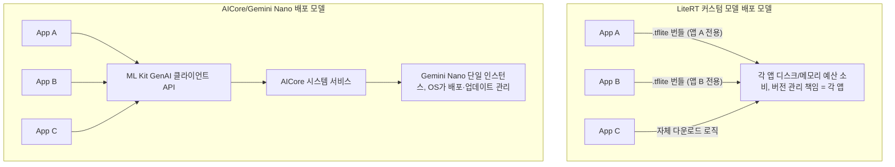

## AICore 는 Gemini Nano 를 앱마다 번들되지 않는 공유 시스템 모델로 관리한다

상위 문서: [Android 시스템 서비스와 기기 기능 지도](../../android-system-services-and-device-capabilities.md)

관련 지도: [온디바이스 AI 접근 계약](./on-device-ai-contracts.md)

### 핵심 정의

`LiteRT`(구 TensorFlow Lite, 온디바이스 딥러닝 추론을 위한 구글의 공식 경량 런타임)로 커스텀 모델을 쓰는 앱은 보통 `.tflite` 모델 파일을 앱 APK/AAB 에 직접 번들하거나 앱이 자체적으로 다운로드해 관리한다. `AICore`(Android OS 차원에서 온디바이스 파운데이션 모델을 관리하고 백그라운드 추론을 수행하는 시스템 서비스)는 이와 다른 배포 모델을 쓴다. 공식 문서는 AICore 를 시스템 수준 모듈로 설명한다.

>"As a system-level module, you access AICore through a series of APIs in order to run inference on-device."

즉 모델(`Gemini Nano`: 모바일 기기 내부 NPU/GPU 환경에 최적화된 구글의 경량 온디바이스 언어 모델)은 앱의 자산이 아니라 Android OS 가 관리하는 시스템 자산이다.

### 메커니즘

AICore 가 모델 배포를 시스템으로 옮기면서 얻는 이득을 공식 문서는 다음과 같이 설명한다.

>"AICore enables the Android OS to provide and manage AI foundation models. This significantly reduces the cost of using these large models in your app, principally due to the following: Ease of deployment: AICore manages the distribution of Gemini Nano and handles future updates. You don't need to worry about downloading or updating large models over the network, nor impact on your app's disk and runtime memory budget."

이 문장은 세 가지 계약을 담고 있다.

1. **배포 주체 이동**: 모델을 내려받고 최신 상태로 유지하는 책임이 각 앱에서 AICore(시스템)로 옮겨간다.
2. **디스크/메모리 예산 분리**: 대형 파운데이션 모델이 앱의 APK 크기나 런타임 메모리 예산에 포함되지 않는다. 여러 앱이 같은 Gemini Nano 인스턴스를 공유해 쓴다.
3. **추론 실행 위치**: 실제 추론은 앱 프로세스가 아니라 AICore 시스템 서비스에서 일어난다.

>"Gemini Nano runs in Android's AICore system service, which leverages device hardware to enable low inference latency and keeps the model up-to-date."

앱은 ML Kit GenAI API 같은 클라이언트 API 를 통해 AICore 에 요청을 보내고, 실제 모델 가중치나 추론 파이프라인을 직접 소유하지 않는다. 이는 마치 앱이 `LocationManager` 를 통해 시스템 위치 서비스에 접근하지만 GPS 칩을 직접 제어하지 않는 것과 같은 층위 분리다 — 앱은 API 클라이언트이고, 모델/하드웨어 자원은 시스템이 소유·관리한다.

### 코드 예시

```kotlin
// 앱은 모델 파일을 소유하지 않는다. ML Kit GenAI 클라이언트를 통해
// AICore가 관리하는 Gemini Nano에 접근할 뿐이다.
implementation("com.google.mlkit:genai-summarization:1.0.0-beta1")
```

```kotlin
val summarizer = Summarization.getClient(
    SummarizerOptions.builder(context)
        .setInputType(InputType.ARTICLE)
        .setOutputType(OutputType.ONE_BULLET)
        .build()
)
// 이 시점까지 앱 코드는 모델 가중치 파일 경로를 다루지 않는다.
// 모델의 존재/다운로드/버전 관리는 AICore/시스템이 담당한다.
```

### 다이어그램



### 판단 기준

- 특정 도메인에 맞춘 작은 커스텀 모델(이미지 분류기 등)을 완전히 통제하고 싶다면 LiteRT 로 직접 번들/관리한다.
- 범용 생성형 AI 기능(요약, 교정, 재작성 등)이 필요하고 모델 크기·업데이트 책임을 앱이 지고 싶지 않다면 AICore 기반 ML Kit GenAI API 를 우선 검토한다.
- AICore 경로를 선택하면 앱은 모델 버전 고정을 직접 통제할 수 없다는 것을 전제로 설계한다 — 시스템이 모델을 업데이트하면 출력이 달라질 수 있다.

### 경계

- 이 노트는 모델 배포/소유 주체의 차이까지만 다룬다. 온디바이스 추론과 클라우드 추론의 일반적 차이는 [온디바이스 추론은 클라우드 추론이 필요로 하는 네트워크 왕복을 건너뛴다](./on-device-inference-skips-the-network-round-trip-cloud-inference-needs.md) 가 다룬다.
- 이 기능이 실제로 이 기기에서 쓸 수 있는지 사전 확인하는 절차는 [온디바이스 AI 기능 가용성은 사용 전에 반드시 확인해야 한다](./on-device-ai-feature-availability-must-be-checked-before-use.md) 가 다룬다.
- AICore 내부의 모델 아키텍처, LoRA 세부, 안전 필터링 알고리즘 구현은 이 노트가 다루지 않는다.

### 관찰 가능한 신호

AICore 기반 기능은 앱 APK 용량 분석(APK Analyzer)에서 대형 모델 가중치 파일이 보이지 않는다는 점으로 LiteRT 번들 모델과 구분할 수 있다 — 모델이 앱 자산이 아니라 시스템 자산이기 때문이다. 반면 LiteRT 로 번들한 모델은 APK Analyzer 의 assets/lib 목록에서 `.tflite` 파일 크기로 직접 확인된다.

### 공식 문서

- [AICore overview](https://developer.android.com/ai/aicore)
- [Android AI overview](https://developer.android.com/ai)

검증일: 2026-08-04. AICore/Gemini Nano 의 지원 기기 범위와 API 표면은 developer preview 단계로 변경될 수 있으므로 적용 시점에 원문을 다시 확인한다.
