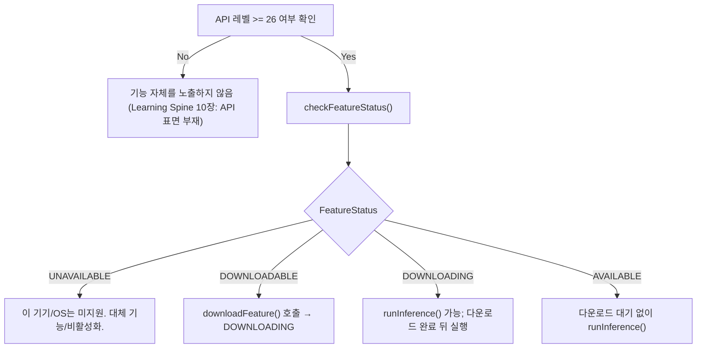

## 온디바이스 AI 기능 가용성은 사용 전에 반드시 확인해야 한다

상위 문서: [Android 시스템 서비스와 기기 기능 지도](../../android-system-services-and-device-capabilities.md)
관련 지도: [온디바이스 AI 접근 계약](./on-device-ai-contracts.md)

### 핵심 정의

`00_foundations/learning-spine`의 10장은 "기능 사용은 발견에서 시작하지, 권한 확인에서 시작하지 않는다"는 원칙을 다룬다. 온디바이스 AI는 이 원칙이 가장 직접적으로 적용되는 영역 중 하나다. 모델이 이미 다운로드돼 있는지, 현재 기기와 `SummarizerOptions` 조합이 이 기능을 지원하는지는 추론 전에 확인해야 하는 별도 상태다. ML Kit GenAI API는 이 상태를 `FeatureStatus` 상수로 노출한다.

> 상태값: "UNAVAILABLE, DOWNLOADABLE, DOWNLOADING, AVAILABLE"

### 메커니즘

ML Kit GenAI Summarization API를 예로 들면, 클라이언트는 추론을 바로 요청하지 않고 `checkFeatureStatus()`로 먼저 상태를 조회한다.

```kotlin
val featureStatus = summarizer.checkFeatureStatus().await()

if (featureStatus == FeatureStatus.DOWNLOADABLE) {
    summarizer.downloadFeature(object : DownloadCallback { /* ... */ })
} else if (featureStatus == FeatureStatus.AVAILABLE) {
    startSummarizationRequest(articleToSummarize, summarizer)
}
```

`UNAVAILABLE`은 현재 기기와 옵션 조합에서 기능을 사용할 수 없다는 뜻이다. `DOWNLOADABLE`은 필요한 모델 자산을 받을 수 있다는 뜻이고, `downloadFeature()`로 미리 받을 수 있다. 다만 공식 API는 첫 추론 요청도 필요한 다운로드를 시작할 수 있다. `DOWNLOADING` 상태에서도 `runInference()`를 호출할 수 있으며 요청은 다운로드가 끝난 뒤 실행된다. `AVAILABLE`은 필요한 자산이 이미 준비된 상태다.

- `UNAVAILABLE` → 현재 구성에서는 사용할 수 없음. 대체 기능이나 기능 비활성화가 맞는 처리지만 시스템/AICore 업데이트 뒤에도 영구히 같다고 단정하지 않는다.
- `DOWNLOADABLE`/`DOWNLOADING` → 10장의 "하드웨어는 있지만 사용자(또는 시스템) 쪽 사전 조건이 아직 채워지지 않았다" 축과 유사하다. 다만 사용자 설정이 아니라 모델 다운로드 완료가 조건이라는 점이 다르다.
- `AVAILABLE` → 다운로드 대기 없이 추론을 시작할 수 있다.

이 요구사항은 API 레벨과도 얽혀 있다. ML Kit GenAI Summarization API는 최소 API 레벨을 요구한다.

> "This API requires Android API level 26 or higher."

즉 API 레벨 조건과 `FeatureStatus` 조건은 서로 다른 층위의 확인이며, 둘 다 통과해야 실제 추론이 가능하다.

### 코드 예시

```kotlin
suspend fun runSummarizationSafely(
    summarizer: Summarizer,
    articleText: String,
): String? {
    // summarizer의 소유자는 ViewModel.onCleared()/Activity.onDestroy() 등에서 close()한다.
    when (summarizer.checkFeatureStatus().await()) {
        FeatureStatus.UNAVAILABLE -> return null
        FeatureStatus.DOWNLOADABLE -> {
            // 데이터 비용과 대기 시간을 UI에서 알린 뒤 명시적으로 완료를 기다린다.
            summarizer.downloadFeature(object : DownloadCallback {
                override fun onDownloadStarted(bytesToDownload: Long) = Unit
                override fun onDownloadProgress(totalBytesDownloaded: Long) = Unit
                override fun onDownloadCompleted() = Unit
                override fun onDownloadFailed(e: GenAiException) = Unit
            }).await()
        }
        // DOWNLOADING이면 아래 추론 Future가 다운로드 완료까지 기다린다.
        FeatureStatus.DOWNLOADING, FeatureStatus.AVAILABLE -> Unit
        else -> return null
    }

    val request = SummarizationRequest.builder(articleText).build()
    return summarizer.runInference(request).await().summary
}
```

### 다이어그램



### 판단 기준

- 추론 API를 호출하기 전에 항상 `checkFeatureStatus()` 결과를 먼저 분기한다. `AVAILABLE`을 가정하고 바로 `runInference()`를 호출하지 않는다.
- `DOWNLOADABLE` 상태에서 자동으로 큰 모델을 즉시 다운로드하는 것이 사용자 경험/데이터 비용에 적절한지 판단한다 — 필요하면 Wi-Fi 연결 시에만 다운로드하도록 조건을 건다.
- `UNAVAILABLE`과 `DOWNLOADABLE`을 같은 오류 메시지로 처리하지 않는다. 전자는 현재 기기·옵션 조합에서 사용할 수 없고, 후자는 다운로드로 해결할 수 있다.
- `runInference()`는 비동기 `ListenableFuture`를 반환한다. 콜백에서 지역 변수를 바꾼 직후 반환하지 말고 Future 완료를 `await()`하거나 성공/실패 콜백에서 UI 상태를 갱신한다.
- 지원 기기라도 unlocked bootloader에서는 지원되지 않을 수 있고, foreground 사용, 동시 요청의 `BUSY`, 할당량·안전 필터 실패를 포함한 `GenAiException` 처리가 필요하다.

### 경계

- 이 노트는 가용성 확인 절차까지만 다룬다. 온디바이스와 클라우드 추론의 차이는 [온디바이스 추론은 클라우드 추론이 필요로 하는 네트워크 왕복을 건너뛴다](./on-device-inference-skips-the-network-round-trip-cloud-inference-needs.md)가, 모델을 시스템이 공유 관리하는 계약은 [AICore는 Gemini Nano를 앱마다 번들되지 않는 공유 시스템 모델로 관리한다](./aicore-manages-gemini-nano-as-a-shared-system-model-not-a-bundled-asset.md)가 다룬다.
- permission/AppOps gate와 기능 발견의 일반 순서 원칙은 이 노트가 반복하지 않는다. [10장 기기 기능 발견과 background execution](../../../00_foundations/learning-spine/10-device-capability-discovery-and-background-execution.md)이 정본이다.

### 관찰 가능한 신호

`checkFeatureStatus()`가 반환하는 `FeatureStatus` 값을 로그로 남기면 특정 기기에서 기능이 왜 동작하지 않는지(미지원 vs 다운로드 대기 vs 다운로드 실패) 구분할 수 있다. `downloadFeature()`와 `runInference()`가 반환하는 Future의 실패 원인 및 `DownloadCallback.onDownloadFailed()`를 함께 기록한다.

### 공식 문서

- [ML Kit GenAI Summarization for Android](https://developers.google.com/ml-kit/genai/summarization/android)
- [10장 기기 기능 발견과 background execution](../../../00_foundations/learning-spine/10-device-capability-discovery-and-background-execution.md)

검증일: 2026-08-06. `FeatureStatus`, 비동기 `ListenableFuture`, 다운로드 중 추론 대기, 자원 `close()` 계약을 공식 ML Kit 문서와 API reference로 재확인했다. API 표면은 베타 단계이므로 적용 시점에 원문을 다시 확인한다.
