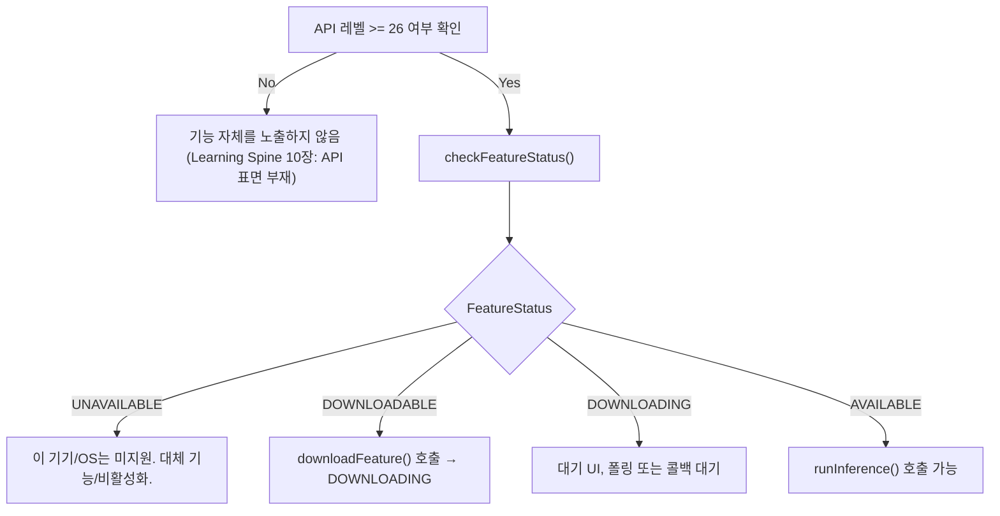

## 온디바이스 AI 기능 가용성은 사용 전에 반드시 확인해야 한다

상위 문서: [Android 시스템 서비스와 기기 기능 지도](../../android-system-services-and-device-capabilities.md)
관련 지도: [온디바이스 AI 접근 계약](./on-device-ai-contracts.md)

### 핵심 정의

`00_foundations/learning-spine`의 10장은 "기능 사용은 발견에서 시작하지, 권한 확인에서 시작하지 않는다"는 원칙을 다룬다. 온디바이스 AI는 이 원칙이 가장 직접적으로 적용되는 영역 중 하나다. 모델이 이미 다운로드돼 있는지, 이 기기가 애초에 이 기능을 지원하는지는 API 호출 전에 반드시 확인해야 하는 별도의 상태다. ML Kit GenAI API는 이 상태를 `FeatureStatus`(모델의 기기 내 존재 및 다운로드 상태를 노출하는 enum 객체)라는 명시적인 enum으로 노출한다.

> 상태값: "UNAVAILABLE, DOWNLOADABLE, DOWNLOADING, AVAILABLE"

### 메커니즘

ML Kit GenAI Summarization API를 예로 들면, 클라이언트는 추론을 바로 요청하지 않고 `checkFeatureStatus()`로 먼저 상태를 조회한다.

```kotlin
val featureStatus = summarizer.checkFeatureStatus().await()

if (featureStatus == FeatureStatus.DOWNLOADABLE) {
    summarizer.downloadFeature(object : DownloadCallback { /* ... */ })
} else if (featureStatus == FeatureStatus.AVAILABLE) {
    startSummarizationRequest(articleToSummarize, summarizer)
}
```

`UNAVAILABLE`은 이 기기/OS 조합에서 해당 기능 자체를 지원하지 않는다는 뜻이다. `DOWNLOADABLE`은 기능은 지원하지만 모델이 아직 기기에 없다는 뜻이며, `downloadFeature()`로 명시적으로 받아야 한다. `DOWNLOADING`은 진행 중, `AVAILABLE`이어야만 실제 추론(`runInference()`)을 호출할 수 있다. 이 네 상태는 Learning Spine 10장이 구분한 세 가지 실패 축과 정확히 대응한다.

- `UNAVAILABLE` → 10장의 "하드웨어/기능 자체가 없다" 축. 대체 기능이나 기능 비활성화가 맞는 처리다.
- `DOWNLOADABLE`/`DOWNLOADING` → 10장의 "하드웨어는 있지만 사용자(또는 시스템) 쪽 사전 조건이 아직 채워지지 않았다" 축과 유사하다. 다만 사용자 설정이 아니라 모델 다운로드 완료가 조건이라는 점이 다르다.
- `AVAILABLE` → 이 상태에서만 실제 추론 API를 호출한다.

이 요구사항은 API 레벨과도 얽혀 있다. ML Kit GenAI Summarization API는 최소 API 레벨을 요구한다.

> "This API requires Android API level 26 or higher."

즉 API 레벨 조건과 `FeatureStatus` 조건은 서로 다른 층위의 확인이며, 둘 다 통과해야 실제 추론이 가능하다.

### 코드 예시

```kotlin
suspend fun runSummarizationSafely(
    summarizer: Summarizer,
    articleText: String,
): String? {
    // 1. Learning Spine 10장의 원칙: 권한이 아니라 기능 발견부터 시작한다.
    when (summarizer.checkFeatureStatus().await()) {
        FeatureStatus.UNAVAILABLE -> {
            // 이 기기/OS는 이 기능을 지원하지 않는다. 대체 UI로 폴백한다.
            return null
        }
        FeatureStatus.DOWNLOADABLE -> {
            // 모델이 없다. 사용자에게 다운로드가 필요함을 알리고 명시적으로 받는다.
            summarizer.downloadFeature(object : DownloadCallback {
                override fun onDownloadCompleted() { /* 완료 후 재시도 */ }
                override fun onDownloadFailed(e: GenAiException) { /* 실패 처리 */ }
            })
            return null
        }
        FeatureStatus.DOWNLOADING -> return null // 진행 중, 대기 UI 표시
        FeatureStatus.AVAILABLE -> {
            val request = SummarizationRequest.builder(articleText).build()
            var result: String? = null
            summarizer.runInference(request) { partial -> result = partial }
            return result
        }
        else -> return null
    }
}
```

### 다이어그램



### 판단 기준

- 추론 API를 호출하기 전에 항상 `checkFeatureStatus()` 결과를 먼저 분기한다. `AVAILABLE`을 가정하고 바로 `runInference()`를 호출하지 않는다.
- `DOWNLOADABLE` 상태에서 자동으로 큰 모델을 즉시 다운로드하는 것이 사용자 경험/데이터 비용에 적절한지 판단한다 — 필요하면 Wi-Fi 연결 시에만 다운로드하도록 조건을 건다.
- `UNAVAILABLE`과 `DOWNLOADABLE`을 같은 오류 메시지로 처리하지 않는다. 전자는 이 기기에서 영구히 쓸 수 없는 것이고, 후자는 사용자 조치(다운로드 대기)로 해결된다 — Learning Spine 10장이 강조하는 것과 같은 구분이다.

### 경계

- 이 노트는 가용성 확인 절차까지만 다룬다. 온디바이스와 클라우드 추론의 차이는 [온디바이스 추론은 클라우드 추론이 필요로 하는 네트워크 왕복을 건너뛴다](./on-device-inference-skips-the-network-round-trip-cloud-inference-needs.md)가, 모델을 시스템이 공유 관리하는 계약은 [AICore는 Gemini Nano를 앱마다 번들되지 않는 공유 시스템 모델로 관리한다](./aicore-manages-gemini-nano-as-a-shared-system-model-not-a-bundled-asset.md)가 다룬다.
- permission/AppOps gate와 기능 발견의 일반 순서 원칙은 이 노트가 반복하지 않는다. [10장 기기 기능 발견과 background execution](../../../00_foundations/learning-spine/10-device-capability-discovery-and-background-execution.md)이 정본이다.

### 관찰 가능한 신호

`checkFeatureStatus()`가 반환하는 `FeatureStatus` 값을 로그로 남기면 특정 기기에서 기능이 왜 동작하지 않는지(미지원 vs 다운로드 대기 vs 다운로드 실패) 바로 구분할 수 있다. `downloadFeature()` 실패는 `DownloadCallback.onDownloadFailed()`에 전달되는 예외로 관찰하며, `AVAILABLE` 상태를 확인하지 않고 `runInference()`를 호출하면 모델이 준비되지 않았다는 실패가 즉시 발생한다.

### 공식 문서

- [ML Kit GenAI Summarization for Android](https://developers.google.com/ml-kit/genai/summarization/android)
- [10장 기기 기능 발견과 background execution](../../../00_foundations/learning-spine/10-device-capability-discovery-and-background-execution.md)

검증일: 2026-08-04. `FeatureStatus` API 표면은 베타 단계로 변경될 수 있으므로 적용 시점에 원문을 다시 확인한다.
