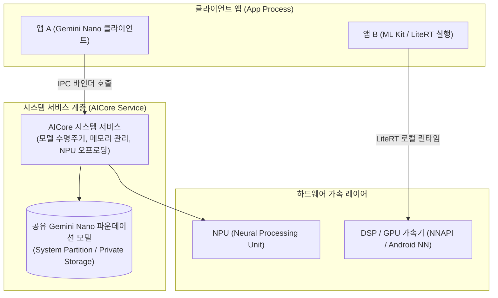

## 온디바이스 AI 접근 계약

이 지도는 앱이 기기 안에서 ML/생성형 AI 추론을 실행할 때 마주치는 계약을 클라우드 추론과의 차이, 모델을 누가 배포·관리하는가, 기능 가용성을 어떻게 확인하는가로 나눈다. ML Kit/LiteRT(TFLite)는 앱이 모델을 직접 번들하거나 다운로드하는 모델이고, **AICore**가 관리하는 **Gemini Nano**는 앱마다 모델을 갖지 않고 시스템이 단일 공유 파운데이션 모델을 관리하는 모델이다. 두 모델 모두 기기 하드웨어(NPU/RAM) 및 OS 버전에 따라 가용성이 달라지므로 사전 기능 발견(Capability Discovery)이 필수적이다.

### 주요 메커니즘 및 코드 예시 (Mechanisms & Code Examples)

- **AICore / Gemini Nano**: 시스템 서비스가 모델 다운로드, 메모리 상주, NPU 가속 추론 및 프로세스 간 보안 격리를 관리.
- **ML Kit / LiteRT (TFLite)**: 앱 내부 샌드박스 또는 Play Services 모듈로 정적 비전/자연어 모델 구동.
- **가용성 확인 (Feature Availability)**: `FeatureStatus.AVAILABLE`, `DOWNLOADABLE`, `DOWNLOADING` 상태 확인 후 비동기 다운로드 요청.

```kotlin
// AICore 기반 온디바이스 생성형 AI 가용성 확인 및 텍스트 생성
val generativeModel = Firebase.aiLogic.getGenerativeModel("gemini-nano")

// 기능 가용성 확인
val availability = generativeModel.checkAvailability()
if (availability == FeatureAvailability.AVAILABLE) {
    val response = generativeModel.generateContent("다음 텍스트를 한 줄로 요약해줘: ...")
    println("On-device AI Result: ${response.text}")
}
```

### 아키텍처 다이어그램



### 관찰 신호 (Observation Signals)

- **ADB 및 dumpsys 진단**:
  ```bash
  # 1. AICore 시스템 서비스 상태 및 다운로드된 파운데이션 모델 덤프
  adb shell dumpsys aicore
  # 2. AICore 모델 다운로드 및 준비 상태 CLI 확인 (지원 기기)
  adb shell cmd aicore status
  # 3. NPU / NNAPI 하드웨어 가속 드라이버 상태 확인
  adb shell dumpsys media.camera | grep -i "npu"
  ```
- **Logcat 로그 확인**:
  ```bash
  adb logcat -s AICore AICoreClient LiteRT MLKit
  ```

### 읽는 순서

1. [온디바이스 추론은 클라우드 추론이 필요로 하는 네트워크 왕복을 건너뛴다](on-device-inference-low-latency.md) 에서 ML Kit/LiteRT 와 클라우드 API 의 근본적인 차이를 본다.
2. [AICore는 Gemini Nano를 앱마다 번들되지 않는 공유 시스템 모델로 관리한다](aicore-gemini-nano.md) 에서 모델 배포 주체가 앱에서 OS 로 이동하는 계약을 본다.
3. [온디바이스 AI 기능 가용성은 사용 전에 반드시 확인해야 한다](on-device-ai-feature-availability.md) 에서 기기·OS 버전에 따른 가용성 차이와 capability 확인 패턴을 본다.

### 문제 분류

| 증상 또는 질문 | 먼저 확인할 경계 |
| --- | --- |
| 오프라인에서도 인식/분류가 동작해야 한다 | ML Kit/LiteRT 온디바이스 모델을 쓰고 있는지, 클라우드 API 에 의존하고 있는지 |
| 앱 용량이 큰 생성형 AI 모델 때문에 커지는 게 걱정된다 | AICore/Gemini Nano 처럼 시스템이 관리하는 공유 모델을 쓸 수 있는지 |
| 특정 기기에서만 AI 기능이 동작하지 않는다 | 기능 존재 확인을 건너뛰고 바로 추론 API 를 호출했는지 |
| 모델을 처음 쓸 때 첫 호출이 느리거나 실패한다 | 모델이 다운로드 가능(downloadable) 상태인지, 아직 기기에 없는 상태에서 추론을 시도했는지 |

### 책임 경계

- 이 지도는 앱이 온디바이스 AI 기능에 접근하는 계약(추론 위치, 모델 배포 주체, 가용성 확인)만 다룬다. 모델 학습, 프롬프트 엔지니어링 품질, 특정 도메인 정확도 튜닝은 다루지 않는다.
- 클라우드 기반 Gemini API 나 Firebase AI Logic 의 서버 측 과금·쿼터 정책은 이 지도의 범위가 아니다. 이 지도는 기기 쪽 접근 계약만 다룬다.
- 기능 발견의 일반 원칙(`hasSystemFeature()`, capability 확인이 permission gate 보다 먼저라는 순서)은 기초 학습 축이 다루므로 반복하지 않고 온디바이스 AI 에 고유한 가용성 상태(`FeatureStatus`)만 추가한다.

### 노트 목록

- [온디바이스 추론은 클라우드 추론이 필요로 하는 네트워크 왕복을 건너뛴다](on-device-inference-low-latency.md)
- [AICore는 Gemini Nano를 앱마다 번들되지 않는 공유 시스템 모델로 관리한다](aicore-gemini-nano.md)
- [온디바이스 AI 기능 가용성은 사용 전에 반드시 확인해야 한다](on-device-ai-feature-availability.md)

### 공식 문서

- [Android AI overview](https://developer.android.com/ai)
- [AICore overview](https://developer.android.com/ai/aicore)
- [ML Kit GenAI Summarization](https://developers.google.com/ml-kit/genai/summarization/android)

검증일: 2026-08-04. Android AI 파운데이션 모델 아키텍처 및 AICore 가용성 확인 계약을 공식 문서를 기준으로 확인했다.
