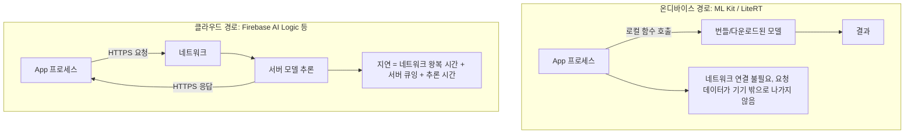

## 온디바이스 추론은 클라우드 추론이 필요로 하는 네트워크 왕복을 건너뛴다

상위 문서: [Android 시스템 서비스와 기기 기능 지도](../../android-system-services-and-device-capabilities.md)

관련 지도: [온디바이스 AI 접근 계약](./on-device-ai.md)

### 핵심 정의

Android 의 `ML Kit`(비전·텍스트·생성형 AI 태스크를 지원하는 모바일 전용 온디바이스 SDK)과 LiteRT(구 TensorFlow Lite)는 모델을 기기 안에서 직접 실행해 추론 결과를 얻는다. 공식 문서는 이 둘을 다음과 같이 구분해 설명한다.

>"ML Kit provides production-ready solutions to common tasks and requires no ML expertise. Models are built-in and optimized for mobile."
>
>"For more control, or to deploy your own ML models, Android provides a custom ML stack built on top of LiteRT and Google Play services"

반대로 클라우드 추론(Firebase AI Logic 을 통한 Gemini 등)은 요청을 네트워크로 보내고 응답을 받는다.

>"Implement on-device features with Gemini Nano and ML Kit GenAI APIs, or harness the full power of Cloud and Hybrid AI with Firebase AI Logic."

두 경로의 근본 차이는 "추론이 어디서 실행되는가"이며, 이는 지연 시간, 오프라인 가용성, 비용 구조를 모두 다르게 만든다.

### 메커니즘

ML Kit/LiteRT 온디바이스 경로는 요청을 프로세스 밖으로 내보내지 않는다. 모델이 앱에 번들되어 있거나(built-in) 최초 1 회 다운로드된 뒤에는, 이후 추론 호출이 로컬 CPU/GPU/NPU 에서 완결된다. 네트워크 연결 여부와 무관하게 결과를 반환할 수 있고, 요청/응답 데이터가 기기 밖으로 나가지 않는다.

클라우드 추론 경로는 매 요청마다 HTTPS 연결을 열어 서버로 프롬프트/이미지를 전송하고, 서버가 더 큰 모델로 추론한 뒤 응답을 돌려받는다. 이 **왕복**(round trip: 네트워크 패킷 전송 및 응답 왕복 지연)은 네트워크 지연, 서버 큐잉 지연, 연결 실패 가능성을 추가한다. 대신 온디바이스 모델보다 훨씬 큰 모델을 쓸 수 있어 일반적으로 더 높은 품질/범용성을 제공한다.

실제 사례로 공식 문서는 다음을 든다.

>"By implementing Gemini Nano on-device, Kakao Mobility streamlined address entry and reduced order completion time by 24% while reducing server costs and enhancing user privacy."

이 사례는 온디바이스 추론이 성능(지연 감소), 비용(서버 비용 절감), 프라이버시(요청이 기기 밖으로 나가지 않음) 세 축에서 동시에 이득을 준 예다.

### 코드 예시

```kotlin
// 온디바이스 경로: 네트워크 요청 없이 로컬에서 완결된다.
val summarizerOptions = SummarizerOptions.builder(context)
    .setInputType(InputType.ARTICLE)
    .setOutputType(OutputType.ONE_BULLET)
    .setLanguage(Language.ENGLISH)
    .build()
val summarizer = Summarization.getClient(summarizerOptions)

val request = SummarizationRequest.builder(articleText).build()
summarizer.runInference(request) { partialResult ->
    // 콜백은 로컬 추론 진행에 따라 호출되며, 이 과정에 네트워크 호출이 없다.
    updateUi(partialResult)
}
```

```kotlin
// 클라우드 경로: 요청/응답이 네트워크를 왕복한다(개념 예시).
val response = firebaseAiClient.generateContent(prompt)
    // 내부적으로 HTTPS 요청을 서버로 보내고 응답을 기다린다.
updateUi(response.text)
```

### 다이어그램



### 판단 기준

- 오프라인 가용성, 낮은 지연, 사용자 데이터를 기기 밖으로 보내지 않아야 하는 요구가 있으면 온디바이스 경로를 우선 검토한다.
- 온디바이스 모델보다 더 큰 모델 용량이나 최신 지식이 필요하거나, 기기 성능이 추론을 감당하기 어려우면 클라우드 경로를 검토한다.
- 두 경로를 하이브리드로 조합(온디바이스 우선, 실패 시 클라우드 폴백)할 수도 있다는 것을 설계 초기에 고려한다.

### 경계

- 이 노트는 추론 위치에 따른 차이까지만 다룬다. 온디바이스 모델을 앱마다 번들하지 않고 시스템이 공유 관리하는 AICore 의 계약은 [AICore는 Gemini Nano를 앱마다 번들되지 않는 공유 시스템 모델로 관리한다](./aicore-manages-gemini-nano-as-a-shared-system-model-not-a-bundled-asset.md) 가 다룬다.
- 온디바이스 모델이 실제로 이 기기에서 쓸 수 있는 상태인지 확인하는 절차는 [온디바이스 AI 기능 가용성은 사용 전에 반드시 확인해야 한다](./on-device-ai-feature-availability-must-be-checked-before-use.md) 가 다룬다.
- 모델 정확도 비교나 특정 태스크에 어떤 모델이 더 나은지는 이 노트가 판단하지 않는다.

### 관찰 가능한 신호

Android Studio Network Profiler 로 추론 호출을 관찰하면, 온디바이스 경로는 호출 시점에 네트워크 트래픽이 발생하지 않는 반면 클라우드 경로는 HTTPS 요청/응답이 기록된다. 이 차이로 "이 기능이 실제로 온디바이스로 도는지"를 코드를 보지 않고도 검증할 수 있다.

### 공식 문서

- [Android AI overview](https://developer.android.com/ai)
- [ML Kit GenAI Summarization for Android](https://developers.google.com/ml-kit/genai/summarization/android)

검증일: 2026-08-04.
