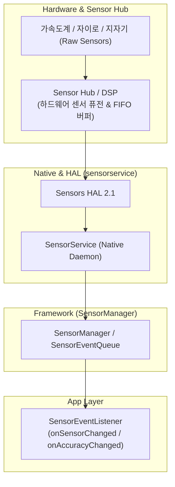

## 센서 접근 계약

이 지도는 Android 센서 접근을 raw/synthetic 센서 구분, 하드웨어 FIFO 배칭/전력 트레이드오프, 그리고 기기 고정 좌표계와 화면 회전 간 변환 문제로 분리한다.

### 주요 메커니즘 및 코드 예시 (Mechanisms & Code Examples)

- **SensorManager**: 기기의 하드웨어 및 합성 센서 목록 조회 및 리스너 등록 (`getSystemService(Context.SENSOR_SERVICE)`).
- **센서 배칭 (Batching)**: 하드웨어 FIFO 큐에 이벤트를 모아두었다가 `maxReportLatencyUs` 만료 시점에 한 번에 전달하여 AP(Application Processor) 절전 상태 유지.
- **좌표계 리매핑**: 기기 기본 방향(Natural Orientation) 기준 축을 디스플레이 회전 각도에 맞게 `SensorManager.remapCoordinateSystem`으로 보정.

```kotlin
val sensorManager = getSystemService(Context.SENSOR_SERVICE) as SensorManager
val accelerometer = sensorManager.getDefaultSensor(Sensor.TYPE_ACCELEROMETER)

// 배칭을 위해 maxReportLatencyUs 지정 (예: 10초)
val registered = sensorManager.registerListener(
    sensorEventListener,
    accelerometer,
    SensorManager.SENSOR_DELAY_NORMAL,
    10_000_000 // 10,000,000 us = 10s
)
```

### 아키텍처 다이어그램



### 관찰 신호 (Observation Signals)

- **ADB 및 dumpsys 진단**:
  ```bash
  # 기기 내 전체 센서 목록, FIFO 버퍼 크기, 활성 리스너 및 배칭 지연시간 덤프
  adb shell dumpsys sensorservice
  # 센서 이벤트 변경 로그 실시간 모니터링
  adb logcat -s SensorManager SensorService
  ```
- **수신 지연/배치 확인**: `SensorEventListener.onSensorChanged`의 타임스탬프(`event.timestamp`)와 시스템 수신 시점(`SystemClock.elapsedRealtimeNanos()`)을 비교하여 FIFO 배칭 정상 작동 여부 검증.

### 읽는 순서

1. [SensorManager는 raw 센서와 합성 센서를 같은 API로 노출한다](sensor-manager-synthetic-sensors.md) 에서 두 종류의 센서가 신뢰도와 지연에서 어떻게 다른지 본다.
2. [센서 배칭은 수신 지연과 배터리 사이의 트레이드오프다](sensor-batching-latency.md) 에서 FIFO 큐와 wakeup 여부를 확인한다.
3. [센서 좌표계는 화면 방향이 아니라 기기 고정 좌표계다](sensor-coordinate-system.md) 에서 회전 시 값이 왜 그대로인지 본다.

### 문제 분류

| 증상 | 먼저 확인할 경계 |
| --- | --- |
| 센서 값이 아예 없음 | 기기에 해당 센서가 존재하는지(`hasSystemFeature`/센서 목록 조회) |
| 값이 튀거나 노이즈가 심함 | raw 센서를 그대로 쓰고 있는지, 필터링/합성 센서로 대체 가능한지 |
| 콜백이 늦게 옴 | 배칭 설정과 `maxReportLatencyUs`, 화면 꺼짐 시 wakeup 센서 여부 |
| 화면 회전 시 값이 이상해 보임 | 좌표계를 화면 회전에 맞춰 리매핑했는지 |

### 책임 경계

- 센서 데이터의 정확도 보정과 필터링은 앱의 책임이며 하드웨어 벤더마다 raw 값의 노이즈 특성이 다르다.
- 배칭은 배터리 절약 메커니즘이지 정확도 향상 수단이 아니다.
- 이 지도는 Sensor API 의 접근/전달 계약을 다루며, 특정 센서를 이용한 제스처 인식 알고리즘 설계는 다루지 않는다.

### 노트 목록

- [SensorManager는 raw 센서와 합성 센서를 같은 API로 노출한다](sensor-manager-synthetic-sensors.md)
- [센서 배칭은 수신 지연과 배터리 사이의 트레이드오프다](sensor-batching-latency.md)
- [센서 좌표계는 화면 방향이 아니라 기기 고정 좌표계다](sensor-coordinate-system.md)

### 공식 문서

- [Sensors overview](https://developer.android.com/develop/sensors-and-location/sensors/sensors_overview)
- [SensorManager](https://developer.android.com/reference/android/hardware/SensorManager)

검증일: 2026-08-03. Android 센서 하드웨어 추상화 및 배칭/좌표계 계약을 공식 문서를 기준으로 확인했다.
