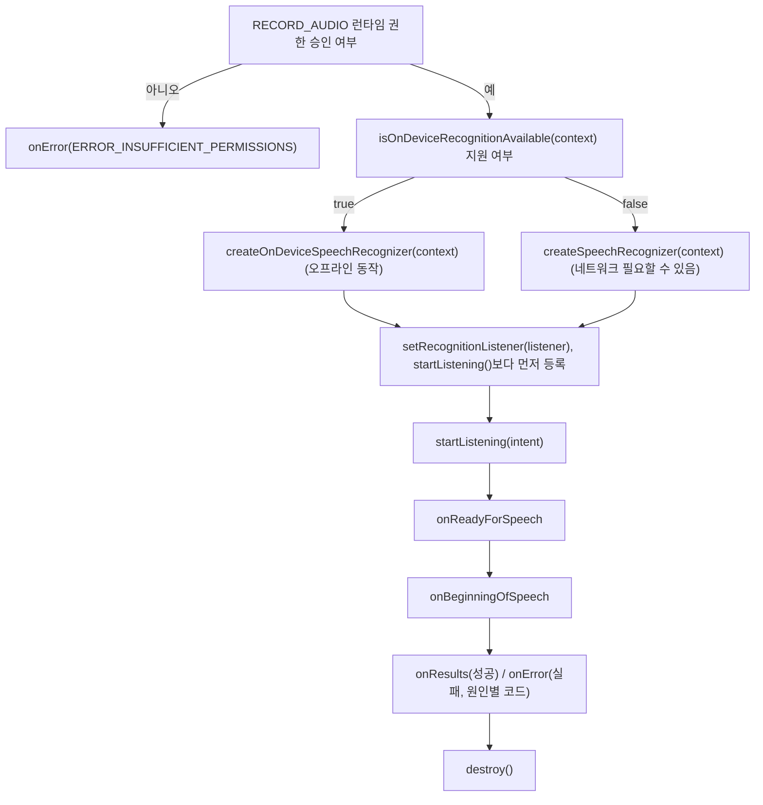

## SpeechRecognizer는 RECORD_AUDIO 권한을 전제로 하는 콜백 기반 비동기 계약이다

상위 문서: [Android 시스템 서비스와 기기 기능 지도](../../android-system-services-and-device-capabilities.md)
관련 지도: [음성 합성/인식 접근 계약](speech.md)

### 핵심 정의

`SpeechRecognizer`(마이크로 입력된 사용자 음성을 텍스트 문장으로 변환하는 STT 시스템 서비스 API)는 직접 `new`로 생성하지 않고 `SpeechRecognizer.createSpeechRecognizer(context)`(네트워크 인식 가능) 또는 `SpeechRecognizer.createOnDeviceSpeechRecognizer(context)`(온디바이스 전용, 오프라인 동작)로 생성한다. 공식 문서가 명시하듯, 이 API를 쓰려면 사용자가 앱에 `RECORD_AUDIO`(마이크 데이터 수집을 허용하는 위험 권한: Dangerous Permission) 권한을 부여해야 한다.

> "For `SpeechRecognizer` to convert your user's speech into text, the user needs to grant your app the `RECORD_AUDIO` permission."

### 메커니즘

`SpeechRecognizer`는 `RecognitionListener`(음성 인식 수명주기 이벤트 및 인식 결과를 비동기로 수신하는 콜백 인터페이스) 콜백을 통해서만 결과를 전달하는 비동기 API다. `setRecognitionListener(RecognitionListener)`를 `startListening()`보다 먼저 등록해야 하며, 등록 전에 명령을 보내면 어떤 콜백도 오지 않는다. 주요 콜백은 `onReadyForSpeech`, `onBeginningOfSpeech`, `onResults`, `onError` 등이다. `onError(int error)`는 실패 원인을 구분해 전달하는데, 대표적으로 `ERROR_INSUFFICIENT_PERMISSIONS`(권한 부족)와 `ERROR_NO_MATCH`(권한·네트워크는 정상이지만 인식된 발화가 없음)는 원인이 서로 다르다. `isOnDeviceRecognitionAvailable(context)`가 `false`를 반환하면 그 기기에서는 `createOnDeviceSpeechRecognizer()` 자체가 실패하므로, 온디바이스 인식을 요구하는 기능이라면 생성 전에 이 값을 먼저 확인해야 한다. 더 이상 사용하지 않는 `SpeechRecognizer`는 `destroy()`로 해제해야 한다.

### 코드 예시

```kotlin
class VoiceCommandActivity : AppCompatActivity() {
    private var speechRecognizer: SpeechRecognizer? = null

    private val listener = object : RecognitionListener {
        override fun onReadyForSpeech(params: Bundle?) {}
        override fun onBeginningOfSpeech() {}
        override fun onResults(results: Bundle?) {
            val matches = results?.getStringArrayList(SpeechRecognizer.RESULTS_RECOGNITION)
            // matches[0] 등을 사용해 인식된 텍스트를 처리한다.
        }
        override fun onError(error: Int) {
            when (error) {
                SpeechRecognizer.ERROR_INSUFFICIENT_PERMISSIONS -> {
                    // RECORD_AUDIO 권한이 실제로 거부된 상태다.
                }
                SpeechRecognizer.ERROR_NO_MATCH -> {
                    // 권한/네트워크는 정상이지만 인식된 발화가 없다.
                }
            }
        }
        // onRmsChanged, onBufferReceived, onEndOfSpeech, onPartialResults, onEvent 등은 생략.
    }

    override fun onCreate(savedInstanceState: Bundle?) {
        super.onCreate(savedInstanceState)
        if (SpeechRecognizer.isOnDeviceRecognitionAvailable(this)) {
            speechRecognizer = SpeechRecognizer.createOnDeviceSpeechRecognizer(this)
        } else {
            speechRecognizer = SpeechRecognizer.createSpeechRecognizer(this)
        }
        // startListening()보다 반드시 먼저 등록해야 콜백을 받는다.
        speechRecognizer?.setRecognitionListener(listener)
    }

    override fun onStart() {
        super.onStart()
        val intent = Intent(RecognizerIntent.ACTION_RECOGNIZE_SPEECH).apply {
            putExtra(RecognizerIntent.EXTRA_LANGUAGE_MODEL, RecognizerIntent.LANGUAGE_MODEL_FREE_FORM)
        }
        speechRecognizer?.startListening(intent)
    }

    override fun onDestroy() {
        super.onDestroy()
        speechRecognizer?.destroy()
    }
}
```

### 다이어그램



### 판단 기준

- 오프라인 동작이 제품 요구사항이면 `isOnDeviceRecognitionAvailable()`로 지원 여부를 먼저 확인한 뒤 `createOnDeviceSpeechRecognizer()`를 쓴다. 지원하지 않는 기기에서는 `createSpeechRecognizer()`로 폴백한다.
- `setRecognitionListener()` 등록과 `startListening()` 호출의 순서를 반드시 지킨다. 순서가 바뀌면 콜백을 하나도 받지 못하는 조용한 실패로 이어진다.
- `onError`의 원인 코드를 구분해서 처리한다. `ERROR_INSUFFICIENT_PERMISSIONS`는 권한 재요청으로, `ERROR_NO_MATCH`는 재시도 안내로 이어지는 서로 다른 대응이 필요하다.

### 경계

- 이 노트는 `SpeechRecognizer` API 호출 순서와 콜백 계약만 다룬다. 마이크 버튼 UI, wake word 감지, 음성 명령의 자연어 해석은 다루지 않는다.
- `RECORD_AUDIO` 런타임 권한을 요청하는 일반적인 권한 다이얼로그 흐름 자체는 이 노트가 아니라 일반 런타임 권한 계약이 다루며, 이 노트는 `SpeechRecognizer`가 그 권한을 전제조건으로 삼는다는 경계만 명시한다.
- 텍스트를 음성으로 바꾸는 반대 방향 계약은 [TextToSpeech는 비동기로 초기화되며 사용 전 언어 가용성을 확인해야 한다](text-to-speech-initialization.md)가 다룬다.

### 관찰 가능한 신호

```bash
# 1. 마이크 권한 AppOps 상태 확인
adb shell cmd appops get <package_name> RECORD_AUDIO

# 2. 음성 인식 및 AudioRecord 스트림 로그 실시간 필터링
adb logcat -s SpeechRecognizer SpeechRecognizerImpl AudioRecord
```


`onError(error)`에서 `ERROR_INSUFFICIENT_PERMISSIONS`를 받으면 `RECORD_AUDIO`가 실제로 거부됐다는 뜻이고, `ERROR_NO_MATCH`를 받으면 권한과 네트워크는 정상이지만 인식할 발화 자체가 없었다는 뜻이라 두 실패는 원인이 다르다. `setRecognitionListener()`를 `startListening()` 이후에 등록하거나 누락하면 `onReadyForSpeech`조차 호출되지 않는 것으로 등록 순서 위반을 관찰할 수 있다.

### 공식 문서

- [SpeechRecognizer](https://developer.android.com/reference/android/speech/SpeechRecognizer)
- [Handle audio input from audio glasses and display glasses using Automatic Speech Recognition](https://developer.android.com/develop/xr/jetpack-xr-sdk/asr)

검증일: 2026-08-05.
