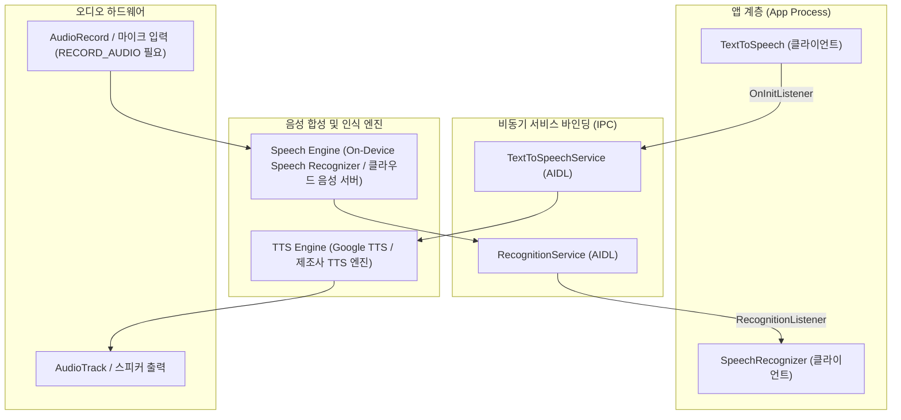

## 음성 합성/인식 접근 계약

이 지도는 텍스트를 음성으로 바꾸는 `TextToSpeech`와 음성을 텍스트로 바꾸는 `SpeechRecognizer`를 각각 비동기 초기화/언어 가용성, 권한 전제조건/콜백 순서라는 서로 다른 계약으로 나눈다. 둘 다 동기적으로 즉시 쓸 수 있는 API가 아니라, 엔진 준비 완료를 비동기 콜백으로 기다려야 하는 비동기 서비스 바인딩 계약이라는 공통점이 있다.

### 주요 메커니즘 및 코드 예시 (Mechanisms & Code Examples)

- **TextToSpeech (TTS)**: 비동기 바인딩 초기화(`OnInitListener`), 음성 언어 데이터 가용성 판별(`setLanguage`), 발화 큐잉(`speak`).
- **SpeechRecognizer (STT)**: 마이크 런타임 권한(`RECORD_AUDIO`), 리스너 선행 등록(`setRecognitionListener`), 온디바이스 및 네트워크 인식 모드 분기.

```kotlin
// TextToSpeech 초기화 및 음성 출력
lateinit var tts: TextToSpeech
tts = TextToSpeech(context) { status ->
    if (status == TextToSpeech.SUCCESS) {
        val result = tts.setLanguage(Locale.KOREAN)
        if (result != TextToSpeech.LANG_MISSING_DATA && result != TextToSpeech.LANG_NOT_SUPPORTED) {
            tts.speak("안녕하세요", TextToSpeech.QUEUE_FLUSH, null, "utterance_id_1")
        }
    }
}
```

### 아키텍처 다이어그램



### 관찰 신호 (Observation Signals)

- **ADB 및 dumpsys 진단**:
  ```bash
  # 1. 설치된 TTS 엔진 패키지 확인
  adb shell pm list packages | grep tts
  # 2. 오디오 출력 및 레코더 스트림 활성 상태 덤프
  adb shell dumpsys media.audio_flinger
  # 3. 마이크 권한 AppOps 상태 확인
  adb shell cmd appops get <package_name> RECORD_AUDIO
  ```
- **Logcat 로그 확인**:
  ```bash
  adb logcat -s TextToSpeech SpeechRecognizer SpeechRecognizerImpl AudioRecord
  ```

### 읽는 순서

1. [TextToSpeech는 비동기로 초기화되며 사용 전 언어 가용성을 확인해야 한다](text-to-speech-initialization.md)에서 `OnInitListener`와 `setLanguage()` 결과 코드를 먼저 본다.
2. [SpeechRecognizer는 RECORD_AUDIO 권한을 전제로 하는 콜백 기반 비동기 계약이다](speech-recognizer-callbacks.md)에서 권한 전제조건과 `RecognitionListener` 등록 순서를 본다.

### 문제 분류

| 증상 또는 질문 | 먼저 확인할 경계 |
| --- | --- |
| `speak()`를 호출했는데 아무 소리도 안 난다 | `OnInitListener.onInit(SUCCESS)` 콜백을 받기 전에 호출했는지 |
| 특정 언어에서만 TTS가 무음이거나 엉뚱하게 발음된다 | `setLanguage()` 반환값이 `LANG_MISSING_DATA`/`LANG_NOT_SUPPORTED`인지 |
| `startListening()`을 호출했는데 어떤 콜백도 안 온다 | `setRecognitionListener()`를 `startListening()`보다 먼저 등록했는지 |
| 음성 인식이 권한 승인 후에도 실패한다 | `onError`가 `ERROR_INSUFFICIENT_PERMISSIONS`인지 `ERROR_NO_MATCH`인지 |
| 오프라인에서는 음성 인식이 항상 실패한다 | `isOnDeviceRecognitionAvailable()`을 확인하지 않고 `createSpeechRecognizer()`(네트워크)만 썼는지 |

### 책임 경계

- 이 지도는 `TextToSpeech`/`SpeechRecognizer` API 자체의 초기화·권한·콜백 순서 계약만 다룬다. 음성 UI 디자인, wake word 감지, 자연어 의미 해석은 다루지 않는다.
- Assistant 질의를 앱 fulfillment로 연결하는 의미 해석과 실행 책임은 Assistant/에이전트 통합 영역이 담당하며, 이 지도는 그 위에서 쓰이는 순수 음성 합성/인식 API 계약만 다룬다.
- 마이크 하드웨어 자체의 오디오 포커스 조정은 [미디어/오디오/카메라 시스템 서비스 접근 계약](../media-audio-camera/media-audio-camera.md)이 다루며, 이 지도는 `SpeechRecognizer`가 오디오 입력을 어떻게 소비하는지의 세부를 다루지 않는다.

### 노트 목록

- [TextToSpeech는 비동기로 초기화되며 사용 전 언어 가용성을 확인해야 한다](text-to-speech-initialization.md)
- [SpeechRecognizer는 RECORD_AUDIO 권한을 전제로 하는 콜백 기반 비동기 계약이다](speech-recognizer-callbacks.md)

### 공식 문서

- [TextToSpeech](https://developer.android.com/reference/android/speech/tts/TextToSpeech)
- [SpeechRecognizer](https://developer.android.com/reference/android/speech/SpeechRecognizer)

검증일: 2026-08-05. [TextToSpeech](https://developer.android.com/reference/android/speech/tts/TextToSpeech), [SpeechRecognizer](https://developer.android.com/reference/android/speech/SpeechRecognizer)를 기준으로 확인했다.
