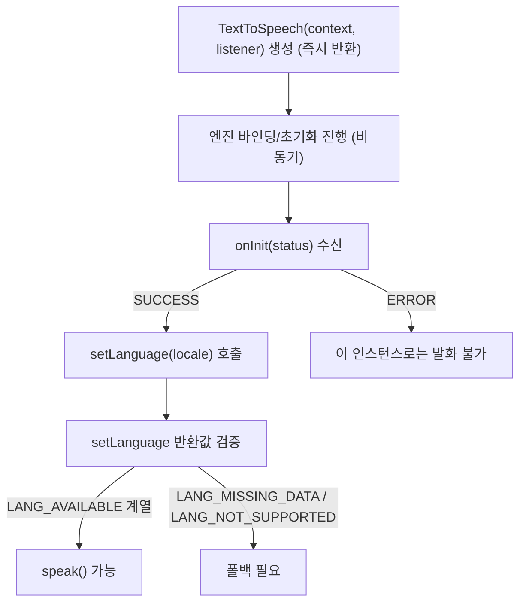

## TextToSpeech는 비동기로 초기화되며 사용 전 언어 가용성을 확인해야 한다

상위 문서: [Android 시스템 서비스와 기기 기능 지도](../../android-system-services-and-device-capabilities.md)
관련 지도: [음성 합성/인식 접근 계약](speech.md)

### 핵심 정의

`TextToSpeech`(텍스트 문자열을 음성 데이터로 합성해 스피커로 출력하는 TTS 시스템 서비스 API) 생성자인 `TextToSpeech(context, OnInitListener)`는 객체를 즉시 반환하지만, TTS 엔진 바인딩과 초기화는 별도로 진행된다. 초기화가 끝나면 `OnInitListener`(TTS 엔진 바인딩 및 비동기 준비 작업 완료 상태를 전달받는 리스너)의 `onInit(status)` 콜백이 `TextToSpeech.SUCCESS` 또는 `TextToSpeech.ERROR`를 전달한다. 이 콜백을 받기 전에 `speak()`를 호출하면 엔진이 아직 준비되지 않았으므로 발화가 보장되지 않는다.

### 메커니즘

`onInit(SUCCESS)`를 받은 뒤에도 곧바로 원하는 언어로 말할 수 있다는 보장은 없다. `setLanguage(Locale)`은 내부적으로 언어 가용성을 판단해 결과 코드를 돌려준다.

- `LANG_AVAILABLE` / `LANG_COUNTRY_AVAILABLE` / `LANG_COUNTRY_VAR_AVAILABLE`: 요청한 언어(또는 국가/변형까지)를 사용할 수 있다.
- `LANG_MISSING_DATA`: 언어 자체는 엔진이 지원하지만 필요한 언어팩 리소스가 기기에 설치돼 있지 않다.
- `LANG_NOT_SUPPORTED`: 설치된 TTS 엔진이 해당 언어를 아예 지원하지 않는다.

`LANG_MISSING_DATA`나 `LANG_NOT_SUPPORTED`를 받으면 `speak()`를 그대로 호출해도 원하는 언어로 발화되지 않으므로, 폴백 언어로 전환하거나 사용자에게 언어팩 설치를 안내해야 한다. 사용이 끝나면 `shutdown()`을 호출해 엔진 리소스를 해제한다.

### 코드 예시

```kotlin
class TtsActivity : AppCompatActivity() {
    private var tts: TextToSpeech? = null

    override fun onCreate(savedInstanceState: Bundle?) {
        super.onCreate(savedInstanceState)

        tts = TextToSpeech(this) { status ->
            if (status == TextToSpeech.SUCCESS) {
                val result = tts?.setLanguage(Locale.KOREAN)
                if (result == TextToSpeech.LANG_MISSING_DATA ||
                    result == TextToSpeech.LANG_NOT_SUPPORTED
                ) {
                    // 언어팩 미설치 또는 미지원: 폴백 언어로 전환하거나 안내한다.
                } else {
                    ttsReady = true
                }
            } else {
                // 엔진 초기화 자체가 실패했다.
            }
        }
    }

    override fun onStart() {
        super.onStart()
        if (ttsReady) {
            tts?.speak("안녕하세요", TextToSpeech.QUEUE_FLUSH, null, "greeting_utterance")
        }
    }

    override fun onDestroy() {
        super.onDestroy()
        tts?.shutdown()
    }
}
```

### 다이어그램



### 판단 기준

- `onInit()` 콜백을 받기 전에는 `speak()`를 호출하지 않는다. 초기화 완료 여부를 별도 플래그로 추적한다.
- `setLanguage()`의 반환값이 `LANG_MISSING_DATA` 또는 `LANG_NOT_SUPPORTED`이면 그대로 `speak()`를 호출하지 말고, 지원되는 언어로 폴백하거나 사용자에게 알린다.
- `Activity`/`Service`의 생명주기와 맞춰 `onDestroy()`에서 `shutdown()`을 호출해 엔진 리소스를 해제한다.

### 경계

- 이 노트는 초기화·언어 가용성 확인 계약만 다룬다. 발화 완료 시점을 추적하는 `UtteranceProgressListener`나 피치/속도 튜닝, SSML 마크업은 다루지 않는다.
- 음성을 텍스트로 바꾸는 반대 방향 계약은 [SpeechRecognizer는 RECORD_AUDIO 권한을 전제로 하는 콜백 기반 비동기 계약이다](speech-recognizer-callbacks.md)가 다룬다.
- Assistant 질의에 대한 응답을 TTS로 읽어주는 통합 흐름 자체는 Assistant/에이전트 통합 계약이 다루며, 이 노트는 TTS API 자체의 호출 계약만 다룬다.

### 관찰 가능한 신호

```bash
# 1. 기기에 설치된 TTS 엔진 패키지 목록 조회
adb shell pm list packages | grep tts

# 2. 기본 TTS 엔진 설정 확인
adb shell settings get secure tts_default_synth

# 3. TextToSpeech 바인딩 및 음성 합성 로그 확인
adb logcat -s TextToSpeech
```


`onInit(TextToSpeech.ERROR)`를 받으면 이 `TextToSpeech` 인스턴스는 초기화에 실패한 것이므로 이후 `speak()` 호출은 신뢰할 수 없다. `setLanguage()` 반환값을 `LANG_AVAILABLE` 계열 상수와 직접 비교하는 로그를 남기면, 특정 언어에서만 무음이거나 엉뚱한 언어로 발화되는 문제를 초기화 실패가 아니라 언어팩 부재로 정확히 좁힐 수 있다.

### 공식 문서

- [TextToSpeech](https://developer.android.com/reference/android/speech/tts/TextToSpeech)
- [Handle audio output for AI glasses using Text to Speech](https://developer.android.com/develop/xr/jetpack-xr-sdk/tts)

검증일: 2026-08-05.
