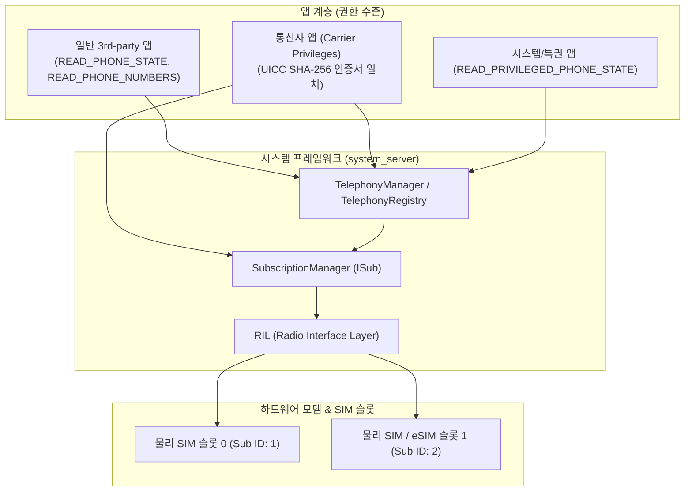

## 텔레포니 접근 계약

이 지도는 통신 상태 조회 권한 계층(`TelephonyManager`), 멀티 SIM/구독 모델(`SubscriptionManager`), 통신사 서명 기반 특권(`CarrierPrivileges`)이라는 세 핵심 계약을 분리한다.

### 주요 메커니즘 및 코드 예시 (Mechanisms & Code Examples)

- **TelephonyManager**: 네트워크 타입, 셀룰러 상태 모니터링(`TelephonyCallback`), 전화번호/상태 런타임 권한 세분화.
- **SubscriptionManager**: 듀얼 SIM/eSIM 환경에서 논리적 구독 ID(`subscriptionId`)와 물리적 SIM 슬롯 인덱스(`slotIndex`) 분리.
- **Carrier Privileges**: UICC(SIM 카드)에 내장된 SHA-1/SHA-256 인증서 해시를 통해 통신사 앱에 부여되는 런타임 권한 대체 특권.

```kotlin
// 1. SubscriptionManager를 통한 활성 SIM 목록 조회
val subscriptionManager = getSystemService(Context.TELEPHONY_SUBSCRIPTION_SERVICE) as SubscriptionManager
val activeSubscriptions = subscriptionManager.activeSubscriptionInfoList

for (subInfo in activeSubscriptions.orEmpty()) {
    val subId = subInfo.subscriptionId
    val simSlotIndex = subInfo.simSlotIndex
    
    // 2. 특정 구독 ID에 바인딩된 TelephonyManager 획득
    val telephonyManager = getSystemService(TelephonyManager::class.java)
        .createForSubscriptionId(subId)
    println("Slot $simSlotIndex -> Operator: ${telephonyManager.simOperatorName}")
}
```

### 아키텍처 다이어그램



### 관찰 신호 (Observation Signals)

- **ADB 및 dumpsys 진단**:
  ```bash
  # 1. 텔레포니 레지스트리 및 활성 전화 통신 리스너 덤프
  adb shell dumpsys telephony.registry
  # 2. 전화 하드웨어 및 RIL/모뎀 상태 덤프
  adb shell dumpsys phone
  # 3. 활성 SIM 구독(Subscription) 정보 덤프
  adb shell dumpsys isub
  # 4. UICC 통신사 특권(Carrier Privileges) 규칙 덤프
  adb shell dumpsys uicc_carrier_privileges
  ```
- **Logcat 로그**:
  ```bash
  adb logcat -s TelephonyManager TelephonyRegistry SubscriptionManager RILJ
  ```

### 읽는 순서

1. [TelephonyManager 권한은 READ_PHONE_STATE와 READ_PHONE_NUMBERS로 세분화된다](telephony-manager-permissions.md) 에서 필요한 정보에 맞는 최소 권한을 고른다.
2. [SubscriptionManager는 멀티 SIM에서 논리적 구독과 물리 슬롯을 분리한다](subscription-manager-slots.md) 에서 듀얼 SIM 기기의 데이터 모델을 본다.
3. [Carrier privilege는 런타임 권한 없이 통신사 서명 인증서로 부여된다](carrier-privilege-certificates.md) 에서 통신사 앱의 특권 모델을 본다.

### 문제 분류

| 증상 | 먼저 확인할 경계 |
| --- | --- |
| 전화번호/IMEI 조회가 실패 | 요청한 정보에 맞는 정확한 permission 인지(전체 조회는 대부분 시스템 앱 전용) |
| 듀얼 SIM 기기에서 통화/데이터가 엉뚱한 SIM 으로 감 | subscription ID 를 명시적으로 지정했는지 |
| 통신사 전용 기능이 일반 앱에서 실패 | carrier privilege 가 필요한 API 인지, UICC 인증서 서명이 있는지 |

### 책임 경계

- 대부분의 개인 식별 통신 정보(IMEI, 전화번호 등)는 Android 10 이후 일반 서드파티 앱이 조회할 수 없도록 강하게 제한됐다. 이 지도는 그 제한의 구조를 다루되, 우회 방법을 다루지 않는다.
- Carrier privilege 는 permission 시스템과 별도의 신뢰 경로이며, 사용자 승인이 아니라 SIM 에 내장된 통신사 서명으로 결정된다.

### 노트 목록

- [TelephonyManager 권한은 READ_PHONE_STATE와 READ_PHONE_NUMBERS로 세분화된다](telephony-manager-permissions.md)
- [SubscriptionManager는 멀티 SIM에서 논리적 구독과 물리 슬롯을 분리한다](subscription-manager-slots.md)
- [Carrier privilege는 런타임 권한 없이 통신사 서명 인증서로 부여된다](carrier-privilege-certificates.md)

### 공식 문서

- [TelephonyManager 문서](https://developer.android.com/reference/android/telephony/TelephonyManager)
- [UICC carrier privileges](https://source.android.com/docs/core/connect/uicc)

검증일: 2026-08-03. [TelephonyManager 문서](https://developer.android.com/reference/android/telephony/TelephonyManager)와 [UICC carrier privileges](https://source.android.com/docs/core/connect/uicc) 를 기준으로 확인했다.
