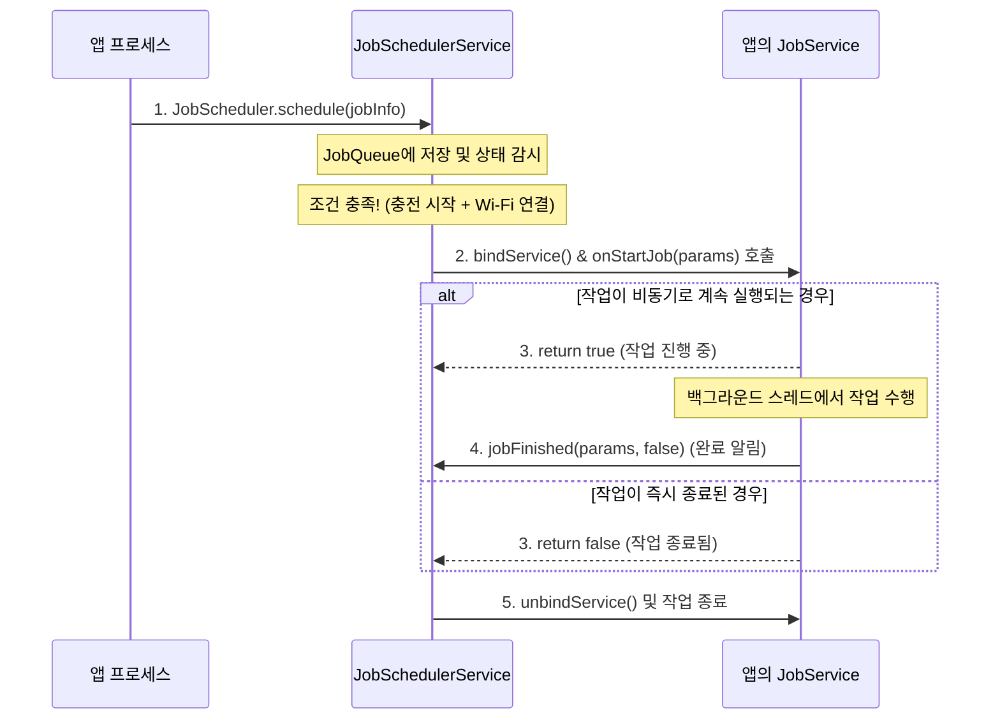

# JobScheduler (JobSchedulerService - 스마트 에코 스케줄러)

## 1. 개요 (Overview)

**JobScheduler (JobSchedulerService)**는 Android 5.0(API 21)에서 도입되어 `system_server`에서 구동되는 시스템 서비스로, **앱의 지연 가능한(Deferrable) 백그라운드 작업을 시스템이 지정한 특정 조건(충전 중, 무제한 Wi-Fi 연결, 기기 대기 등)이 충족될 때 일괄 집행(Batching)하는 지능형 백그라운드 관리자**이다.

앱이 개별적으로 배터리와 네트워크를 소비하지 않고, OS가 중앙에서 수많은 앱의 백그라운드 작업을 묶어서 한 번에 처리함으로써 기기의 배터리 효율과 시스템 자원(CPU/RAM) 소비를 극대화한다.

---

### 초보자를 위한 쉽게 이해하는 비유

* **`JobScheduler` (스마트 알뜰 예약 세탁기 / Smart Eco-Scheduler)**:
  - 빨래(백그라운드 작업)를 아무 때나 돌리지 않고, "전기세가 제일 싸고(충전 상태) + 심야 시간(기기 대기) + 물이 충분할 때(Wi-Fi)" 모아둔 빨래를 한 번에 돌리는 **스마트 가전 컨트롤러**.
* **`JobInfo` (세탁 예약 조건 카드)**:
  - "이 빨래는 꼭 Wi-Fi가 켜지고 충전 케이블이 꽂혔을 때만 돌려주세요"라고 적어둔 작업 조건 정의서.
* **`JobService` (실제 세탁 코스 수행자)**:
  - 조건을 만족하면 시스템에 의해 깨어나 실제 작업을 수행하는 앱의 백그라운드 실행 컴포넌트.
* **`Batching` (모아서 한 번에 세탁하기)**:
  - 10개 앱의 예약 작업을 묶어서 배터리/라디오 모뎀을 한 번만 깨워 처리하는 연비 최적화 기법.

```mermaid
graph TD
    App["App Process"] -->|1. schedule(JobInfo)| JSS["JobSchedulerService (system_server)"]
    JSS -->|2. 작업 등록 & 조건 감시| ConstraintEvaluator["Constraint Evaluator (충전/네트워크/Idle)"]
    
    ConstraintEvaluator -->|3. 모든 조건 충족 (Charging + Wi-Fi)| BatchEngine["Batch Execution Engine"]
    BatchEngine -->|4. JobService 바인딩 (onStartJob)| AppJobService["App: JobService.onStartJob()"]
    AppJobService -->|5. 작업 완료시 jobFinished()| JSS
```

---

## 2. JobScheduler의 제약 조건 (Constraints) 및 작동 원리

### 1) 4대 주요 제약 조건
- **네트워크 조건 (`setRequiredNetworkType`)**: `NETWORK_TYPE_UNMETERED` (Wi-Fi 전용), `NETWORK_TYPE_ANY` 등 원하는 네트워크 상태 지정.
- **전원 조건 (`setRequiresCharging`)**: 기기가 AC/USB 충전기에 연결되어 있는지 여부.
- **기기 대기 조건 (`setRequiresDeviceIdle`)**: 사용자가 기기를 사용하지 않고 화면이 꺼진 휴면(Doze) 상태인지 여부.
- **용량/배터리 상태 (`setRequiresStorageNotLow` / `setRequiresBatteryNotLow`)**: 저장 공간이나 배터리가 부족하지 않은지 확인.

### 2) 작업 배치(Batching) 및 Doze 모드 통합
- 배터리를 방전시키는 주요 원인인 셀룰러/Wi-Fi 라디오 모뎀 깨우기(Wakeup) 횟수를 줄이기 위해 여러 앱의 `JobInfo` 실행 시점을 통합한다.
- Android의 **Doze 모드(휴면 모드)** 및 **App Standby** 상태와 연동되어 지연 가능한 백그라운드 실행을 자동으로 조정한다.

---

## 3. JobScheduler 실행 및 콜백 수명주기



1. **JobInfo 생성 및 등록**: 앱이 작업 ID 및 실행 제약 조건을 설정하여 `JobScheduler.schedule()`을 호출한다.
2. **조건 모니터링**: `JobSchedulerService`는 BroadcastReceiver 및 시스템 이벤트 핸들러를 통해 충전 상태 및 네트워크 변경을 감시한다.
3. **onStartJob() 호출**: 조건이 충족되면 시스템이 앱의 `JobService`를 바인딩하고 메인 스레드에서 `onStartJob()`을 호출한다.
4. **jobFinished() 호출**: 비동기 작업 종료 후 반드시 `jobFinished()`를 호출해 시스템에 작업 완료를 알리고 WakeLock 및 자원을 해제해야 한다.

---

## 4. Jetpack WorkManager와의 관계

- **WorkManager의 기본 엔진**:
  - Android Jetpack의 **WorkManager**는 하위 호환성을 보장하는 백그라운드 작업 표준 라이브러리로, API 23 이상 기기에서는 내부적으로 **JobScheduler**를 기본 엔진으로 사용하여 백그라운드 작업을 실행한다.
- **직접 사용 vs WorkManager 사용 권장**:
  - Google 공식 가이드는 구버전 호환성(AlarmManager + BroadcastReceiver Fallback) 및 데이터베이스 작업 영속성을 자동 처리해 주는 **WorkManager 사용을 강력히 권장**한다.

---

## 5. 연관 문서 (Related Links)

- [system_server](system-server.md) - JobSchedulerService가 상주하는 메인 시스템 프로세스
- [ServiceManager](service-manager.md) - JobSchedulerService의 Binder 참조를 관리하는 전역 디렉토리
- [WorkManager 레퍼런스](background-and-notifications/background-work-contracts/workmanager-is-default-for-deferrable-guaranteed-work.md) - 보장된 지연 가능 백그라운드 작업 표준 래퍼 라이브러리
