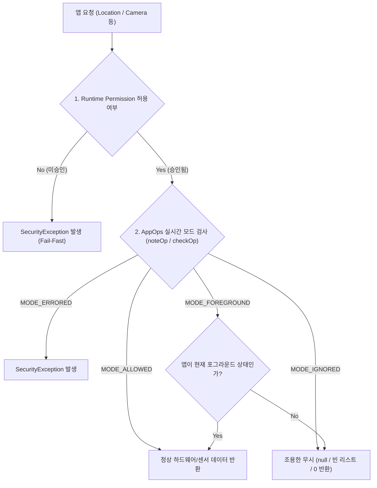

## AppOps는 permission 승인 뒤에도 실행 시점 정책을 추가로 거부할 수 있다

### 1. 개요 (Overview)

**AppOps**(App Operations, `AppOpsManager`)는 Android 플랫폼의 정적/동적 런타임 권한(Permission) 승인 상태와 별개로 동작하는 **동적 실행 시점 정책 계층(Dynamic Runtime Policy Layer)**이다.

앱이 Manifest 에 권한을 선언하고 사용자가 런타임 권한 대화상자에서 "허용"을 부여했더라도, 해당 동작에 매핑된 App-Op 모드가 `MODE_IGNORED` 또는 `MODE_ERRORED` 상태이면 시스템 서비스는 크래시 없이 조용히 무시(Silent Failure)하거나 빈 데이터/기본값을 반환한다.

---

#### 초보자를 위한 쉽게 이해하는 비유

- **AppOps 권한 거부 (출입증은 있으나 내부 세부 구역 출입 통제)**:
  - 회사 사원증(런타임 권한)을 받았더라도, 특정 보안 구역(카메라, 마이크, 위치 센서) 진입 시 보안실 관리자(AppOps)가 "현재 회의 중 아님", "백그라운드 상태임" 등의 실시간 조건을 따져 문을 열어주지 않거나 더미 데이터를 주는 2차 실시간 통제 메커니즘.



---

### 2. 핵심 메커니즘 (Key Mechanisms)

#### 1) 런타임 Permission 과 App-Op 의 매핑
- 플랫폼이 정의한 런타임 dangerous permission 에는 추적 및 통제용 App-Op 이 1:1 또는 1:N 으로 연결된다 (`AppOpsManager.permissionToOp()`, 예: `android.permission.CAMERA` ↔ `OPSTR_CAMERA`).
- `noteOp()`: 1회성 데이터 접근(예: 마지막 위치 조회) 시 사용.
- `startOp()` & `finishOp()`: 지속적인 세션(예: 마이크 녹음, 카메라 스트리밍) 동안 사용되며, 상태바의 프라이버시 인디케이터(초록색 점)를 활성화한다.

#### 2) AppOps 모드 4대 상태
- **`MODE_ALLOWED` (0)**: 정상 접근 허용.
- **`MODE_IGNORED` (1)**: 조용히 무시 (Silent Ignore). 예외를 던지지 않고 0, null, 빈 리스트를 반환하여 앱 충돌을 방지하면서 프라이버시를 보호.
- **`MODE_ERRORED` (2)**: 명시적 `SecurityException` 발생.
- **`MODE_DEFAULT` (3)**: 플랫폼 기본 권한 결정 규칙을 따름.
- **`MODE_FOREGROUND` (4)**: 앱이 포그라운드(화면 상단 액티비티 또는 FGS)에 있을 때만 허용.

---

### 3. 코드 레벨 흐름 (Kotlin Code Example)

#### 플랫폼 서비스 제공자 관점의 검증 흐름

```kotlin
// 시스템 서비스 및 ContentProvider 에서의 보호 API 구현 예시
fun readProtectedData(context: Context, requiredPermission: String): List<DataItem> {
    val callingUid = Binder.getCallingUid()
    val callingPackage = context.packageManager.getPackagesForUid(callingUid)?.firstOrNull()
        ?: throw SecurityException("Unknown calling UID")

    // 1. 1차 정적 런타임 권한 강제
    context.enforceCallingPermission(requiredPermission, "Permission required")

    // 2. 2차 동적 AppOps 모드 확인
    val appOps = context.getSystemService(AppOpsManager::class.java)
    val op = AppOpsManager.permissionToOp(requiredPermission)
        ?: return executeInternalQuery() // 매핑 op 없으면 진행

    val mode = appOps.noteOpNoThrow(
        op,
        callingUid,
        callingPackage,
        null, // attributionTag (API 30+)
        "Accessing protected items"
    )

    return when (mode) {
        AppOpsManager.MODE_ALLOWED -> executeInternalQuery()
        AppOpsManager.MODE_IGNORED -> emptyList() // 프라이버시 보호: 조용한 빈 리스트 반환
        else -> throw SecurityException("AppOps denied execution: mode=$mode")
    }
}
```

---

### 4. 관측 신호 및 CLI 명령어 (CLI Verification)

```bash
# 1. 특정 패키지의 모든 AppOps 모드 및 최근 접근 시각 덤프
adb shell dumpsys appops <package_name>

# 2. 특정 권한의 AppOps 모드를 수동으로 변경하여 '조용한 무시' 경로 테스트
# 위치 권한을 승인한 상태에서 AppOps 모드를 ignore 로 강제
adb shell cmd appops set <package_name> FINE_LOCATION ignore

# 3. AppOps 모드를 다시 허용으로 원복
adb shell cmd appops set <package_name> FINE_LOCATION allow

# 4. AppOps 상태를 시스템 기본값으로 초기화
adb shell cmd appops reset <package_name>
```

---

### 5. 트러블슈팅 및 책임 경계 (Troubleshooting & Boundaries)

- **증상: `checkSelfPermission` 은 GRANTED 인데 LocationListener 로 콜백이 전혀 오지 않음**:
  - 원인: 백그라운드 제한 또는 사용자의 "앱 사용 중에만 허용" 설정으로 인해 AppOps 가 `MODE_IGNORED` 로 처리 중.
  - 대책: 사전 check 의존을 지양하고, 타임아웃 fallback 및 포그라운드 서비스 전환을 적용.
- **경계**: 일반 앱이 시스템 API 없이 스스로 타 앱의 AppOps 를 조작하거나 우회할 수 없으며, SELinux 커널 통제는 `05_security_privacy/platform-hardening` 에서 다룬다.

---

### 6. 연관 문서 (Related Links)

- [시스템 서비스 접근 공통 계약](service-lookup.md)
- [Binder 서비스는 필요한 호출 경계에서 호출자 신원과 정책을 검사한다](system-server-uid-pid-check.md)
- [Context.getSystemService](get-system-service.md)
- [안드로이드 권한 시스템 & AppOps](../../05_security_privacy/permissions/appops-and-permissions.md)
- [system_server 표준 레퍼런스](../../01_system_internals/boot-and-runtime/system-server/system-server.md)
