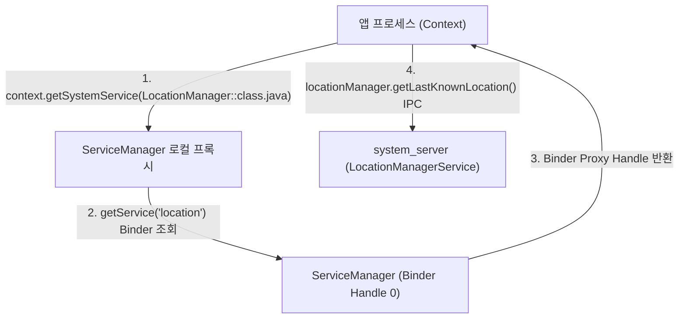

## Context.getSystemService (시스템 서비스 획득 매커니즘)

### 1. 개요 (Overview)

**`Context.getSystemService()`** 는 Android 애플리케이션이 `LocationManager`, `WindowManager`, `NotificationManager` 등 OS 가 제공하는 시스템 수준 서비스의 로컬 핸들(Proxy 매니저 객체)을 획득하기 위해 사용하는 핵심 Android API 이다.

내부적으로 [ServiceManager](service-manager.md) 를 통해 `system_server` 프로세스에 상주하는 Binder 프록시를 조회하며, 반환된 매니저 객체를 통해 [Binder IPC](../../01_system_internals/ipc-and-process/binder-ipc.md) 통신을 수행한다.

---

#### 초보자를 위한 쉽게 이해하는 비유

- **`getSystemService()` (민원실 창구 번호표 매니저 받기)**:
  - 시민(앱 프로세스)이 시청(system_server)의 특정 전문 부서(위치과, 건축과)와 연락하고 싶을 때, 시청 안내소(ServiceManager)로 가서 **해당 부서 전통 내선전화기 핸들(`getSystemService`)**을 발급받아 통화하는 방식.



---

### 2. 주요 메커니즘 및 주의사항

1. **ServiceManager 조회를 통한 캐싱 (Cached Manager)**:
   - `Context` 내부의 서비스 레지스트리가 매니저 객체를 인스턴스화하여 캐싱하므로, 동일 Context 내에서는 효율적인 참조가 유지된다.
2. **Context Scope 의존성 (Activity vs Application)**:
   - `WindowManager` 나 `LayoutInflater` 같은 UI 관련 서비스는 반드시 화면 경계와 연결된 **`Activity Context`** 에서 획득해야 하며, `ApplicationContext` 에서 획득 시 윈도우 토큰 부재 예외가 발생할 수 있다.
3. **매니저 호출 시의 IPC 오버헤드**:
   - `getSystemService()` 반환 매니저의 메서드 호출은 동기적인 일반 자바 메서드처럼 보이지만, 내부는 **[Binder IPC](../../01_system_internals/ipc-and-process/binder-ipc.md)** 원격 호출이다. 따라서 메인 스레드에서의 무분별한 폴링 루프 호출은 UI 블로킹을 유발할 수 있다.

---

### 3. 코드 예시 (`Context.getSystemService` 안심 사용)

```kotlin
// 추천: 타입 기반 getSystemService API 및 시스템 피처 검증
val locationManager = context.getSystemService(LocationManager::class.java)

if (context.packageManager.hasSystemFeature(PackageManager.FEATURE_LOCATION)) {
    // 위치 서비스 IPC 요청 수행
    val lastLocation = locationManager?.getLastKnownLocation(LocationManager.GPS_PROVIDER)
}

// UI 경계 관련 서비스는 Activity Context 에서 획득
val windowManager = activity.getSystemService(WindowManager::class.java)
```

---

### 4. 연결 문서 (Related Links)

- [ServiceManager](service-manager.md) - Binder Handle 0 시스템 서비스 등록소
- [system_server](../../01_system_internals/boot-and-runtime/system-server/system-server.md) - 시스템 서비스들을 호스팅하는 메인 자바 프로세스
- [Binder IPC](../../01_system_internals/ipc-and-process/binder-ipc.md) - getSystemService 매니저가 통신하는 IPC 파이프라인
- [WindowManagerService](window-manager-service.md) - WMS 서비스 레퍼런스
- [PackageManagerService](package-manager-service.md) - PMS 서비스 레퍼런스
